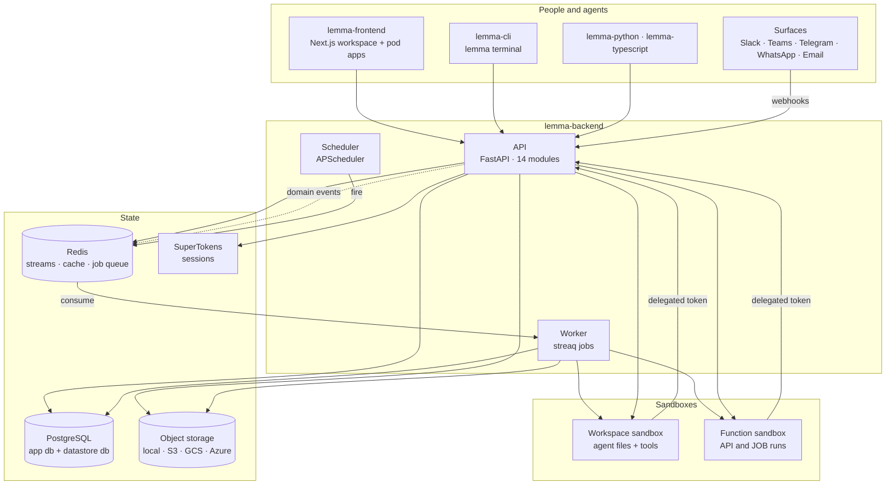
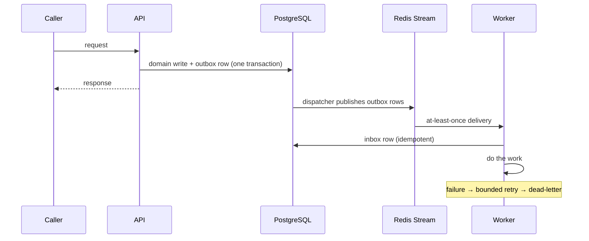

# Architecture

How the Lemma platform is put together: what the components are, what talks to
what, where state lives, and which invariants hold everywhere.

This is the map. The territory is documented in depth elsewhere — every section
below links to it.

- New to the product? Read the [README](README.md) first.
- Running it? [Installation](docs/installation.md) and
  [configuration](docs/configuration.md).
- Changing the backend? [Backend module guide](lemma-backend/docs/modules/README.md)
  and [development guidelines](lemma-backend/docs/development.md).

## The shape of it

Lemma is a **harness for team software**: shared state, permissions, workflows,
and approvals that both people and agents operate through the same APIs. A
**pod** is the unit of that — one self-contained environment holding tables,
files, agents, workflows, functions, apps, and surfaces.

Everything in the repo exists to serve one of four jobs:

| Job | Components |
|---|---|
| Run the platform | `lemma-backend`, `lemma-frontend` |
| Install and operate it locally | `desktop`, `lemma-stack` |
| Build and operate pods | `lemma-cli`, `lemma-skills`, `lemma-pod-bundle` |
| Build on top of it | `lemma-python`, `lemma-typescript` |

## Component map

### lemma-backend — the platform

A FastAPI application assembled from **14 modules** registered in
`app/core/registry/installed.py`. Each module declares its routers, event
consumers, background tasks, and lifespan hooks; nothing else registers
centrally.

Three process roles, from the same codebase:

| Process | Entrypoint | Owns |
|---|---|---|
| API | `app/app.py` | HTTP, WebSockets, authorization, durable writes |
| Worker | `app/worker.py` | streaq jobs, event consumers, long I/O |
| Scheduler | `app/scheduler.py` | time triggers |

Desktop and `make dev` run an **all-in-one** variant (`local_app.py`) that hosts
all three in one process. That is a packaging choice, not a different
architecture — the module boundaries and the event path are identical.

→ [Module guide](lemma-backend/docs/modules/README.md) · one document per module,
each naming the tables it owns.

### lemma-frontend — the workspace

Next.js 16 / React 19. The pod workspace, the operator UI, and the public site.
Pod **apps** are separate deployable frontends that talk to the same pod APIs
through the TypeScript SDK.

### Sandboxes — where untrusted code runs

Agent workspaces and function runs both execute in provisioned sandboxes,
never in the backend process. The program inside a sandbox image is
`lemma-backend/sandbox_runtime/`; a sandbox image must never need the backend
to start.

One `WORKSPACE_PROVIDER` setting chooses what a sandbox is made of — `docker`,
`e2b`, or `lemma_local` (Desktop's private VM). The important consequence is
durability: on Docker and `lemma_local` the compute is replaced and files
survive; on E2B the sandbox *is* the disk.

→ [Sandbox fabric](docs/architecture/sandbox/README.md) — protocol, lifecycle
state model, provider adapters, function execution.

### Desktop and lemma-stack — local installation

`desktop/` is a Tauri shell over `lemma-locald`, a durable control plane that
owns a process ledger, network state, logs, and a config vault. It supervises
the backend, the frontend, Agent Host, and a private Linux runtime holding
PostgreSQL, Redis, SuperTokens, and containerd. No user-facing Docker
dependency.

`lemma-stack` is the CLI control surface for the same daemon.

→ [Desktop architecture](docs/architecture/desktop.md) ·
[Agent Host](docs/architecture/agent-host.md)

### SDKs and CLI — the clients

`lemma-python` and `lemma-typescript` are **generated from a committed OpenAPI
specification**. They are never hand-edited, CI fails on drift, and the API and
both SDKs share a major/minor compatibility line.

→ [Generated-code policy](docs/security/generated-code-policy.md) ·
[Versioning](docs/versioning.md)

`lemma-cli` (`lemma-terminal` on PyPI) is how both humans and coding agents
operate a pod. `lemma-skills` teaches coding agents to use it.
`lemma-pod-bundle` is the dependency-free bundle format shared by the CLI and
the backend, so neither has to depend on the other.

## Where state lives

| Store | Holds | Notes |
|---|---|---|
| **PostgreSQL — app db** | Users, pods, agents, workflows, functions, connectors, schedules, runs | Alembic migrations; every module names the tables it owns |
| **PostgreSQL — datastore db** | Pod tables, records, files metadata | Separate database, per-pod schemas, queried under row-level security by a lower-privilege role |
| **Redis** | Domain event streams, streaq job queue, caches | All data caching goes through Redis — never an in-process dict |
| **Object storage** | Uploaded files, derived documents, app bundles, icons | `local`, `s3`, `gcs`, or `azure` |
| **SuperTokens** | Sessions and auth recipes | Self-hosted; no managed auth dependency |

Two rules follow from the pool being small (10 + 10 overflow per process):

> **Never hold a DB session across external I/O or a streaming body.**
> Do the DB work in a short unit of work, commit, release, *then* do the slow
> thing.

> **Cache in Redis, not in the process.**

→ [Development guidelines](lemma-backend/docs/development.md)

## How work moves

State changes and the events announcing them commit **in the same transaction**:

Consequences a contributor has to design around:

- **Delivery is at-least-once.** Consumers must be idempotent and inbox-backed.
- **Validation errors acknowledge; infrastructure errors re-raise** so the
  message is retried rather than silently dropped.
- **Downstream job IDs are deterministic**, so a replay does not duplicate work.
- Anything that outlives a request belongs in a streaq job, not a request
  handler.

## Invariants

These hold across every module, and most are enforced by a CI gate rather than
by review.

| Invariant | Enforced by |
|---|---|
| Modules collaborate through explicit `contracts` packages or versioned domain events — never by importing another module's internals | `make architecture` (no-growth ratchet on a committed baseline) |
| Complexity, oversized files, and broad `except` clauses cannot grow | `make architecture`, Ruff `BLE001` |
| Every resource operation resolves through the central authorization context; pod data is additionally protected by row-level security | Authorization tests, cross-session isolation tests |
| Secrets are `SecretStr` and revealed only at point of use; provider errors never reach logs or API responses raw | Canary-secret tests, redaction tests |
| Generated clients match the committed OpenAPI spec exactly | Codegen drift check |
| Every logged event exists in the event catalog | Logging contract gate |
| Schema changes ship an Alembic upgrade *and* downgrade | Migration tests |

→ [Threat model](docs/security/threat-model.md) ·
[Release checklist](docs/security/release-checklist.md)

## Licensing boundary

The split is deliberate and follows the deployment boundary:

- **AGPLv3** — `lemma-backend`, `lemma-frontend`, `desktop`. Server-delivered
  core: modify and offer it over a network, and your modifications are
  AGPL too.
- **Apache-2.0** — `lemma-stack`, `lemma-cli`, `lemma-python`,
  `lemma-typescript`, `lemma-skills`, `lemma-pod-bundle`. Client-side tools
  meant for broad embedding.

`lemma-pod-bundle` is the one package that sits on the seam, and its license
follows from that. Both the Apache-2.0 CLI and the AGPLv3 backend need to agree
on the bundle format, so it is deliberately stdlib-only and Apache-2.0 — the
permissive side of the boundary — and `lemma-cli` vendors it into the published
`lemma-terminal` wheel. Anything AGPL-licensed must not be pulled into it.

Both sets live in one repo and one release train. See
[LICENSE](LICENSE) and [LICENSES/](LICENSES/).
