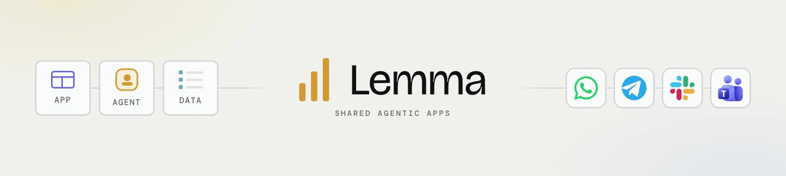
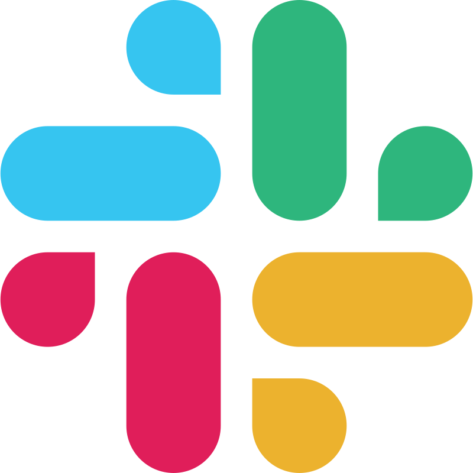
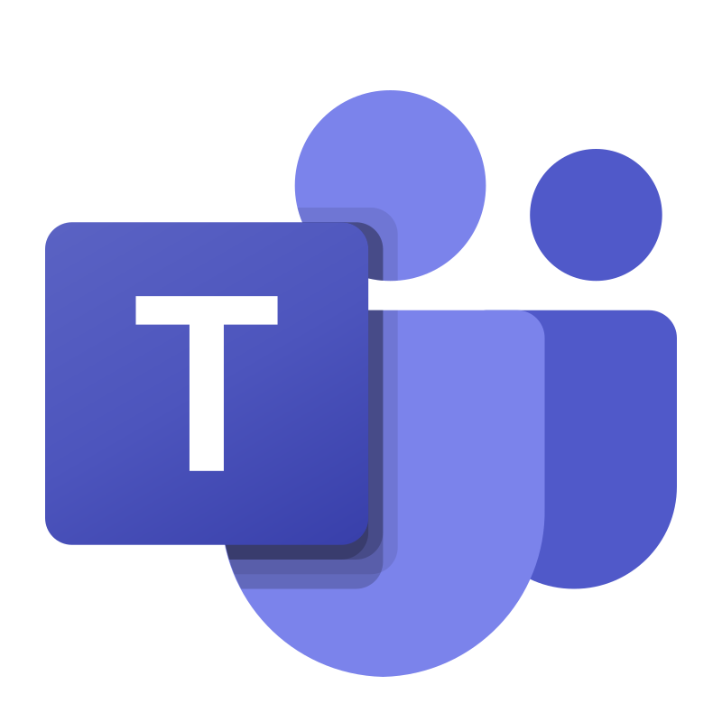

<div align="center">



**Shared Apps and Agents.** Your team, your agents, one context layer, scoped to each person.


<a href="https://github.com/lemma-work/lemma-platform/releases/latest"></a>

[Quickstart](#quickstart) · [What shared means](#one-of-it-however-many-of-you) · [Inside a pod](#inside-a-pod) · [Surfaces](#however-the-work-arrives-it-lands-in-the-same-pod) · [Coding agents](#the-agent-you-already-use-builds-the-whole-system) · [Examples](#complete-pods-running) · [Docs](https://lemma.work/docs)

Website → **[lemma.work](https://lemma.work)**

</div>

---

## A multiplayer, self-improving harness

A harness is everything around the model: the tools it can call, the memory it
reads, the state it writes, the loop it runs in, and the boundary it works
inside. Coding agents gave you a harness for one person, on one machine, for the
length of one session.

Lemma is that harness for a team. State is shared and permissioned, so many
people and many agents work the same records. It keeps running between sessions,
on schedules, webhooks, and table events. And it compounds: corrections become
standing instructions, sequences become workflows, judgment becomes an agent
role. The harness your team uses next month is better than the one you ship
today, because using it is what improved it.

Your coding agent builds it. Describe the job to Claude Code, Codex, Cursor,
OpenCode, or Antigravity; it writes the whole system as files: the app people
open, the tables underneath it, the agents, the workflows, and the permissions.
Then it imports and verifies the result through the same CLI. Your team opens it
at a URL, or reaches it from Slack, Teams, Telegram, WhatsApp, or email.

**Open source. Run it on your laptop, your server, or Lemma Cloud. Use Claude Code or Codex through your existing subscription, Lemma-managed models, or any OpenAI- or Anthropic-compatible provider.**

## Quickstart

### Lemma Cloud

The same stack, hosted, reachable by teammates and surfaces:

```bash
uv tool install lemma-terminal
lemma servers select lemma-cloud
lemma auth login
lemma skills install
lemma pod create support-ops --with-starter   # scaffolds a working starter (table + agent) and imports it
lemma chat "what can you do in this pod?"
```

### Your laptop

Download Lemma Desktop, choose **Local**, and select **Install local services**.
Lemma owns the local runtime and picks its own ports, so one bootstrap command
reads them back out of Desktop and registers them with the CLI as the `local`
server.

<a href="https://github.com/lemma-work/lemma-platform/releases/latest"></a>

Run this after Desktop's local setup has finished once:

```bash
uv tool install lemma-terminal
curl -fsSL https://raw.githubusercontent.com/lemma-work/lemma-platform/main/install.sh |
  bash -s -- --cli-only          # registers Desktop's endpoints as the local server
lemma servers select local
lemma auth login
lemma skills install
lemma pod create support-ops --with-starter
```

Then open the generated `support-ops/` directory in the coding agent you already
use and describe the system you want. Full Desktop, Agent Host, and provider
setup lives in [Install in depth](#install-in-depth) and
[docs/installation.md](docs/installation.md).

Use `uv tool install`, not `pip`. `lemma-terminal` needs Python 3.14, and
`uv tool install` provisions that interpreter itself, so whatever `python3` is
on your machine does not matter. `pip install lemma-terminal` on an older
interpreter does not fail — it quietly resolves back to `0.6.2`, the last
release that allowed 3.11, and installs a CLI several minors behind the server.
`lemma --version` reports what you actually have.

**If a command did not do what it says here:**

| Symptom | What to do |
| --- | --- |
| `Server not found: local` | Desktop's local setup has not run, or the bootstrap above was skipped. Run it, then `lemma servers show` to confirm which server is active. |
| Agents unavailable, or chat answers with a provider error | No AI provider has validated yet. **Local Control Center → AI Providers**; Ollama or LM Studio if you have no API key. |
| Something works in the app but not in the CLI, or the other way round | `lemma doctor` — it diagnoses client/server version skew and duplicate installs. |

## One of it, however many of you

You share the agent itself, already running. Send someone the link; they open the
same agent, and their work lands in the same records. There is one of it to fix,
one of it to improve, and one set of records underneath.

Scoped to each person:

| Who | Role | Access |
|---|---|---|
| **Priya** | Owner | Approves refunds, any amount |
| **Marco** | Member | His own jobs; refunds route to Priya |
| **Classifier** | Agent | Reads tickets; read-only |

Same system, different rights. One version of it, for everyone.

## Build it, ship it, and hand it to your team

**01 · Build it where you already work.** Claude Code, Codex, Cursor, OpenCode,
or inside Lemma itself. The agent authors the tables, agents, workflows,
permissions, and the app, then verifies them through the same CLI.

**02 · The app and its agents go live together.** One URL for the people who use
it. The agents work on schedules, webhooks, and table events, and keep working
while everyone is logged off.

**03 · Bring your team, and anyone else who needs it.** Teammates, clients, and
guests each get an invite link, the app, and their own account inside the pod.

**04 · Decide exactly what each one can touch.** One permission model covers
people and agents: per-table grants, resource visibility, and approval gates on
the consequential steps.

**05 · Use it from wherever you already are.** Slack, Telegram, WhatsApp, and email.
Or open it as an app. Every entry point reads and writes the same records under
the same permissions.

## Inside a pod

Everything in Lemma lives in a **pod**: a self-contained environment for one
person, team, or process. A pod holds shared state, agents, workflows,
permissions, and one or more apps.

| Primitive | What it gives you |
|---|---|
| **Tables** | Typed, queryable business data with row-level security. Leads, tickets, tasks, approvals: readable by agents, owned by the pod. |
| **Files** | Markdown memory for preferences, playbooks, voice guides, and notes. Full-text searchable, permission-scoped, read and written by agents alongside the tables. This is where policy lives: versioned, editable, and read at run time. |
| **Agents** | LLM workers with a role, tool grants, and access scoped to specific tables, files, and connectors. |
| **Workflows** | Graphs that mix agents, functions, decisions, loops, waits, and **human approval steps**. Triggered by schedules, webhooks, table events, chat, or the API. |
| **Functions** | The predictable half: same input, same output, every time. Plain code for validators, state transitions, and outbound actions. Agents call them as tools, so judgment and rules stay separable. |
| **Permissions** | Roles for people *and* agents: pod-level roles, table grants, resource visibility, delegation tokens. |
| **Approvals** | Workflow steps that pause, route to a specific person, and resume on their decision, in the app or in Slack. Days later, if that is how long it takes. |
| **Connectors** | Every connection shows the account, its access, and what uses it, so "the agent can email customers" is a setting you can see. |
| **Apps** | The UI where people see the job, direct work, and handle decisions. Deployed at a URL and built on the same pod APIs as the agents. An agent writes, and the app is already showing it. |
| **Surfaces** | Slack, Microsoft Teams, Telegram, WhatsApp, and email, wired to pod agents with identity resolution and conversation linking. |

## The harness improves itself

Finished work leaves reusable structure behind. A triaged email becomes a record.
Repeated corrections become standing instructions, repeated sequences become
workflows, and recurring judgment becomes an agent role, with approval gates
wherever people stay responsible.

## However the work arrives, it lands in the same pod

A teammate approves a refund **in Slack**. A field update arrives as a
**WhatsApp** voice note and lands as a structured record. An agent drafts a
customer reply **by email** and waits for a person before sending. The
conversation is the surface; underneath, all of it reads and writes the same
tables, runs the same workflows, and respects the same permissions.

Supported today: **Slack, Microsoft Teams, Telegram, WhatsApp, and email**.
Each one has webhook ingress, identity resolution, and agent-initiated actions.
Telegram long-polling and Slack Socket Mode connect local setups directly.

<div align="center">

<table>
  <tr>
    <td align="center"><strong>Surfaces</strong></td>
    <td align="center"><br><sub>Slack</sub></td>
    <td align="center"><br><sub>Teams</sub></td>
    <td align="center"><br><sub>Telegram</sub></td>
    <td align="center"><br><sub>WhatsApp</sub></td>
    <td align="center"><strong style="font-size:28px">&#9993;</strong><br><sub>Email</sub></td>
  </tr>
</table>

<em>Wherever your team already works, the pod shows up.</em>

</div>

Every pod agent gets its own address, and anyone can write to it from whatever
mail client they already use. Reaching a Gmail or Outlook *account* is a
connector, not a surface. Each surface resolves who is asking and what they may
ask for; the pod holds the data.

A pod also works for one person. One human and a few agents, with WhatsApp as
the front door and tables as the memory, make a personal assistant that keeps
state, asks before it acts, and picks up tomorrow where it left off today.

## The agent you already use builds the whole system

The app, the tables, the agents, the workflows, and the permissions. All written
as files, imported, and checked by the same agent that wrote them. Building and
operating use the same CLI.

<div align="center">

<table>
  <tr>
    <td align="center" width="112"><br><sub>Claude Code</sub></td>
    <td align="center" width="112"><br><sub>Codex</sub></td>
    <td align="center" width="112"><br><sub>OpenCode</sub></td>
    <td align="center" width="112"><br><sub>Cursor</sub></td>
    <td align="center" width="112"><br><sub>Antigravity</sub></td>
  </tr>
</table>

</div>

**Install Lemma's skills into the agent you already use:**

```bash
lemma skills install             # auto-detects Claude Code / Codex / OpenCode / Cursor
lemma skills install --target claude --all-skills   # or pick a target and include runtime helpers
lemma skills install --target agents --scope project # Antigravity, from inside the pod directory
```

Skills ship in [`lemma-skills/`](lemma-skills/). Restart your coding agent after
installing, point it at an empty directory, and give it the job:

> Use the Lemma builder skills available in this workspace to build a complete app for **[describe the job]**.
>
> Start from the person doing the work and the outcome they need. Then design the smallest useful operating loop.
>
> Build the whole system on Lemma: the app people open and use, the tables and docs that hold shared state, the functions and workflows that move the work, the agents that can help, and clear permissions with human review points.
>
> Keep the interface calm, specific to the job, and ready for a real team to use. Before changing anything, show me the proposed workflow and resource model.

It writes the tables, agents, workflows, and permissions as files, imports them,
then runs the workflow to check it pauses where it should:

```bash
lemma pod init support-ops       # scaffold a starter bundle to edit (or: lemma agent|table|workflow init …)
lemma pod import ./support-ops
lemma apps deploy support-ops ./index.html   # deploy a no-build HTML app (or a Vite project dir)
```

**Or run your agent inside Lemma.** Agent Host connects your local Claude Code,
Codex, OpenCode, or Cursor to the pod: it picks up tasks from a durable queue,
streams its work back through the pod, and pauses at approval gates before
protected actions. Two agents working the same pod share persistent state, a task
queue, and run history. See [Agent Host](#agent-host).

Any agent operates a pod directly through the CLI:

```bash
lemma table list                 # inspect the data model
lemma record update tickets tkt_418 --data '{"status": "closed"}'
lemma agent run classifier "classify ticket tkt_418"   # agents take a message; lemma function run takes JSON
lemma workflow run refund-review     # returns as soon as it reaches a human approval step
lemma chat "what's left in the queue?"
```

If you're reading this inside a coding agent session: that agent can work a pod
right now.

Python and TypeScript SDKs (with 25+ React hooks) live in
[`lemma-python/`](lemma-python/) and [`lemma-typescript/`](lemma-typescript/).
Generating your frontend elsewhere? Back it with a pod. The TypeScript SDK gives
any app tables, agents, workflows, and permissions out of the box.

## Complete pods, running

Ten open-source pods you can install and make yours. Open one, see how it was
built, change it:

| Pod | | |
|---|---|---|
| **[Roundtable](https://github.com/deepak-jha-kgp/roundtable)** | Team operations | Real work, shared context, human judgment |
| **[Frontdesk](https://github.com/deepak-jha-kgp/frontdesk)** | Customer support | Every request routed, every answer grounded, every send controlled |
| **[Panini](https://github.com/deepak-jha-kgp/panini)** | Writing | AI proposes, people decide, the document remembers |
| **[Smart Inbox](https://github.com/deepak-jha-kgp/smart-inbox)** | Personal productivity | Your rules, your voice, a quieter inbox |
| **[Sidekick](https://github.com/deepak-jha-kgp/sidekick)** | Personal productivity | Knows the routine, remembers the context, asks before acting |
| **[Lemma Design](https://github.com/deepak-jha-kgp/lemma-design)** | Design | Design the idea, prototype the feeling, make it real |
| **[Nachiketa](https://github.com/deepak-jha-kgp/nachiketa)** | Learning | Start with a question, build from sources, learn by attempting |
| **[Drop](https://github.com/deepak-jha-kgp/drop)** | Capture | Send it once, find it later, keep the context |
| **[Meal](https://github.com/deepak-jha-kgp/meal)** | Wellbeing | Say what you ate, see the pattern, choose one next move |
| **[Lemma GTM](https://github.com/deepak-jha-kgp/lemma-gtm)** | Go to market | Position clearly, build with proof, ship the campaign |

Browse and install them at **[lemma.work/templates](https://lemma.work/templates)**.

A pod is files. Export it, share it, remix it:

```bash
lemma pod export ./support-ops    # the whole system, as files
lemma pod import ./support-ops    # ship it back, or anywhere else
```

The same coding agent that built a pod can export, change, verify, and re-import
it.

## Open, local, and portable

- **Your machine.** The full stack runs self-contained on your laptop. You choose which external services receive data.
- **Our cloud, when you want it.** [lemma.work](https://lemma.work) runs the same open-source stack as a hosted option for pods that need to reach teammates and surfaces.
- **Your subscription, managed models, or your keys.** Pod-assigned runs use your local **Claude Code or Codex login** through Agent Host. Server-run agents use Lemma-managed models or an **Anthropic-compatible or OpenAI-compatible** key or endpoint: a cloud provider, a self-hosted gateway, or a local model. Runtime profiles are per pod, so different agents can use different models.
- **Your code.** Core is [AGPLv3](LICENSE); SDKs, CLI, and tools are [Apache-2.0](LICENSES/Apache-2.0.txt).

## Install in depth

### Lemma Desktop

Download the signed **online** package from the latest release for macOS 14+ on
Apple silicon, and drag Lemma to Applications before opening it. The small
installer downloads digest-verified runtime components on first use; this release
publishes the online package, and offline packages follow later.

There is no published Windows installer. Windows 11 23H2+ on x86-64 is built and
signed every release, but the installer stays a workflow artifact rather than a
release asset: attaching it would be an offer of support we cannot make until
the Windows paths have been tested end to end. Getting it takes a GitHub account
and the Actions UI — steps in [installing on
Windows](docs/installation.md#windows-installation-experimental).

Choose **Local**, select **Install local services**, and create the local owner
inside the app. Lemma owns its lightweight VZ/WSL2 runtime and installs
everything it needs itself: one download, one app. Configure the required AI
profile and optional integrations in **Local Control Center**.

On first installation Lemma chooses a private high-port pair and keeps it stable
across restarts. **Local Control Center → Diagnostics** shows the exact
workspace, API, built-app, and OAuth callback URLs. See the complete [local
installation and operations guide](docs/installation.md).

The CLI ships knowing one server, `lemma-cloud`. Because Desktop's ports are
chosen per installation, the `local` server is written from what Desktop
actually allocated rather than assumed. The stack-control bootstrap installs
`lemma-stack` and does that in one step:

```bash
curl -fsSL https://raw.githubusercontent.com/lemma-work/lemma-platform/main/install.sh |
  bash -s -- --cli-only
```

`--cli-only` is what registers `local`; without it, `install.sh` starts the
Docker/Podman compatibility install instead, which Desktop users do not want.
Run it after Desktop's local setup has completed once — it reads the endpoints
from the running installation, so it fails if there is nothing to read.

### Agent Host

To let a pod dispatch runs through your local Claude Code, Codex, OpenCode, or
Cursor login, pair this machine as an Agent Host and point a runtime profile at
one of those coding agents.

In [Lemma Desktop](docs/installation.md), open **Models** and press **Connect
this computer**, then **Add to chat models** on the agents it finds. The app
pairs itself as you: one click, and this machine is paired. Desktop supervises
Agent Host, so pairing, starting, stopping, and updates all happen there, and
`lemma runtime profiles list` shows the profiles it created. Point any agent at
one:

```bash
lemma agent update <name> --data '{"agent_runtime": {"profile_id": "<profile_id>"}}'
```

Agent Host runs on the machines Desktop runs on (macOS and Windows), and drives
each coding agent over the [Agent Client
Protocol](https://agentclientprotocol.com). Antigravity (`agy`) installs Lemma's
skills and authors pods today; pod-dispatched runs arrive with its ACP support.

### A provider for server-run agents and conversations

Use **Local Control Center → AI Providers**, or apply the same transactional
configuration through `lemma-stack` (the stack-control CLI, installed by the
bootstrap above — it is not on PyPI):

```bash
lemma-stack config set ai.protocol=openai_compat ai.base_url=http://127.0.0.1:11434/v1 ai.default_model=qwen3
```

Secrets are stored in Keychain or Credential Manager, model access is validated
before activation, and a failed change rolls back. See
[configuration](docs/installation.md#configure-an-ai-provider) for hosted
providers, integrations, and agent surfaces.

No API key? Point it at a model on your own machine instead: start Ollama or
LM Studio and press **Ollama** or **LM Studio** in **Local Control Center → AI
Providers**. Server-run agents stay unavailable, with the reason shown, until
some provider validates.

## Repo layout

| Path | Package | License |
|------|---------|---------|
| `lemma-backend/` | FastAPI backend, sandbox images and runtime, migrations, and infra Docker Compose | AGPLv3 |
| `lemma-frontend/` | Next.js frontend | AGPLv3 |
| `lemma-stack/` | `lemma-stack`, installer and manager for a self-contained local stack | Apache-2.0 |
| `desktop/` | Tauri macOS desktop app (thin shell around the `lemma-stack` supervisor) | AGPLv3 |
| `lemma-cli/` | `lemma-terminal`, the `lemma` CLI and terminal UI | Apache-2.0 |
| `lemma-python/` | `lemma-sdk`, Python SDK | Apache-2.0 |
| `lemma-typescript/` | `lemma-sdk`, TypeScript/JavaScript SDK for Node, browser, and React | Apache-2.0 |
| `lemma-skills/` | Built-in agent skills | Apache-2.0 |
| `lemma-pod-bundle/` | `lemma-pod-bundle`, the pod bundle format, shared by the CLI and the backend | Apache-2.0 |
| `docs/` | Installation, configuration, architecture, and security documentation | n/a |
| `install.sh` | Bootstrap for `lemma-stack`. `--cli-only` registers Desktop as the CLI's `local` server; with no flags it runs the Docker/Podman compatibility install | n/a |

Everything is a normal directory in one repo.
[ARCHITECTURE.md](ARCHITECTURE.md) explains how the pieces fit together.

## Development

For contributing to the platform itself, hot-reload from source:

```bash
git clone https://github.com/lemma-work/lemma-platform.git
cd lemma-platform
make init        # install dependencies and create persistent local configuration
make dev         # run backend, frontend, and the sandbox runtime with local debug/request logs
make dev-public  # add an ephemeral public API URL for webhooks and surfaces
make logs        # tail infrastructure container logs
make stop        # stop dev app, the sandbox runtime, and tunnel processes
make stop-all    # also stop dev infrastructure
```

Run `make help` for the full list. The dev stack uses explicit development
ports (frontend 3710, backend 8710). Managed Desktop installations choose
persistent high ports instead.

`make dev-public` requires `cloudflared` and creates one temporary
`*.trycloudflare.com` URL for the API. The frontend and auth UI stay on
`http://localhost:3710`, while the public API URL is injected into the frontend,
webhook callbacks, and generated API links for that run. The quick-tunnel URL
changes on every restart and is intended only for development.

Backend-only commands live in `lemma-backend/`:

```bash
cd lemma-backend
make test
make lint
make migrate
```

Start at [`docs/`](docs/README.md). It indexes everything. The most-used
entries: [installation](docs/installation.md) for the full setup guide,
[configuration](docs/configuration.md) for what every setting does,
[ARCHITECTURE.md](ARCHITECTURE.md) for how the components fit together,
[CONTRIBUTING.md](CONTRIBUTING.md) for what a pull request needs, and
[`lemma-backend/README.md`](lemma-backend/README.md) /
[`lemma-frontend/README.md`](lemma-frontend/README.md) for per-component detail.

## Licensing

The Lemma platform uses a dual-licensing model:

**AGPLv3** (server-delivered core):

- `lemma-backend/`: the FastAPI backend, including the sandbox images and the
  runtime that ships inside them
- `lemma-frontend/`: the Next.js frontend and operator UI

These are licensed under the [GNU Affero General Public License v3](LICENSE).
If you modify and offer the software over a network (e.g. a hosted SaaS), you
must release your modified source under the same terms.

**Apache-2.0** (client-side developer tools):

- `lemma-stack/`: local stack installer and manager
- `lemma-cli/`: the `lemma` CLI and terminal UI
- `lemma-python/`: the Python SDK
- `lemma-typescript/`: the TypeScript SDK
- `lemma-skills/`: agent skills
- `lemma-pod-bundle/`: the shared pod bundle format

These are intended for broad embedding, installation, and adaptation, so they
remain Apache-2.0 and include their own `LICENSE` files.

`lemma-pod-bundle` is Apache-2.0 rather than AGPLv3 on purpose: it is the
dependency-free vocabulary that lets the Apache-2.0 CLI and the AGPLv3 backend
agree on the bundle format while each stays independent of the other, and it is
vendored into the published `lemma-terminal` wheel.

**Commercial licensing and exceptions** are available from Folks and Machines,
Inc. for organizations that require a commercial licence. The commercial
exception clears the AGPL procurement question while keeping the core genuinely
open source.

**Trademark:** The Lemma name, logos, and marks are trademarks of Folks and
Machines, Inc.; the software licenses grant rights to the code alone. Fork the
code, not the brand.

Lemma is built by [Folks and Machines, Inc.](https://lemma.work), a Delaware
corporation. © 2026 Folks and Machines, Inc.
