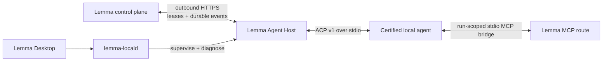

# Lemma Agent Host

Lemma Agent Host is the durable local boundary between a Lemma runtime and
user-owned coding agents. It lets Lemma use Codex, Claude Code, Cursor, and
OpenCode without putting a provider credential in Lemma Cloud or maintaining a
custom parser for every provider CLI.

Agent Host is intentionally a separate native process. Lemma Desktop supervises
it through `lemma-locald`; headless installations can run it in the foreground
or install a per-user operating-system service.

How Desktop supervises, controls, and reports it - including the privilege
boundary for the workspace page - is in
[Agent Host in the desktop app](../../docs/architecture/agent-host.md).

## Architecture



The control-plane transport is at-least-once. Before any provider side effect,
Agent Host writes the command, lease epoch, dispatch intent, checkpoints, and
event sequence to a SQLite WAL journal. The server fences every run with a lease
epoch and de-duplicates the append-only event stream. If the host dies after a
prompt may have been dispatched, the run becomes `DISPATCH_UNKNOWN`; Lemma does
not silently repeat it.

### One conversation, one provider session

A Lemma conversation maps to a single Codex/Claude Code/OpenCode session for its
whole life, so the agent keeps its own history instead of meeting the user again
on every message. Each run is a fresh process; continuity comes from the session
id, not from a held connection.

The host opens the session and journals its id with the dispatch intent.
`pending_control` puts that id on *every* checkpoint the run reports — a run has
one pending-checkpoint slot, so pinning it to a single checkpoint loses it to the
next state change. Lemma stores it against the conversation and returns it as the
next run's `resume_session_id`; the host then sends `session/load` rather than
`session/new`.

Three properties this depends on:

- **A failed load starts a new session, and the prompt brings the history.**
  Providers expire sessions on their own schedule, so a stale id is normal
  operation. Lemma only sends the latest message when it knows the agent can
  resume; when it cannot — a harness with no `loadSession`, or a session the
  provider has forgotten — the prompt carries the conversation instead, so a
  fresh session is a fresh session rather than an amnesiac one.
- **Replayed history is dropped.** `session/load` streams the whole prior
  conversation back before returning. Lemma already has those turns, so session
  updates are suppressed until this run's own prompt is dispatched.
- **The id is scoped to its harness.** A Codex rollout id means nothing to Claude
  Code, so a conversation moved between harnesses starts fresh rather than
  failing a load every turn.

Profile configuration and the model are re-applied to a resumed session exactly
as to a new one, so editing a profile still takes effect on the next turn.

## Certified integrations

The built-in adapter pack is pinned in
[`agent-adapters.lock.json`](agent-adapters.lock.json):

| Agent | Local transport | Distribution |
| --- | --- | --- |
| Codex | ACP v1 | Pinned official Codex ACP npm adapter |
| Claude Code | ACP v1 | Pinned official Claude Agent ACP npm adapter |
| Cursor | ACP v1 | Native `cursor-agent acp` |
| OpenCode | ACP v1 | Native `opencode acp` |

Setup commands drain stdout and stderr concurrently. Version discovery has a
30-second deadline and a 1 MiB limit per output stream; npm installation has a
five-minute deadline and a 4 MiB limit per stream. Exceeding either limit fails
the operation and stops its process group on Unix or job on Windows. Remaining
descendants are also stopped when the parent exits successfully. These are
setup cleanup boundaries, not filesystem or network isolation. Failed adapter
downloads do not activate the staged cache, and setup can be retried.

Background installation shares readiness state with the serving host. Each
adapter failure triggers rediscovery, including an unwritable or malformed
cache directory, so a failed download does not remain labelled installing.
Graceful host shutdown cancels pending installs, stops their subprocess trees,
and joins the installer workers before exiting.

The release lock records exact npm adapter versions and their registry SRI
digests. The current bootstrap uses npm's own integrity verification for those
exact packages; a fully offline, Lemma-signed adapter pack remains a GA release
gate. Local upstream versions are probed and minimum supported versions are
enforced. Models and other session configuration are discovered from ACP at
runtime, so a newly available model does not require a Lemma backend release.

Headless services also search the standard Homebrew, local-bin, Volta, asdf,
mise, pnpm, Bun, Cargo, and installed NVM Node locations. Set
`LEMMA_AGENT_HOST_PATH` to an OS path list when an agent or adapter is installed
somewhere else.

## Security properties

- Every Lemma target pairing issues an independent opaque host secret,
  rotatable by re-pairing and revocable per host from the web UI or the host
  itself. The server stores only the SHA-256 hash, so a database leak exposes
  no usable credentials; locally the secret lives only in the owner-only
  `config.json` (mode 0600 on Unix).
- Pairing uses a short-lived, single-use code; the issued secret is returned
  exactly once at enrollment and all device traffic is scoped to the five
  Agent Host device endpoints.
- Target URLs require HTTPS. Plain HTTP is accepted only for an explicitly
  opted-in loopback development target.
- Provider OAuth/API credentials remain inside the provider's own local
  credential store.
- Lemma MCP credentials are encrypted at rest, scoped to one run and lease
  epoch, and exposed only to an adapter-private MCP bridge.
- Agent Host does not advertise ACP client-side filesystem or terminal
  capabilities, permission requests fail closed, and known unrestricted or
  pre-approved provider modes are filtered and rejected again at dispatch.
- Adapter subprocesses start in private scratch directories. A cancellation is
  first an ACP `session/cancel`, so the agent ends its own turn and the provider
  flushes the session file the next turn resumes from; a process-tree kill is
  the backstop for an adapter that ignores it, and for shutdown. ACP is not an
  operating system sandbox; deployments needing stronger isolation should run
  Agent Host under a dedicated OS account or sandbox policy.
- Logs contain redacted operational metadata, never host secrets, run-scoped
  bearer tokens, or MCP authorization values.

See the design document for trust boundaries, replay defenses, SSRF controls,
credential rotation, and incident response.

## Build

The crate requires Rust 1.88 or newer.

```bash
cargo build --release --locked
cargo fmt --check
cargo clippy --all-targets -- -D warnings
cargo test --all-targets
```

The release binary is `target/release/lemma-agent-host`. Lemma's macOS and
Windows Desktop builds compile and bundle the target-triple sidecar
automatically.

## Connect a target

Lemma Desktop owns this. **Models → Connect this computer** mints a pairing code
through the session the app already holds and hands it to the bundled sidecar
over locald's private IPC — nothing is displayed and nothing is copied.

The binary's own CLI is what Desktop and locald drive, and it is available for
development and debugging:

```bash
lemma-agent-host connect \
  --url https://api.example.lemma.ai \
  --pairing-code 'one-time-code'
```

One process can connect to multiple local, self-hosted, or Lemma Cloud targets.
Each connection has an independent secret, journal state, and revocation
boundary.

## Lifecycle and diagnostics

Desktop routes every lifecycle change through locald's authenticated private
IPC, and locald refuses a competing standalone service while it owns the
lifecycle. Against a host locald is not supervising, the binary answers directly:

```bash
lemma-agent-host discover
lemma-agent-host doctor
lemma-agent-host status
lemma-agent-host refresh
lemma-agent-host drain
lemma-agent-host resume
lemma-agent-host logs --follow
```

There is no OS service install any more. `install-service` built a launchd
LaunchAgent, a systemd user unit, or a per-user Task Scheduler entry pinned to a
downloaded release — a second install channel that could run alongside Desktop's
own copy against the same pairing, speaking an older protocol. Desktop is the
supported way to keep a host running; `lemma-agent-host serve` runs one in the
foreground for containers or an external supervisor.

Disconnect revokes the remote device before deleting its local identity:

```bash
lemma-agent-host disconnect --target my-workspace
```

If a target is permanently unreachable, `--force-local` removes only the local
state. The remote device must then be revoked from Lemma separately.

## Direct adapter smoke tests

The `run` subcommand exercises the real ACP adapter and provider authentication
without connecting to Lemma or injecting tools:

```bash
lemma-agent-host run --agent codex --prompt 'Reply exactly: CODEX_OK'
lemma-agent-host run --agent claude-code --prompt 'Reply exactly: CLAUDE_OK'
lemma-agent-host run --agent opencode --prompt 'Reply exactly: OPENCODE_OK'
```

Pass `--json` for NDJSON containing the negotiated session, every ACP stream
event (including non-text content blocks), and the terminal outcome. This keeps
agent thoughts separate from assistant-message chunks and is the preferred
format for repeatable diagnostics.

This mode is intended for release qualification and local diagnosis. It creates
an isolated scratch directory under the Agent Host data directory.

## Durable local state

Default data locations:

| Platform | Location |
| --- | --- |
| macOS | `~/Library/Application Support/Lemma/agent-host` |
| Linux | `$XDG_STATE_HOME/lemma/agent-host` |
| Windows | `%LOCALAPPDATA%\Lemma\agent-host` |

`config.json` contains target metadata and the per-target host secret (the
file is owner-only). `journal.sqlite3` contains durable commands, run states,
and the event outbox; run-scoped MCP configurations are journaled with their
runs until the backend acknowledges delivery. Set
`LEMMA_AGENT_HOST_DATA_DIR` only for development or isolated test runs.

## Testing

The crate has:

- unit tests for manifest pinning, version gates, configuration, lease
  heartbeats, journal replay, stream upsert synthesis, and service
  definitions;
- a fake-process ACP end-to-end test using the official Rust ACP SDK;
- a loopback HTTP end-to-end test covering pairing, polling, harness
  publication, event replay, and self-revocation;
- backend PostgreSQL migration and full protocol tests; and
- a real backend/worker/Rust-host HTTP test, with a scripted ACP provider,
  proving live conversation streaming, second turns, persistence after a
  client disconnect or provider crash, and concurrent tool approvals;
- Desktop/locald supervision tests that verify restart and full process-tree
  cleanup; and
- a control-plane contract test that pins the properties the stand-in backend in
  `tests/support` has to share with the real one.

The Rust end-to-end tests drive the shipped
host binary against that stand-in, which proves something about the host only
while the stand-in behaves like the backend. It did not: `agent_host_harnesses`
is unique on `(host_id, harness_key)` so a harness keeps one id for the life of
a host, and the double minted a fresh UUID on every publish. A re-publish then
named an id the host had not been told about yet, `START_RUN` was refused as
`HARNESS_NOT_FOUND` — permanent, and the double sends it once — and the test sat
out its full 90-second timeout. It surfaced as an intermittent hang across four
different tests in two files, on branches touching none of them.

**These tests are hermetic, and that is enforced rather than assumed.** The host
warms its adapter cache on `serve`, which means a real `npm install` of the
Codex and Claude Agent adapters and then a real probe of whichever finishes —
launching the developer's own agents inside a suite whose real-agent tests are
deliberately `#[ignore]`d. `HostProcess` sets
`LEMMA_AGENT_HOST_SKIP_ADAPTER_DOWNLOAD=1` to stop it. Set that variable
yourself only for a test run; a normal install needs its adapters.

The ignored real-harness test runs the same ACP driver against authenticated
Codex, Claude Code, and OpenCode installations, then pairs a complete
`HostRuntime` with an isolated loopback control plane for every selected agent.
It checks that assistant text arrives before completion, the final answer is
complete, and the event sequence has one terminal event with no gaps or duplicates.
Follow-up tests exercise session continuity, missing sessions, cancellation,
native-tool approval and denial, and Lemma MCP tools. Use a disposable Agent Host
data directory containing copies of the verified adapters:

```bash
LEMMA_REAL_AGENT_HOST_DATA_DIR=/path/to/agent-host-data \
  cargo test --test real_harness_e2e -- --ignored --nocapture --test-threads=1
```

Set `LEMMA_REAL_AGENT_E2E_AGENTS=codex,opencode` to select a subset. These tests
are release qualification, not public CI: they require dedicated provider test
accounts and spend real quota. The paired fixture exercises the real Rust host;
the backend's HTTP integration tests separately exercise its control-plane implementation.

Run `make desktop-agent-host-e2e` from the repository root to join those halves:
it builds the Rust host and pairs it with the real backend and worker. PostgreSQL,
Redis, and authentication services run in disposable test containers. The public
conversation SSE client must receive Unicode text before the scripted provider
is allowed to finish; subsequent turns and saved messages must preserve it.
Another case closes the client midstream and checks that the answer still
finishes and persists without repeating provider dispatch. This lane needs Rust,
backend dependencies, and Docker on macOS or Linux, with no provider credentials.
It runs in the required Desktop contracts CI job. Native Windows provider and
packaged-app qualification remain separate.

`make desktop-agent-host-browser-e2e` adds the real web chat: sending a message,
reading the approval card, approving or denying the native tool, live Unicode
streaming, Stop, simultaneous approvals with different decisions, a provider
crash, closing/reopening a streaming chat, and reloading
the resulting transcript. Install the locked dependencies in `lemma-typescript`,
`lemma-frontend`, and `desktop/ui-tests`, then install Playwright Chromium with
`npm exec --prefix desktop/ui-tests -- playwright install chromium`. Alternatively,
set `LEMMA_TEST_BROWSER_CHANNEL=chrome` to use installed Chrome. The test creates
its own account, host, frontend server and browser profile; process groups and
containers are cleaned on failure too. Screenshots and frontend diagnostics go
under `output/playwright/`. This also runs in Desktop contracts CI.

### JSON ACP scenarios

The provider's wire messages live in `tests/fixtures/scenarios/*.json` and run
through `scripted_acp_agent.py <traffic-log> json:<scenario-path>`. They are
synthetic ACP v1 exchanges, consumed by the same ACP SDK as installed providers.
They do not replace backend endpoints or the chat UI with mocks. The streaming
fixtures are also shared with the Rust process-level regressions.

A version-1 scenario has `steps` and an optional `stopReason`. Each step has one
action:

- `send`: an actual ACP JSON-RPC notification or permission request.
- `await_permission`: wait for a response by request `id`, then replay the
  `selected[optionId]` or `cancelled` steps. Unknown responses fail the test.
- `await_cancel`: require the host's `session/cancel` notification.
- `await_release`: wait until the test client has observed live output and
  creates the traffic log's sibling `.release` file.
- `exit`: simulate a provider process failure with the given exit code.

The parallel fixture sends both requests before either is answered. The HTTP
test answers the second first and makes different decisions, then checks exact
ACP responses, complete arguments, and one saved result per tool. Waiting for
approval uses a connection-owned task so later notifications and requests can
continue. Add only synthetic or fully sanitized provider exchanges to this
directory; keep the live-provider lane to detect adapter/protocol drift.

The supervisor owns worker, probe, delivery, and run tasks: cancellation or an
error cancels their work instead of detaching it. A closed installation-change
channel stops the worker, and refresh requests share one active discovery round.
The worker regressions cover these paths without launching installed providers.

The shared chat SDK treats `STOP_REQUESTED` as an active run until it settles.
Reopening a stopping conversation reattaches its stream, and requesting Stop
retains partial text while the final transcript is persisted.

`streaming_flow_e2e` runs without provider accounts. Its ACP subprocess waits for
the receiver to observe live Unicode text before finishing. It also tests a lost
append acknowledgement, preservation of partial text after an agent crash,
deadline, or host restart, and durable transcript snapshots that match the live
answer. Restart recovery seals acknowledged chunks from the journal before
recording the interrupted outcome; it never repeats an already dispatched prompt.

Codex native image generation has a separate opt-in smoke test because it spends
image-generation quota. It verifies that `$imagegen` produces a real PNG in the
explicit Agent Host artifact handoff directory:

```bash
LEMMA_REAL_AGENT_HOST_DATA_DIR=/path/to/agent-host-data \
LEMMA_REAL_AGENT_E2E_IMAGE=1 \
  cargo test --test real_harness_e2e \
  codex_native_image_generation_creates_a_publishable_artifact \
  -- --ignored --nocapture
```

## License

Lemma Agent Host is part of Lemma and is licensed under
AGPL-3.0-or-later. Certified third-party adapters retain the licenses recorded
in the locked adapter manifest.
