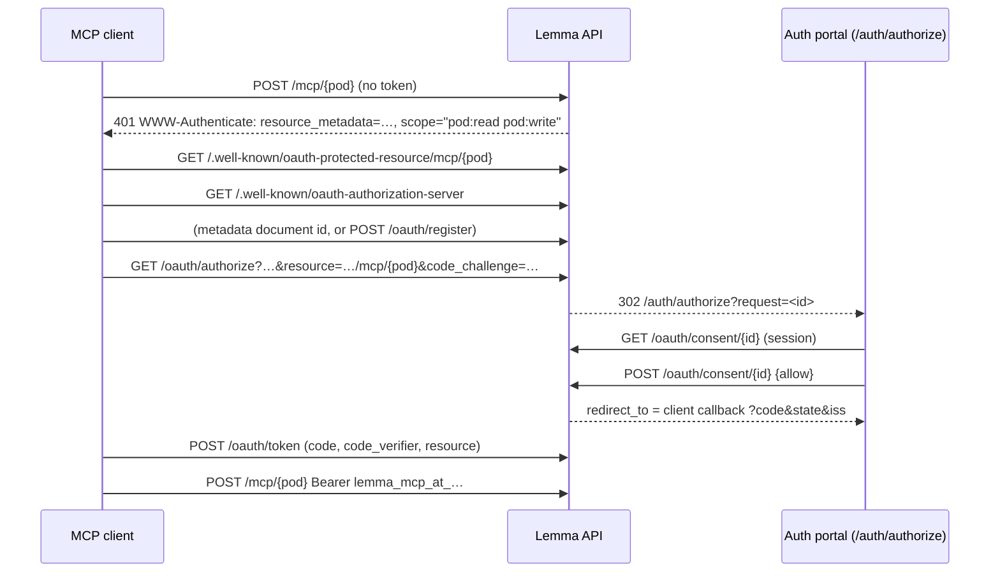

# Pods as remote MCP servers

A person can add one of their pods to Claude (claude.ai, Desktop, Claude Code),
ChatGPT or any other MCP client by URL, sign in to Lemma, and the client then
works in that pod as them: reading and writing its tables and files under the
same permissions and row-level security they have in Lemma.

```
https://<api>/mcp/<pod id>
```

The code is `lemma-backend/app/modules/mcp_access/` (the authorization server,
consent and grants) and `lemma-backend/app/mcp_server.py` (the endpoint). The
consent page is `lemma-frontend/src/auth/mcp-consent-screen.tsx`.

## What the clients require

Checked against each vendor's documentation at the time of writing. The MCP
revision is 2026-07-28.

| Client | How it registers | Redirect URI | What else it needs |
|---|---|---|---|
| Claude (claude.ai, Desktop, mobile) | A client ID metadata document when the server advertises both `client_id_metadata_document_supported` and `"none"` among token endpoint auth methods; dynamic registration otherwise; or a client ID pasted under Advanced settings | `https://claude.ai/api/mcp/auth_callback` | Starts sign-in **only** on a 401 carrying `resource_metadata`. Uses the first authorization server only. The resource in the metadata must equal the URL the person entered. Reaches the server from `160.79.104.0/21`, so the server must be public. Requires `readOnlyHint`/`destructiveHint` on every tool |
| Claude Code | The same metadata document (`https://claude.ai/oauth/claude-code-client-metadata`), dynamic registration, or `--client-id` | `http://localhost:<any port>/callback` | `claude mcp add --transport http <name> <url>`, then `/mcp` or `claude mcp login <name>` |
| ChatGPT (developer mode) | A metadata document (`https://chatgpt.com/oauth/...`) preferred; dynamic registration; pre-registered | `https://chatgpt.com/connector_platform_oauth_redirect` when the server returns `iss`; `https://chatgpt.com/connector/oauth/{callback_id}` otherwise | Token audience equal to the `resource` it sent. `search`/`fetch` tools are needed only to be a "company knowledge" source, not to connect. Tools without `readOnlyHint` are treated as writes and confirmed |
| Any 2026-07-28 client | Pre-registered, then metadata document, then dynamic registration (now deprecated but still the fallback) | Its own | Refuses a server whose metadata lacks `code_challenge_methods_supported`. Sends `resource` on both authorize and token requests. Validates RFC 9207 `iss` |

Sources:
[MCP authorization](https://modelcontextprotocol.io/specification/2026-07-28/basic/authorization),
[client registration](https://modelcontextprotocol.io/specification/2026-07-28/basic/authorization/client-registration),
[streamable HTTP](https://modelcontextprotocol.io/specification/2026-07-28/basic/transports/streamable-http),
[tools](https://modelcontextprotocol.io/specification/2026-07-28/server/tools),
[Claude connector authentication](https://claude.com/docs/connectors/building/authentication),
[adding a custom connector to Claude](https://claude.com/docs/connectors/custom/add-unlisted),
[Claude Code MCP](https://code.claude.com/docs/en/mcp),
[ChatGPT plugin auth](https://developers.openai.com/plugins/build/auth),
[ChatGPT developer mode](https://developers.openai.com/api/docs/guides/developer-mode).

### What an interactive UI (MCP Apps) needs

A tool names a `ui://` resource in `_meta.ui.resourceUri`; the resource is HTML
served with MIME type `text/html;profile=mcp-app`, rendered by the host in a
sandboxed iframe that talks JSON-RPC over `postMessage` (`ui/initialize`, then
`ui/notifications/tool-result` carrying the result). Claude, Claude Desktop,
ChatGPT, VS Code and others render them; ChatGPT also reads its older
`openai/outputTemplate` key as an alias. Sources:
[MCP Apps overview](https://modelcontextprotocol.io/extensions/apps/overview),
[the specification](https://github.com/modelcontextprotocol/ext-apps/blob/main/specification/2026-01-26/apps.mdx),
[client support](https://modelcontextprotocol.io/extensions/client-matrix),
[MCP Apps in ChatGPT](https://developers.openai.com/apps-sdk/mcp-apps-in-chatgpt).

None ships yet; see [not built yet](#not-built-yet).

## Decisions

**An authorization server of our own, on the SDK's handlers.** Three options:

- *SuperTokens' OAuth2 provider recipe.* Available only on SuperTokens' managed
  service, not self-hosted
  ([docs](https://supertokens.com/docs/authentication/unified-login/introduction)),
  which a self-hosted Lemma cannot assume. It also has no dynamic registration
  or metadata documents, and its discovery document omits
  `code_challenge_methods_supported`, which spec-following clients refuse.
- *fastmcp's OAuth proxy.* It proxies an upstream OAuth provider. Lemma's
  identity provider is SuperTokens sessions, which is not one.
- *Our own.* The MCP SDK already implements the HTTP half — authorize, token,
  register and revoke handlers, PKCE, redirect checks, error formats — over a
  provider protocol. `LemmaAuthorizationServer` is that provider. The person
  signs in to Lemma the way they always do; the server only issues tokens.

**One URL per pod.** The URL is the RFC 8707 resource indicator, and the token
is bound to it, so a token for one pod is refused by every other pod. One URL
for all pods, with the pod picked on the consent screen, would save adding a
second connector, but every token would then have the same audience and the
pod would be a fact stored beside it rather than one the client asked for.
`/authorize` without a `resource` naming a pod on this server is refused with
`invalid_target`.

**Both registration methods.** Client ID metadata documents, because Claude and
ChatGPT prefer them. The document is fetched through fastmcp's SSRF-guarded
fetcher, and loopback redirects match any port, which Claude Code relies on.
ChatGPT's document (`https://chatgpt.com/oauth/client.json`) declares
`private_key_jwt`, so a metadata-document client may authenticate at the token
endpoint with an RFC 7523 assertion signed by the keys its document publishes;
the assertion's audience may be the token endpoint or the issuer. A
dynamically registered client cannot use `private_key_jwt`: it has no document
to publish keys in.
Dynamic registration as well, because the spec keeps it as the fallback and
older clients use it. Registered client secrets are stored as SHA-256 digests.

**Tokens are opaque and stored as digests.** Every MCP request already reads
the database to authorize the tool call, so one indexed lookup more buys what a
JWT cannot: revocation takes effect on the next request. Access tokens last an
hour. Refresh tokens last 30 days, rotate on every use, and a rotated refresh
token presented again ends the whole grant (OAuth 2.1 §4.3.1). Tokens carry a
`lemma_mcp_at_` / `lemma_mcp_rt_` prefix, which is how the endpoint tells them
from Lemma session tokens without asking SuperTokens, and how a secret scanner
recognises a leaked one.

**Scopes: `pod:read` and `pod:write`.** The pod tools split cleanly into those
that read and those that write, and a finer set would ask a person to reason
about tools they have never seen. A client granted only `pod:read` is not shown
the writing tools and is refused if it calls one. `offline_access` is accepted
and ignored: refresh tokens are always issued, and the spec asks servers not to
advertise it.

**Authorization is the person's own.** A token resolves to the person and the
pod, and tool calls run exactly as a Lemma session with no delegation claims
does: through the pod's own assistant, which is user-equivalent, so the
person's roles, resource grants and row-level security all apply. Consent
additionally checks that the person can read the pod, as a courtesy refusal at
the door rather than the enforcement. On every request the account's standing
is checked too, so deactivating an account stops its connected clients.

**The toolset is the pod toolset, annotated.** Every tool carries a title and
`readOnlyHint`, `destructiveHint`, `idempotentHint` and `openWorldHint`
(`app/modules/agent/services/pod_mcp_tool_policy.py`). A test fails if a pod
tool has no row there, because a missing row would default a new tool to the
cautious "write" policy silently. For outside clients the `needs_approval`
hand-off is removed from denied results: it points a Lemma agent at
`request_approval`, a tool outside clients do not have, and for someone acting
as themselves a denial is the answer.

**Revocation.** `GET /oauth/grants` lists a person's connected clients (one row
per client and pod, with scopes and when it was last used);
`DELETE /oauth/grants/{id}` ends one and deletes its tokens. A client can also
revoke through `/oauth/revoke`, which ends its whole grant.

**Rate limits.** Per grant, 300 MCP requests a minute
(`MCP_ACCESS_REQUESTS_PER_MINUTE`), answered with 429 and `Retry-After`. Per
source IP, 30 registrations an hour and 60 token requests a minute. Limits fail
open if Redis is unavailable: they protect the service, they do not authorize.

**The Agent Host's mount is unchanged.** The same FastMCP app answers at
`/agent-runtime/pods/{id}/mcp`, where a bad session token is still a JSON-RPC
error, as the Agent Host expects. The public mount answers 401 with the
challenge instead — the only thing that makes Claude start signing in — and
also validates `Origin`, as the transport spec requires.

## The exchange



Pending authorizations (10 minutes) and codes (5 minutes, single use) live in
Redis. Clients, grants and token digests live in `mcp_oauth_clients`,
`mcp_oauth_grants` and `mcp_oauth_tokens`.

## Connecting a client

The URL is `https://<api>/mcp/<pod id>`; `GET /oauth/mcp-endpoint/{pod_id}`
returns it for a signed-in person.

- **Claude**: Customize → Connectors → Add custom connector, paste the URL,
  and leave the OAuth client choice on Claude's own identity. The API must be
  reachable from the public internet.
- **Claude Code**: `claude mcp add --transport http lemma <url>`, then run
  `/mcp` in a session (or `claude mcp login lemma`) and allow access in the
  browser.
- **ChatGPT**: Settings → Security and login → turn on developer mode, then
  add a connector with the URL and choose OAuth.
- **Anything else**: point it at the URL. A client that follows the MCP
  authorization spec needs nothing more.

## Deploying behind a path prefix

`API_URL` may carry a path (`https://lemma.example/api`), with a proxy stripping
the prefix before the API sees it. The pod URL is then `…/api/mcp/<pod id>` and
the issuer `…/api`. Two things must reach the API unchanged, because RFC 8414
and RFC 9728 put them at the host root: `/.well-known/oauth-authorization-server/api`
and `/.well-known/oauth-protected-resource/api/mcp/<pod id>`. Set
`SUPERTOKENS_API_GATEWAY_PATH=/api/st` to match. This is how the connector was
tested against claude.ai and ChatGPT through a single tunnel.

## Not built yet

- **MCP Apps.** A table view for `pod_get_records` and `pod_query` results is
  the obvious first one: a static `ui://lemma/table` resource, linked from both
  tools' `_meta.ui.resourceUri`, rendering the structured result the host
  forwards. It is left out of this change because it needs a real host to
  verify against, and a claude.ai connector needs a publicly reachable API.
- **A Claude Code plugin.** A `lemma` plugin could carry the Lemma skills and
  an `.mcp.json` whose URL is a `userConfig` value (`${user_config.pod_url}`),
  distributed through a marketplace in a public repository
  (`/plugin marketplace add <owner>/<repo>`). `lemma skills install --target
  claude` already installs the skills; the plugin would add the connector
  beside them and make both one install.
- **A product scenario.** The module e2e test drives the whole exchange
  in-process; a `tests/scenarios/` journey over a real socket belongs with a
  product-spec entry for "connect a pod to an outside assistant".
- **A resource check at the token endpoint.** The SDK does not pass the token
  request's `resource` to the provider, so a client that names a different
  resource at the token step than at authorize still gets a token for the one
  it was authorized for. The audience is never wider than what the person
  consented to.
