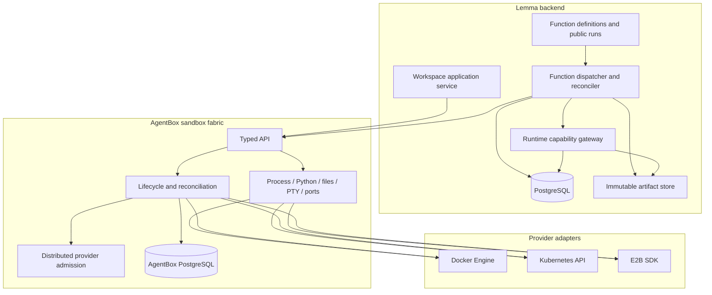
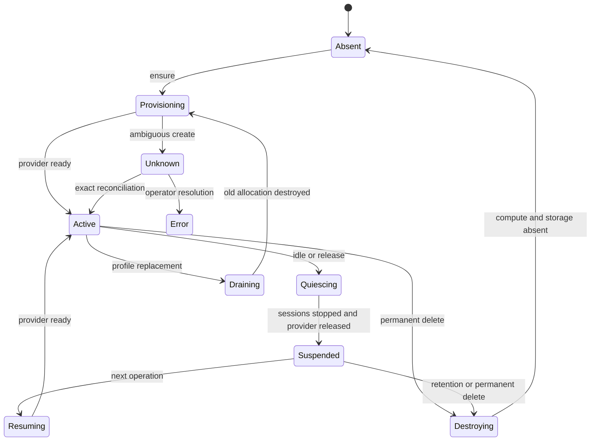
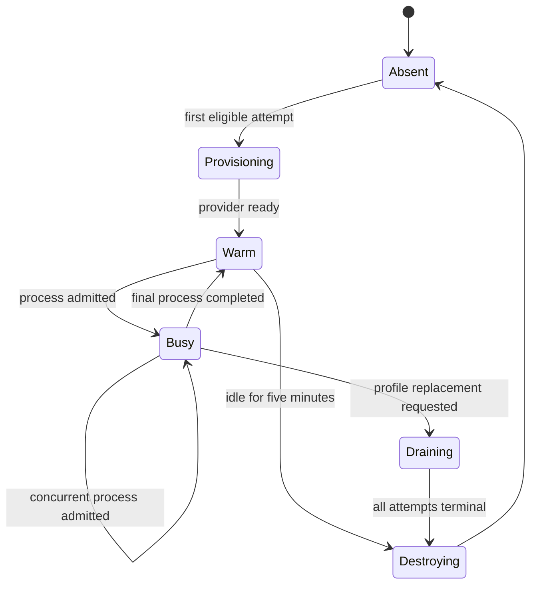

# AgentBox: Sandbox Fabric

**Status:** Proposed design; implementation and conformance in progress

**Date:** 2026-07-22

**Decision owners:** Lemma platform, backend, infrastructure, and security teams

**Canonical design set:**

- [Sandbox protocol](sandbox-protocol.md)
- [Provider adapters](provider-adapters.md)
- [Function execution](function-execution.md)
- [Testing strategy](testing-strategy.md)
- [Verification and rollout](verification-and-rollout.md)

## 1. Executive decision

AgentBox is Lemma's provider-neutral **sandbox fabric**. It owns the parts that
must be implemented once for Docker, Kubernetes, and E2B: provider credentials,
logical-to-physical allocation, lifecycle, capacity admission, generic execution,
filesystem access, stateful Python sessions, terminal processes, application port
access, and reconciliation.

AgentBox is not a function platform. The Lemma backend owns function definitions,
immutable revisions, durable runs, API/JOB scheduling, execution attempts,
priorities, callbacks, cancellation policy, results, and domain events. Function
execution obtains a stateless pod sandbox and starts a generic process through
AgentBox. No function-specific HTTP service, queue, or result cache runs inside a
sandbox.

The design intentionally uses different lifecycle policies for the two workloads:

| Workload | Logical owner | Durable state | Idle action | Physical isolation |
| --- | --- | --- | --- | --- |
| Workspace | User | `/workspace` files | Quiesce and release | One sandbox per user |
| Function | Pod | None | Destroy after five minutes | One sandbox per pod |

The logical identity is a composite key. A UUID is never interpreted without its
workload kind:

```text
(WORKSPACE, user_id)
(FUNCTION, pod_id)
```

The function logical ID is therefore exactly the pod ID without sharing a namespace
with user workspaces. Provider-generated IDs remain private AgentBox data.

## 2. Problem statement

The current implementation couples four independently difficult concerns:

1. provider lifecycle;
2. an HTTP runtime inside every sandbox;
3. user workspace sessions and browser/application routing;
4. function scheduling and execution.

That coupling produces stacked readiness probes, manager and backend polling,
session heartbeats, public gateway routing, nested retries, provider inventory on
hot paths, and an in-sandbox function queue. A provider error can pass through
several retry loops, and an ambiguous operation can be replayed without a single
owner for the decision.

State persistence also obscures those decisions today: SQLite and PostgreSQL paths
contain large duplicated raw-query implementations, lifecycle invariants leak into
database statements, and some tests mutate private connections directly. The
replacement uses one typed SQLAlchemy repository/unit-of-work boundary so orchestration reads as
domain transitions and dialect details remain in one adapter.

E2B's native lifecycle makes the mismatch especially visible. A normal E2B pause
preserves filesystem and memory, `connect()` resumes the same sandbox, and full
memory pause supports activity-driven auto-resume. A filesystem-only pause cold
boots and cannot use auto-resume. Paused sandboxes do not expire automatically.
See [E2B sandbox persistence](https://e2b.dev/docs/sandbox/persistence) and
[auto-resume](https://e2b.dev/docs/sandbox/auto-resume).

AgentBox removes the compensating machinery instead of making it more complex.
Provider adapters use the provider's strongest native data plane. The public
AgentBox protocol describes portable behavior and makes nonportable behavior
explicit.

## 3. Goals

- Give Lemma one internal API for sandbox lifecycle and generic execution across
  Docker, Kubernetes, and E2B.
- Make a warm workspace command a single AgentBox operation plus one provider data
  plane operation.
- Preserve user files across workspace release on every supported provider.
- Keep stateful Python, foreground commands, background processes, stdin, PTY,
  reconnect, files, and application ports coherent across providers.
- Give API functions a bounded low-latency path and JOB functions a durable queued
  path without using a user workspace.
- Ensure one logical create attempt causes at most one provider create request.
- Make deadlines, capacity, unknown outcomes, and retry permission explicit.
- Keep provider SDKs and credentials out of the Lemma backend.
- Run the same behavioral conformance suite against real Docker and E2B
  environments for the initial release. Kubernetes remains specified but cannot be
  enabled until its later conformance program passes.
- Keep AgentBox state transitions readable behind SQLAlchemy repositories and an
  explicit unit-of-work boundary rather than embedding raw SQL in lifecycle logic.

## 4. Non-goals

- Preserving Python variables or running processes across a portable workspace
  release boundary. Files are the portable guarantee.
- Providing persistent files, memory, or process state for functions.
- Providing exactly-once external side effects. Lemma provides fencing and avoids
  unsafe replay; arbitrary external systems remain nontransactional.
- Treating functions within the same pod as mutually hostile. The pod sandbox is
  the default strong boundary.
- Treating ordinary Docker/runc as a production hostile-code boundary.
- Hiding a reusable credential from arbitrary code executing in the same sandbox.
  Such a credential must never enter the sandbox.
- Supporting the current experimental AgentBox API shape. The replacement is an
  atomic internal breaking change.
- Supporting Daytona, Podman, or additional managed providers in the first
  implementation.
- Claiming Kubernetes production support in the initial Docker/E2B delivery. Its
  adapter contract remains designed now, but implementation promotion waits for a
  real disposable-cluster and strong-runtime test program.
- Migrating or adopting experimental AgentBox database rows, workspace files,
  sessions, processes, Docker resources, or E2B sandboxes. Cutover starts from an
  empty AgentBox database and fresh provider allocations.

## 5. Responsibility boundaries



### 5.1 AgentBox owns

- provider API credentials and SDK configuration;
- workload profiles and immutable template/image references;
- logical sandbox records, workspace storage identities, and physical allocations;
- provider create-rate and active-allocation admission;
- ensure, release, destroy, and exact-ID reconciliation;
- command, background process, stdin, PTY, Python, filesystem, and port operations;
- client operation deduplication and provider process references;
- provider lifecycle events and inventory reconciliation;
- normalized provider errors, deadlines, telemetry, and cost attribution.

### 5.2 Lemma workspace module owns

- user authorization and user-to-workspace mapping;
- conversation/session naming and intended working directory;
- short-lived delegated workspace credentials;
- translating agent tool calls into AgentBox operations;
- user-facing output truncation and tool result schemas.

### 5.3 Lemma function modules own

- function definitions, revisions, schemas, grants, and activation;
- artifact build and retention;
- public `FunctionRun` state and API/JOB behavior;
- the durable execution queue and priority policy;
- attempt IDs, fences, deadlines, tickets, callbacks, and terminal outcomes;
- per-pod execution units and API reservation;
- domain completion events and workflow resumption.

AgentBox sees a request to ensure a `FUNCTION` sandbox and start an opaque process.
It does not know whether that process represents an API function, a JOB function,
or another future stateless workload.

## 6. Profiles and artifacts

A profile is immutable configuration selected by name and digest. It defines the
provider template/image, resource class, supported portable capabilities, runtime
ABI, filesystem policy, network policy, and lifecycle policy. The logical sandbox
record stores both the requested profile name and exact digest.

Initial profiles:

### 6.1 `workspace-python-v1`

- Python 3.14 and shell tooling, locked with `uv`;
- Lemma CLI/SDK;
- Node 24 LTS and browser/application tooling locked with `pnpm`;
- stateful Python support;
- reconnectable commands and PTYs;
- `/workspace` as the only durable project root;
- public internet egress with private, link-local, metadata, and provider control
  destinations denied;
- provider-specific persistent workspace storage.

### 6.2 `function-python-v1`

- `lemma-function-runtime` launcher and invocation child;
- exact supported CPython 3.14 ABI and a locked `uv` environment;
- certificate and minimal operating-system runtime dependencies;
- no browser, Node, package installer, compiler, AgentBox runtime HTTP server, or
  persistent volume;
- no public ingress;
- Lemma runtime gateway plus a controlled egress gateway that enforces the
  revision-declared public HTTPS destinations;
- five-minute warm idle period followed by destruction.

A profile update creates a new digest. AgentBox drains the old physical allocation
and creates a replacement. It never mutates an active allocation into a different
profile.

### 6.3 Package and document tooling decision

`uv` and `pnpm` are the only canonical package managers in maintained AgentBox
images and templates. Lock files are release inputs; builds use locked/frozen modes
and never rewrite them. Workspace agents may use those two tools explicitly.
Function sandboxes contain only the resolved environment and do not expose an
invocation-time package installer.

LiteParse remains the workspace document parser. Its installed Node footprint is
about 31 MB. A measured MarkItDown stack was already about 79 MB after MarkItDown,
Magika, ONNX Runtime, pdfminer, lxml, Mammoth, and python-pptx, before all optional
format dependencies, and it would remove OCR, bounding boxes, page structure, and
page screenshots needed by workspace document tools. Replacing LiteParse therefore
increases this image and weakens the capability contract.

## 7. Lifecycle principles

### 7.1 Workspace lifecycle



- Running idle timeout: five minutes.
- Release first blocks new work, drains active operations, terminates managed
  sessions/processes, clears ephemeral credentials and browser state, then invokes
  the provider release primitive.
- `/workspace` files survive release.
- Session and process continuity is not portable across release.
- Suspended retention is seven days; activity during that period resumes the
  logical workspace.
- Permanent delete removes every exact physical allocation and the durable storage.

### 7.2 Function lifecycle



Function allocations are never suspended. They may cache verified artifacts while
warm, but no correctness path depends on the cache. After five idle minutes the
allocation is destroyed on every provider.

## 8. Reliability principles

1. **One owner per decision.** AgentBox decides provider create/release/destroy
   retries. The function dispatcher decides run replay. Backend callers do neither.
2. **One deadline.** Every operation carries an absolute UTC deadline. Nested
   components derive their remaining timeout and never reset the caller's budget.
3. **Create once.** Persist an allocation token before provider create. Dispatch
   exactly once for that token.
4. **Unknown is a real outcome.** If acceptance cannot be proved or disproved, keep
   the attempt fenced and reconcile it. Do not convert uncertainty into recreation.
5. **No hot-path inventory.** Exact stored provider identity is used for normal
   operations. Inventory, webhooks, and metadata queries repair background state.
6. **No semantic retry from HTTP status alone.** Typed error provenance determines
   retry permission.
7. **No heartbeat protocol.** Active AgentBox operations and provider timeouts cover
   liveness. Long operations set their timeout once from the absolute deadline.
8. **No function polling in healthy execution.** Runtime callbacks complete durable
   attempts. Inspection exists for reconciliation and cancellation only.

## 9. Security invariants

- One physical allocation belongs to one logical sandbox and workload kind for its
  entire lifetime.
- One function allocation belongs to exactly one pod.
- Provider credentials never enter a sandbox or the Lemma backend.
- Reusable human access/refresh tokens never enter function sandboxes.
- Workspace credentials are short-lived, session-scoped, and removed before
  release.
- Function execution receives only a single-use attempt ticket over stdin.
- Function public ingress is disabled.
- Private, link-local, metadata, cluster-control, Docker socket, and provider-control
  networks are unavailable to user/function code.
- Kubernetes function Pods mount no service-account token and no persistent volume.
- Docker is development/conformance only for untrusted multi-tenant execution.
- Kubernetes production uses an approved sandbox `RuntimeClass`, initially gVisor
  or Kata.
- Every callback and terminal transition is conditional on `(attempt_id, fence)`.

## 10. Source-of-truth rule

This directory is the sole target-architecture source of truth for AgentBox and
sandbox-backed function execution. Module READMEs may summarize ownership and link
here, but must not restate lifecycle, retry, provider, or execution protocol rules.

The implementation is not complete merely because it matches one document in this
set. It must satisfy the protocol, all three provider mappings, function execution
invariants, and the acceptance gates together.

## 11. Glossary

| Term | Meaning |
| --- | --- |
| Logical sandbox | Stable `(workload_kind, logical_id)` requested by a caller |
| Physical allocation | One provider-created container, Pod, or E2B sandbox |
| Workspace storage | Durable `/workspace` content owned by one logical workspace, independent of a replaceable allocation where the provider permits |
| Allocation token | AgentBox-generated unique identifier for one create attempt |
| Allocation epoch | Monotonic logical incarnation used to fence sessions/processes |
| Profile | Immutable workload image/template, capabilities, and policies |
| Operation ID | Caller-generated identifier for one process-start intention |
| Provider process ID | Opaque provider-native process or runtime reference |
| Release | Stop workspace compute while preserving workspace files |
| Destroy | Permanently remove a physical allocation; for workspace delete, storage too |
| Attempt | One durable function execution dispatch protected by a fence |
| Unknown outcome | Dispatch may have happened but cannot yet be conclusively observed |
| Execution unit | Backend scheduling weight inside one function pod sandbox |
| Runtime gateway | Trusted backend API for ticket claim, artifact access, callbacks, and SDK operations |
| Egress gateway | Trusted proxy that enforces an attempt's revision-declared public HTTPS destinations |
