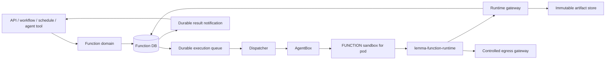
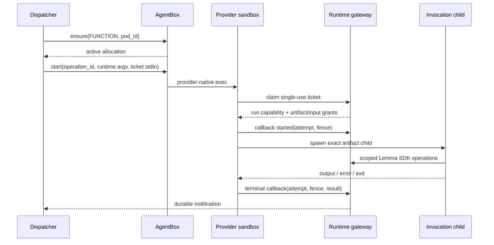

# AgentBox Function Execution Plane

**Status:** Proposed design; backend execution plane implementation in progress

**Parent:** [AgentBox](README.md)

**Sandbox dependency:** [Sandbox protocol](sandbox-protocol.md)

**Execution test contract:** [Testing strategy](testing-strategy.md)

## 1. Executive decision

The Lemma backend owns a durable function execution plane. It obtains one stateless
AgentBox sandbox per pod and uses AgentBox's generic process port to start an
immutable `lemma-function-runtime` launcher. The execution plane does not provision
a user workspace, mint a reusable user token, expose a function HTTP server, or
place a second queue inside the sandbox.

API and JOB are scheduling policies over the same durable run/attempt model:

- API runs enter the highest-priority lane and the HTTP caller waits for the durable
  terminal result under its deadline.
- JOB runs enter the background lane and immediately return `PENDING`.
- API capacity is reserved inside each pod sandbox so queued/running JOB work cannot
  consume every slot.

The default trust boundary is the pod. All functions defined by one pod may share
the same physical sandbox and warm artifact cache. Different pods never share an
allocation, writable filesystem, process namespace, or run capability.

## 2. Components and ownership



| Component | Responsibility | Executes user code? |
| --- | --- | ---: |
| Function domain | Definition, grants, schemas, revisions, public runs/events | No |
| Revision builder | Lock dependencies and produce immutable artifacts | Only in isolated build sandbox |
| Execution queue | Durable priority, eligibility, leases | No |
| Dispatcher | Admission, attempts, AgentBox calls, deadlines, cancellation | No |
| Reconciler | Expired leases, unknown attempts, stale allocations, missing events | No |
| Runtime gateway | Ticket claim, artifact grant, SDK operations, callbacks | No |
| Controlled egress gateway | Attempt-bound public HTTPS policy enforcement | No |
| AgentBox | Provider allocation and generic process control | No |
| Runtime launcher | Validate ticket/artifact, start and supervise child | No direct user import |
| Invocation child | Import exact revision and invoke entrypoint | Yes |

## 3. Domain model

### 3.1 Function revision

A function update creates an immutable revision. Mutable function metadata points to
one active revision only after its artifacts and schemas are ready.

```python
class FunctionRevisionStatus(StrEnum):
    DRAFT = "draft"
    BUILDING = "building"
    READY = "ready"
    FAILED = "failed"
    RETIRED = "retired"


class FunctionRevision(BaseModel):
    revision_id: UUID
    function_id: UUID
    pod_id: UUID
    source_digest: str
    dependency_lock_digest: str
    artifact_digest: str | None
    runtime_abi: str
    builder_digest: str
    entrypoint: str
    input_schema: dict
    output_schema: dict
    resource_class: str
    egress_policy: EgressPolicy
    idempotency: Literal["not_declared", "idempotent"]
    status: FunctionRevisionStatus
```

`EgressPolicy` is immutable revision metadata. Initially it is either `none` or a
canonical set of exact public DNS names reachable only over HTTPS port 443. IP
literals, private names, arbitrary wildcards, arbitrary TCP/UDP, and caller-supplied
destinations are rejected. Any future wildcard or non-HTTPS form requires a
versioned policy schema and new security conformance evidence.

The execution attempt always stores the exact `revision_id` and `artifact_digest`.
It never fetches "current function code" after dispatch.

### 3.2 Public run

The existing public `FunctionRun` remains the caller-visible aggregate:

```text
PENDING -> RUNNING -> COMPLETED | FAILED | CANCELLED | TIMED_OUT | INDETERMINATE
```

`INDETERMINATE` means code may have executed but a safe terminal result cannot be
established. It is not silently converted to `FAILED`, because that would invite an
unsafe replay.

Public runs add or retain:

```text
run_id
function_id / revision_id / pod_id
invoking principal and audit actor
type = API | JOB
input and output references
deadline_at
status and error code
current_attempt_id
idempotency_key nullable
created / started / completed timestamps
```

### 3.3 Attempt

```python
class AttemptStatus(StrEnum):
    CREATED = "created"
    QUEUED = "queued"
    CLAIMED = "claimed"
    ALLOCATING = "allocating"
    DISPATCHING = "dispatching"
    UNKNOWN = "unknown"
    STARTED = "started"
    SUCCEEDED = "succeeded"
    FAILED = "failed"
    CANCELLED = "cancelled"
    TIMED_OUT = "timed_out"
    INDETERMINATE = "indeterminate"


class FunctionAttempt(BaseModel):
    attempt_id: UUID
    run_id: UUID
    fence: int
    operation_id: UUID
    status: AttemptStatus
    artifact_digest: str
    profile_digest: str
    agentbox_allocation_id: UUID | None
    agentbox_allocation_epoch: int | None
    agentbox_process_id: str | None
    ticket_id: UUID
    execution_units: int
    deadline_at: datetime
    lease_owner: str | None
    lease_expires_at: datetime | None
    started_at: datetime | None
    completed_at: datetime | None
    last_error_code: str | None
```

`operation_id` is stable across reconnect/reconciliation of one attempt. A new
attempt receives a new operation ID and higher fence.

## 4. Persistence model

Function execution state lives in the Lemma backend PostgreSQL database, not the
AgentBox database and not Redis as the sole source of truth.

### 4.1 `function_revisions`

Stores immutable source/build identity, entrypoint, schemas, policy, status, and
activation timestamps. Unique identity includes:

```text
source digest
dependency lock digest
runtime ABI
builder digest
```

### 4.2 `function_revision_artifacts`

Stores artifact digest, object key, size, signature/attestation, platform tags,
build logs, vulnerability-policy outcome, and retention state.

### 4.3 `function_execution_queue`

```text
queue_id                  PK
run_id                    unique FK
pod_id
priority                  API > JOB
not_before
deadline_at
execution_units
state                     queued | leased | terminal
lease_owner / lease_expires_at
created_at / updated_at
```

Run and queue row are inserted in one transaction. PostgreSQL `FOR UPDATE SKIP
LOCKED` claims eligible rows. An index orders by priority descending, creation time,
and deadline. Redis notification may wake workers, but losing Redis never loses work.

### 4.4 `function_run_attempts`

Stores the attempt model above with a unique `(run_id, fence)` and unique
`operation_id`. State transitions use compare-and-set predicates over current fence
and allowed source state.

### 4.5 `function_pod_capacity`

```text
pod_id                    PK
allocation_id / epoch     nullable
profile_digest
total_units               default 8
api_reserved_units        default 2
api_units_in_use
job_units_in_use
last_activity_at
version
```

Capacity acquisition and attempt lease occur transactionally. Counters are repaired
from nonterminal attempts by the reconciler.

### 4.6 `function_execution_tickets`

Stores only a hash of the single-use ticket secret plus attempt, fence, expiry,
claim state, and policy. The clear ticket exists only in the dispatcher request body
and runtime stdin. Claim is atomic and irreversible.

## 5. Revision build and activation

Invocation never resolves or installs packages. A revision reaches `READY` only
after:

1. source is normalized and hashed;
2. runtime metadata and entrypoint are validated;
3. dependencies are resolved to a complete hash-locked set;
4. required wheels are obtained or built in an isolated builder;
5. schemas are extracted in an isolated process without backend credentials;
6. source, wheels, lock, metadata, and bootstrap are packaged;
7. the artifact digest is computed and signed/attested;
8. vulnerability and policy checks pass;
9. the artifact is uploaded under its content digest;
10. activation atomically points the function to the ready revision.

An artifact layout is provider-neutral:

```text
manifest.json
source/
dependencies/
bootstrap/
schemas/input.json
schemas/output.json
attestation.json
```

`manifest.json` binds every file digest, runtime ABI, builder digest, entrypoint, and
policy. The runtime verifies the complete manifest before execution.

Build failure leaves the old active revision unchanged. Historical runs continue to
reference their exact revision even after a later activation.

## 6. Scheduling and admission

### 6.1 Priority

Initial priorities:

```text
API = 100
JOB = 10
```

The dispatcher always claims the highest-priority eligible row. Within equal
priority it uses earliest deadline, then FIFO creation time. Running jobs are not
preempted.

### 6.2 Weighted pod capacity

Default sandbox capacity is eight units:

- standard function: two units;
- qualified small I/O function: one unit;
- larger resource classes declare higher weight or a dedicated allocation later.

Two units are reserved for API. Admission rules:

```text
API may use any free units.
JOB may start only when job_units_in_use + requested_units <= 6.
No work starts when total units would exceed 8.
```

Therefore four standard API calls may overlap, while at most three standard JOBs
can occupy the sandbox, preserving one standard API slot.

Capacity is backend state. AgentBox independently admits physical allocations
against provider-wide concurrency/create-rate limits. These are complementary, not
duplicate queues.

### 6.3 API behavior

1. Authorize execution and validate input against the active revision.
2. Insert public run, queue row, and notification key transactionally.
3. Wake the dispatcher.
4. Await durable terminal-state notification under the API deadline.
5. On notification loss, read the run once from PostgreSQL; do not poll AgentBox.
6. Return the terminal result or a typed timeout/capacity response.

API runs still use the durable queue so an API process crash does not create an
untracked sandbox attempt. They receive priority rather than bypassing correctness.

### 6.4 JOB behavior

JOB submission commits the run and queue row and returns `PENDING`. A worker later
claims and dispatches it. There is no second in-sandbox queue and no worker loop
polling a function HTTP endpoint.

### 6.5 AgentBox allocation

For a claimed attempt, the dispatcher calls:

```text
ensure key=(FUNCTION, pod_id)
profile=function-python-v1@<digest>
admission_class=latency for API, batch for JOB
deadline_at=attempt.deadline_at
```

The same active allocation is reused for the pod. If absent, AgentBox provisions it.
If provider capacity is unavailable:

- API remains highest priority but cannot bypass a hard provider quota; it waits
  only inside its deadline and then returns typed capacity failure;
- JOB releases/renews its queue lease and remains queued with `not_before` set from
  AgentBox retry-after.

## 7. Attempt ticket and runtime gateway

### 7.1 Ticket envelope

The dispatcher generates a random, single-use ticket and sends only this envelope to
AgentBox process stdin:

```json
{
  "protocol": "lemma-function-runtime/v1",
  "ticket": "<opaque single-use secret>",
  "attempt_id": "<uuid>",
  "fence": 1,
  "deadline_at": "2026-07-22T12:30:00Z"
}
```

The envelope contains no reusable user token, provider credential, source, input,
connector secret, or artifact URL.

### 7.2 Atomic claim

The runtime calls the trusted gateway over TLS and presents the ticket. Claim:

- hashes and compares the secret;
- verifies unclaimed state, attempt/fence, profile/runtime ABI, and deadline;
- atomically marks it claimed;
- returns a short-lived run capability, artifact grant, attempt-bound egress proxy
  capability, input reference/value, exact manifest digest, execution identity, and
  policy.

Once claimed, the attempt may have executed side effects even if every later
callback is lost. Automatic provider fallback/replay is therefore forbidden unless
the revision declares idempotency.

### 7.3 Run capability

The run capability is not a Lemma user session. It is accepted only by the runtime
gateway and authorizes:

```text
attempt and fence
pod and function revision
function principal and invoking audit actor
approved Lemma resource operations/scopes
log/result callbacks
deadline and revocation
```

It cannot refresh itself, invoke another function, change pod/principal, access
provider APIs, or outlive the attempt.

The Lemma Python SDK inside the invocation binds to the gateway using this capability
and preserves current high-level datastore/file/connector APIs. Connector secrets
remain in the trusted connector/control plane; the function receives results, not
stored account credentials.

The egress capability is separate from the run capability. It is accepted only by
the controlled egress gateway, is bound to `(attempt_id, fence, revision_id,
egress_policy)`, expires at the attempt deadline, and is revoked with the attempt.

## 8. Runtime protocol

### 8.1 Command surface

The immutable function image exposes:

```text
lemma-function-runtime execute
lemma-function-runtime inspect --operation-id <uuid>
lemma-function-runtime cancel --operation-id <uuid> --grace-seconds <n>
lemma-function-runtime health
```

`execute` reads exactly one JSON envelope from stdin, validates framing/size, and
never accepts secrets through argv or environment.

### 8.2 Execution sequence



The launcher:

1. claims ticket before downloading data;
2. creates an attempt-private directory;
3. fetches artifact by signed grant/content digest;
4. verifies digest, manifest, ABI, and attestation;
5. populates/uses a verified warm cache keyed by artifact digest;
6. starts one invocation child in a new process group;
7. applies resource/output/deadline constraints;
8. streams bounded logs to the gateway with monotonically increasing sequence;
9. captures and validates the structured result;
10. sends terminal callback before cleanup;
11. kills descendants and removes attempt-private writable state.

The launcher does not import the user module into its own interpreter.

### 8.3 Input and result limits

Small input/output values travel through the gateway response/callback. Larger
payloads use short-lived object grants and content digests. Initial limits are
configuration, but the protocol requires:

- bounded claim and callback JSON bodies;
- bounded stdout/stderr/result independently;
- truncation metadata rather than unbounded buffering;
- UTF-8 replacement/sanitization for text logs;
- binary data through object/file APIs, not JSON strings;
- output-schema validation before public completion.

### 8.4 Warm cache

The cache is keyed only by verified artifact digest and runtime ABI. It is read-only
to invocation children. Population uses a temporary directory plus atomic rename and
a final verified marker. A failed/timed-out population is removed.

Because function sandboxes are destroyed after five idle minutes and Kubernetes
Pods have no PVC, cache hits are opportunistic. The same attempt must succeed from an
empty cache with identical behavior.

## 9. Completion, retries, and unknown outcomes

### 9.1 Terminal callback

Terminal callback includes:

```text
attempt_id / fence
status
started/completed timestamps
artifact digest
exit code or signal
structured result reference
bounded log references and truncation flags
resource usage
runtime/provider correlation IDs
```

Gateway handling is idempotent. It updates an attempt only when the fence matches
and the source state permits the transition. In the same transaction it updates the
public run, releases execution units, and writes the existing domain-event outbox
entry.

Duplicate callbacks return the stored acknowledgment. A late callback from an old
fence is recorded for audit and cannot change public state.

### 9.2 Retry matrix

| Failure point | Default action |
| --- | --- |
| Before queue claim | Remain/requeue under same run |
| AgentBox definitive pre-create rejection | Wait/requeue within deadline |
| AgentBox ambiguous create | Wait for same allocation operation; never ensure a second one |
| Process definitively not dispatched | Retry same AgentBox operation ID if disposition permits |
| Process dispatch unknown | Inspect same operation and await ticket/callback; no second start |
| Ticket unclaimed and sandbox proved absent | Create a new attempt/fence if deadline permits |
| Ticket claimed or possibly claimed | No automatic replay unless revision is declared idempotent |
| User-code failure | Terminal `FAILED`; no platform retry |
| Timeout | Cancel exact process group and terminal `TIMED_OUT` |
| Lost terminal callback | Reconcile runtime/process/attempt; never infer safe replay from silence |

For a declared idempotent revision, automatic replay creates a new attempt and fence
while retaining the same public run and logical idempotency key. The function must
use that key when calling external systems; declaration does not make arbitrary side
effects transactional.

### 9.3 Indeterminate terminal state

An attempt becomes `INDETERMINATE` when:

- its ticket was or may have been claimed;
- provider/runtime/callback state cannot establish a terminal result;
- the deadline plus reconciliation grace expired;
- replay is not authorized.

The public run surfaces the state and an operator-safe diagnostic. Workflows receive
a failure/indeterminate completion event and do not silently continue as success.

## 10. Deadlines and cancellation

API default deadline remains 120 seconds and JOB default remains 600 seconds unless
the immutable revision/resource policy specifies a lower allowed maximum.

One absolute deadline flows through queue, AgentBox ensure, process start, ticket,
runtime, child, and callbacks. Queue time counts against the deadline.

Before a long attempt, AgentBox sets provider lifetime past the attempt deadline plus
termination grace. No periodic sandbox heartbeat is used.

Cancellation:

1. atomically mark cancel requested for current fence;
2. revoke unclaimed ticket or run capability;
3. call AgentBox terminate for the exact operation ID;
4. runtime sends TERM to the attempt process group;
5. after grace, runtime/provider sends KILL;
6. verify descendants are gone;
7. conditionally persist terminal `CANCELLED` and release units.

If termination cannot be confirmed, return `termination_confirmed=false`, keep the
attempt under reconciliation, and never report successful cancellation while code
may still run.

## 11. Network and security policy

### 11.1 Default egress

The sandbox network permits direct connections only to:

- the Lemma runtime gateway;
- the controlled HTTPS egress gateway; and
- the resolver needed to locate those gateways.

There is no direct sandbox route to a revision-declared internet destination. The
launcher passes the invocation child an attempt-bound proxy endpoint and egress
capability using the standard HTTPS proxy mechanism. The egress gateway:

- authenticates the capability and loads the immutable revision policy;
- accepts only HTTPS `CONNECT` to exact declared DNS names on port 443;
- resolves the name itself on every new connection;
- rejects any public name whose resolved address is private, loopback, link-local,
  multicast, documentation, reserved, metadata, provider-control, or cluster space;
- applies connection, byte, concurrency, and deadline limits; and
- records attempt-attributed destination/audit metadata without logging secrets.

Redirects to another host require another proxy connection and are therefore checked
against the same allowlist. Disabling or bypassing proxy settings cannot grant wider
access because the provider network denies direct internet connections. Provider
adapters configure only this upstream restriction; revision policy evaluation lives
in the one backend-owned egress gateway so behavior is identical across providers.

Always deny:

- RFC1918, loopback outside the sandbox, link-local, and IPv6 private ranges;
- cloud metadata endpoints;
- Kubernetes API/service networks and cluster DNS names outside the controlled
  resolver;
- AgentBox, database, Redis, object storage control endpoints, Docker/containerd
  sockets, and provider APIs;
- arbitrary inbound traffic.

Policy matching occurs before resolution and IP classification occurs after every
resolution, preventing DNS rebinding from turning an allowed name into access to a
denied network. IP literals are not valid v1 declarations.

### 11.2 Sandbox contents

Function environment/argv/files must not contain:

- human access or refresh tokens;
- AgentBox API key;
- E2B, Kubernetes, Docker, cloud, or object-store credentials;
- Kubernetes service-account token;
- connector account secrets;
- a reusable artifact URL.

The run capability may be used by arbitrary function code; its safety comes from
least authority, single-run binding, expiry, audit attribution, and revocation—not
from trying to hide it from that code.

### 11.3 Same-pod trust

Functions within one pod are mutually trusted by product decision. Invocation
children still use separate process groups, temporary directories, output limits,
and resource accounting to contain accidents. A future per-invocation isolation
tier must use a new profile/allocation key and cannot weaken the default cross-pod
boundary.

## 12. Reconciliation

The backend reconciler handles:

- expired queue and attempt leases;
- attempts past deadline;
- `ALLOCATING`, `DISPATCHING`, or `UNKNOWN` attempts without progress;
- claimed tickets missing `started` callback;
- started attempts missing terminal callback;
- AgentBox allocation/process disappearance;
- stale capacity counters;
- terminal runs missing outbox completion events;
- pod allocations idle beyond five minutes when AgentBox cleanup did not complete.

It inspects durable attempt/ticket state first and AgentBox exact operation state
second. It does not list provider sandboxes or call provider SDKs.

## 13. Public compatibility

Function definition and invocation APIs remain conceptually compatible:

- API functions return terminal output synchronously when completed within deadline;
- JOB functions return a pending run and are observed through existing run APIs;
- agents continue exposing ready functions as typed tools;
- workflows/schedules continue consuming completion events;
- function grants and RLS attribution remain function-principal based.

Intentional public additions:

- immutable revision identity on function/run responses;
- `INDETERMINATE` run status;
- typed capacity, build, artifact, sandbox, timeout, and cancellation errors;
- optional idempotency key and declared revision idempotency;
- queue/allocation/execution timing fields for diagnostics.

No public response exposes AgentBox allocation ID, provider ID, provider token, or
runtime capability.

## 14. Operational telemetry

Trace chain:

```text
public run_id
attempt_id / fence
queue_id
pod_id / revision_id / artifact_digest
AgentBox operation_id
AgentBox allocation_id / epoch
provider and internal provider process reference
```

Required timing spans:

- authorization/run creation;
- queue wait and capacity wait;
- AgentBox allocation wait (warm/cold);
- process start acknowledgment;
- ticket claim;
- artifact cache/download/verify;
- child start and user execution;
- callback persistence and caller notification.

Required metrics:

- runs/attempts by type/status/error;
- queue age by API/JOB and pod;
- execution units used/reserved;
- warm/cold allocations and cache hit rate;
- unknown/indeterminate outcomes;
- duplicate callback and stale-fence rejection;
- timeout/cancellation confirmation latency;
- platform overhead separated from user duration;
- artifact build/activation latency and failure reason.
