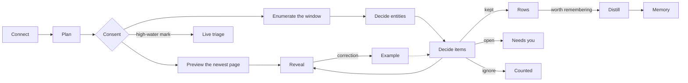
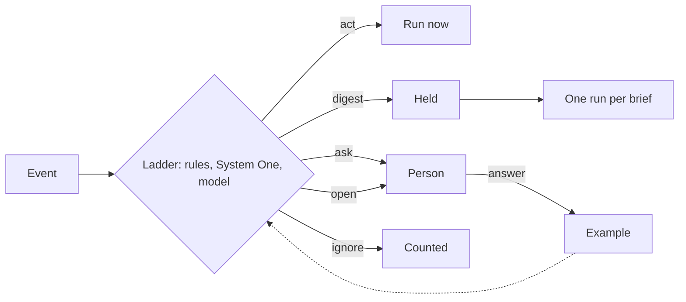

# Decisions

Status: proposal, 2026-10-01, partly built. §12 says what exists and where the
build departs from this text.
Companions: [usage accounting](usage-accounting.md) for how a decision is
charged, [product analytics](product-analytics.md) for the privacy boundary.

A **decision** is a closed-set question asked about one piece of state:
*which of these*, *yes or no*, or *how much, on this scale*. It is cheap and
fast enough to ask about every event, it is written down, and a person can
correct it. It sits between a rule, which is free and understands nothing, and
an agent run, which understands everything, costs the most and always acts.

This document defines decisions as one primitive with five parts:

1. **Questions**: what a judgement looks like.
2. **Deciders**: a judgement worth naming, versioning and reusing.
3. **The ladder**: rules, then System One, then a language model. Each rung
   answers or passes the question on.
4. **Decisions**: the record of one answer.
5. **Examples**: people's answers, which teach every rung.

Every part of Lemma then asks through one contract: bringing a person's data in
when they connect an account, triage, approvals, channels, schedules,
workflows, apps, and every agent or LLM, including ones reaching a pod over MCP.

## 1. Why

Lemma already makes decisions in many places, each built its own way, and
skips one it should be making:

| Where | The question | How it is answered today | What it becomes |
|---|---|---|---|
| Connecting an account (`connectors/domain/events.py`) | What in this person's history should their teammate know? | Never asked. Connecting records `connector.connected`, which only analytics reads | A backfill: source deciders over metadata, routed into tables, Needs you and memory (§5) |
| Schedule filter (`schedule/infrastructure/adapters/system_model_filter.py`) | Should this event fire? | One system-model call per event; the reason is discarded; a rejected webhook event is not recorded | An inline yes/no decider |
| Voice router (`lemma-frontend/src/call/jev-router.ts`) | Is this utterance work, and for which conversation? Should this event be spoken? | Typesafe System One, in the frontend only; no fallback without a key | A system decider with dynamic options |
| Approval replies (`agent/services/interaction_reply.py`) | Is "yeah go ahead" consent? | Exact phrases; anything else is passed to the agent as the person's words | The same phrases become the rules rung of a system decider |
| Chat setup steps (`agent_surfaces/services/chat_onboarding.py`, `onboarding_pod_choice.py`) | Did they give an email, want a new code, pick a pod? | Exact words, a six-digit match, `new <name>` or a list number; anything else re-sends the prompt | The rules rung of `setup_reply`, with the upper rungs behind it (§6.3) |
| Surface admission (`agent_surfaces/domain/entities.py`) | Answer, or stay silent? | DM, owned thread, or @mention | Rules rung; System One only where a surface opts in to speaking up |
| Workflow `DECISION` node (`workflow/execution/executors/decision.py`) | Which branch? | First truthy JMESPath rule | Rules rung, with an optional question behind it |

Backend paths are relative to `lemma-backend/app/modules/`. Four things
follow from this table:

- **Connecting an account brings nothing in.** The web flow ends on
  "Connected." (`lemma-frontend/src/connect/round-trip.ts`), and history
  reaches a pod only by hand:
  - an agent pages through `run_connector_operation` in its own context,
    where a result over 50,000 characters comes back as a note that it was
    too large, and every page is replayed on each later turn
    (`agent/tools/tool_payload_limits.py`);
  - or it scripts `lemma connectors run` in its sandbox, with no progress,
    pacing, consent or record.

  Bundle import brings a pod's structure and seed rows, never a person's
  history (`pod_bundle/domain/state.py`). The one working precedent is outside
  this repository: the shipyard pod's seed script pulls real GitHub events
  with `gh`, shapes each into the payload its automations receive, and wakes a
  whole agent run per item.
- **Every existing gate is either blind or expensive.** The only backend
  judgement that understands language is the schedule filter. It costs a full model call
  per event, and it records nothing when it says no, which contradicts
  PS-SCHED-012 (`ScheduleRunStatus.FILTERED` is never written).
- **Classifying costs a whole agent run.** The builder skill's idiom for
  classifying in a workflow is an AGENT step followed by a DECISION on its
  confidence: a task conversation to choose a branch. A function or an app has
  no model capability except running an agent.
- **Chat setup and channels match exact text.** A person on WhatsApp who
  answers "the bakery one" or "yes but later" falls out of the flow.

## 2. The model

### 2.1 Question

A question is the type of a judgement. It is plain data, so a person, an LLM
or code can write one:

```ts
type Question =
  | { type: "choice";       prompt: string; options: Options; fallback?: OptionKey }  // exactly one
  | { type: "multi_choice"; prompt: string; options: Options }                        // any number
  | { type: "yes_no";       prompt: string; yes?: string; no?: string }
  | { type: "scale";        prompt: string; levels: string[] }                        // 2 to 10, low to high

type Options = Record<OptionKey, string | {
  description: string;   // what this option means
  not_for?: string;      // what it must not be used for
  examples?: string[];   // written with the definition
}>;
```

Some things a question never does:

- **It never produces free text.** Extracting fields, summarising and writing
  are jobs for a model that has already been told the thing matters. Closed
  sets are also what bound prompt injection (§8).
- **Its options can be passed with the call** as well as declared. That is how
  one definition answers "which of these?" over the person's pods, the open
  conversations, or the options of a question already put to them.
- **Its options have the same shape as `ask_user`'s**, a key and a
  description. A question a machine could not answer can therefore be put to a
  person verbatim, and a person's typed reply to an `ask_user` question can be
  interpreted by a question.

### 2.2 Decider

A decider is a named, versioned, reusable definition. Think of it as a function
you teach instead of write: it has a typed input and a closed output, and it
can be called from everywhere a function can.

```yaml
name: email-triage
description: What Kit does with each new email in the support inbox.
guidance: >
  Kit files vendor invoices and answers customers about orders.
  Pricing exceptions and anything legal go to a person.
input:
  fields: [from, subject, snippet, labels]   # only these reach an engine
  max_chars: 4000
questions:
  action:
    type: choice
    prompt: What should Kit do with this email?
    options:
      act: A customer is waiting, or an invoice needs filing.
      digest:
        description: Worth knowing, not urgent. Updates, receipts, FYIs.
        not_for: Anything a customer is waiting on.
      ask: Needs a person. Pricing exceptions, legal, anything personal.
      ignore: Newsletters, promotions, automated notices.
    fallback: ask
rules:
  - when: "contains(labels, 'CATEGORY_PROMOTIONS')"
    answer: { action: ignore }
policy:
  lane: ambient
  escalate_to_model: true
```

The `policy` holds what a caller gets when it says nothing: the lane (a
backfill asks the same decider in the bulk lane), whether a question System
One leaves open climbs to the model, how concentrated System One's answer must
be to count, and the token budget for examples in each request.

Deciders come in two scopes:

- **System deciders** ship with Lemma. They live in the repository, are
  versioned with releases and evaluated in CI. They serve chat setup,
  approvals, channels and voice, some of which run before a pod exists, and
  they are the per-source defaults a backfill starts from (§5.5).
- **Pod deciders** are pod resources. They are written by people or agents, sit
  under the same permissions as functions (`decider.read`, `.create`,
  `.update`, `.delete`, `.execute`), and travel in bundles without their
  learned examples.

The `input` view is part of the definition. The fields listed are the only
part of the state an engine ever sees. This is how a decider is kept both
accurate and minimal: the triage decider above never sends an email body to
anyone.

A caller can also pass questions inline without naming a decider. An inline
call is a decider with no name, no versions and nothing learned. The schedule
filter and one-off agent calls use it.

### 2.3 The ladder

Each question climbs until something answers it:

1. **Rules.** Deterministic matchers declared on the decider: exact phrases,
   patterns, or JMESPath over the rendered state. They are free and instant.
   Today's gates, such as the approval phrases, the pod-choice numbers and the
   JMESPath branches, become this rung. They are not removed; they go first.
2. **System One.** Typesafe's System One endpoint, model Jev, when a key is
   configured. It returns a probability per option. It passes the question on
   (*abstains*) when its answer is not concentrated enough for the decider's
   policy.
3. **A language model.** Structured output on the system profile. It returns an
   option and no distribution, and it abstains by choosing the fallback option.

Questions still open at a rung are asked together, in one request to that
rung.

A rung that is not available is skipped:

- With no Typesafe key, the ladder is rules then the model.
- An organization that opts out of third-party engines gets the same.
- Voice never climbs from System One to the model, because it has no time for
  a second opinion. On a deployment with no key, the model is its only engine.

There is no provider mode switch. A deployment without a key gets the same
behaviour, just slower and without distributions.

People are not a rung inside a decision. They **resolve** what the machines
pass on (§2.5), through whatever way the caller already has of asking a
person.

### 2.4 Decision

A decision is the record of asking a decider, or inline questions, about one
state:

```ts
type Decision = {
  id: DecisionId;
  decider: { name: string; version: number } | null;   // null when inline
  subject: SubjectRef;          // the schedule event, workflow step, message, row, interaction or call,
                                // or a connector item or entity
  answers: Record<QuestionKey, {
    value: OptionKey | OptionKey[] | boolean | number;
    by: "rules" | "system_one" | "model" | "person" | "agent";
    distribution?: Record<string, number>;   // only System One has one
  }>;
  open: QuestionKey[];          // questions that climbed the whole ladder unanswered
  status: "answered" | "abstained" | "resolved" | "corrected";
  engine: { model: string; latency_ms: number; usage_receipt: string | null };
};
```

Four rules govern decisions:

- **Asked once, never recomputed.** Neither System One nor a model is
  deterministic, so the record is the fact. The idempotency key is (decider,
  subject), and the asker too for a private decision, so a subject never finds
  another person's record; an inline call keys on a hash of its questions in
  place of the decider. A redelivered webhook, a retry or a redrive reads the recorded
  decision instead of asking again. The one exception is a decision left open
  because a rung failed or was unavailable at that moment (*interrupted*): the
  moment, not the question, left it open, so asking again asks again and
  updates the same record. A rung that abstained, or one not configured, is
  final.
- **Private unless shared.** The evidence is whatever was decided about -- an
  inbox, a call, a conversation -- so a recorded decision is its asker's alone
  unless the asker shares it with the pod.
- **The evidence is kept for a while.** The rendered input view is kept for a
  correction window (`DECISION_EVIDENCE_TTL_DAYS`) and then dropped, so a feed
  or a person can review a decision without reaching back into its subject.
- **A distribution is shown only where one exists.** A model's answer never
  carries a made-up confidence value.
- **Callers act on answers, never on bare numbers.** Uncertainty is the
  `fallback` option and the `open` list, and both mean the same thing on every
  rung.

### 2.5 Examples

People close the loop, through one operation:

```ts
answer(decision: DecisionId, answers: Record<QuestionKey, Value>, by: Person | Agent): Decision
```

It answers an open question (**resolved**) or overrides a machine's answer
(**corrected**).

- A **person's** answer copies the decision's evidence into an example on the
  option they chose. It counts as a person's only when a signed-in person gives
  it directly.
- An **agent's** answer is recorded as the agent's and never becomes an
  example, so the machine cannot teach itself -- and text an agent read cannot
  have it "relay" a correction nobody made.

Examples attach to the decider, not to where the question was asked. A
correction made in the triage feed therefore improves the same decider when a
workflow or an app asks it. Examples then do two jobs:

- **They feed the upper rungs.** System One receives them as its criteria's
  examples; the model receives them as few-shot cases. They are chosen most
  recent first, balanced across options, bounded by tokens, and never taken
  from another pod.
- **They are the decider's evaluation set.** Changing a definition is tested
  against them, like changing code (§4.3).

This is "it learns how your team works" as a mechanism that can be shown,
counted and undone.

## 3. One contract, every caller

There is one door, the decisions module's contract. Every caller uses it:

| Caller | How it asks | How a person resolves an open question |
|---|---|---|
| Platform code: chat setup, approvals, channels, schedules | `decisions.decide(decider, state, subject)` | The flow's own reply path: a numbered list, buttons, the Needs-you inbox |
| Backfills (§5) | `decisions.decide_rows` over a `connector` source, one job per source and stage | The reveal: every item one tap from a correction; open items in Needs you |
| Workflows | `DECISION` node: its JMESPath `rules` plus an optional `decider` or inline question; one branch per option, and an `on_open` branch | A FORM step whose submission calls `answer` |
| Schedules | `decider` plus `routes` mapping options to outcomes (§6) | A notification with the options as buttons |
| Agents and LLMs: in-process, Agent Host, pod MCP | The tools in §4 | The agent asks with `ask_user` and records the reply with `answer_decision` |
| Functions and apps | `pod.deciders.decide(...)` and `pod.decisions.answer(...)`, in Python and TypeScript | The app's own UI |
| lemma-frontend: voice, the reveal | Backend endpoints under the pod | The screen that asked |

The HTTP surface:

- `POST /pods/{pod_id}/decisions` asks about one `state` with its `subject`:
  a pod decider by name, a system decider as `system:<name>`, or questions
  inline. It returns the decision.
- Both take a `visibility`: `PERSONAL`, the default, or `POD`.
- `POST /pods/{pod_id}/decisions/rows` asks about many rows, with a `key` and
  a `sink` (§4.1). It returns counts, open rows and results, or `202` with a
  job when there are too many for one request or they come from a connector.
- `GET /pods/{pod_id}/decisions`, filtered by decider, job, answer and status,
  is what the reveal and the noticed feed read; `GET …/{id}` reads one.
- `POST /pods/{pod_id}/decisions/{id}/answer` records a person's or an
  agent's answer.
- `/pods/{pod_id}/deciders/{name}` is the CRUD surface, plus `…/test`.
- `/pods/{pod_id}/decisions/jobs/{id}` reads a job. `…/events` streams it as
  Server-Sent Events, a snapshot then live frames, as a bundle import does, and
  `…/cancel` stops it between pages.
- `/pods/{pod_id}/backfills` drafts a plan, `…/{id}/consent` records consent
  and starts it, and `DELETE …/{id}/data` removes what it brought in (§5.7).

Voice moves onto this surface without changing its questions. They stay where
they are, in `questionsFor` in `jev-router.ts`, which makes voice the proof
that the generic shape is right. Moving gives voice:

- a fallback (today, with no key, calls do not route at all);
- a pinned model version;
- metering;
- a record of every decision.

## 4. LLMs use it like anyone else

An agent needs four things from decisions: to ask, to define, to test, and to
record what a person said. The same four tools reach every loop: the
in-process harness, Agent Host's `lemma_tools`, and the public pod MCP server,
so Claude, ChatGPT or Codex pointed at a pod can use its deciders.

### 4.1 `decide`

`decide` takes:

- a `decider` name or inline `questions`, with any options passed per call;
- a `state` and its `subject`, for one thing, or `rows` from exactly one
  source:
  - `items`, inline;
  - `file`, a CSV or JSONL in pod files;
  - `table`, with `RecordFilter`s, read under the caller's RLS;
  - `connector`, a read operation on an installed connector, paged by the job;
- for rows, a `key` naming the field that identifies each row (a table's
  primary key by default), from which each row's subject is built;
- for rows, a `sink`: a results file, the default, or a table.

For one state, it returns the answers, who answered each one, and the
`decision_id`. For rows, it returns:

- counts per option;
- the rows left open;
- rows not attempted;
- the results, inline when small, otherwise wherever the sink put them.

Above a row ceiling that fits in one tool call, and always for a `connector`
source, `decide` becomes a decision job, and the agent waits with `wait_for`.

**The `connector` source** names what `run_connector_operation` would run,
and how to page it:

```ts
type ConnectorRows = {
  auth_config: string;                           // as run_connector_operation addresses it
  operation: string;                             // must read: a GET, for an http connector
  arguments?: Json;                              // the first page's
  account_id?: string;
  items: string;                                 // where a page keeps its items, e.g. "threads"
  cursor?: { next: string; param: string };      // e.g. nextPageToken into pageToken
  expand?: { operation: string; arguments: Json };  // per item, e.g. threads_get at format=metadata
  max_items: number;
};
```

It is added for three reasons:

- **Bulk stays out of the agent's context.** Today a page comes back through
  `run_connector_operation`, where a result over 50,000 characters is replaced
  by a note that it was too large, and every page is replayed on each later
  turn (`agent/tools/tool_payload_limits.py`). An agent sorting a mailbox that
  way spends its context on pages it reads once, and records nothing.
- **It is the backfill's machinery.** A backfill is a `connector` source per
  stage, plus a plan and routes (§5). An agent asked to "sort my last 500
  issues" and a person onboarding Gmail run the same code.
- **It adds no authority.** The job runs the operation as the caller, with the
  split `run_connector_operation` makes: authorize and resolve in a short
  database scope, then execute holding no connection
  (`agent/tools/connectors/pydantic_adapter.py`). Other modules get the same
  split from `connectors/contracts/provisioning.py`. The source needs the
  caller's grant on the connector, and it accepts only reads: an http
  operation's execution descriptor carries its method, and Composio and MCP
  operations need a read flag the catalog does not have yet (proposed).

**The sink** decides where answers go:

- **A results file**, the default, holds the original columns plus one column
  per question, and its distribution when System One answered. It lands next
  to the input for a `file` source, and otherwise under the caller's `/me`,
  the way large connector downloads land under `/me/connector-downloads/`
  (`connectors/services/files/capture_writer.py`). A CSV or JSONL is not
  indexed for search (`datastore/domain/indexing_policy.py`), which suits it:
  it is data to read, not a document to find.
- **A table** upserts one row per decided item, keyed on its subject, with a
  column per question. `only` limits it to rows whose answers match, such as
  everything but `ignore`. With a `table` source it may be the same table,
  which writes the answers into the rows that were decided. Rows are written
  the way the bundle importer seeds them: upserts, in batches under
  `MAX_BULK_RECORDS`, that publish no record events
  (`datastore/contracts/provisioning.py`).

Both, because they serve different readers. A results file is for looking at
once: an analysis, an export, a check. A table is what the rest of a pod acts
on: schedules fire on tables, apps read them, and RLS scopes them. Writing
without record events keeps a bulk answer from firing DATASTORE schedules row
by row; a caller who wants something to happen per answer uses routes (§6.1).

The tool's description tells an agent when to use it: when the same judgement
has to be applied consistently to many things, or when a judgement should be
recorded so that the rest of the pod can act on it. It also says when not to:
anything that needs investigation or tools is the agent's own work.

### 4.2 `define_decider`

`define_decider` creates a decider or a new version of one, from the YAML shape
in §2.2. It accepts the shorthand `key: description` for options.

It returns the normalized definition and warnings:

- options whose descriptions overlap;
- a `choice` question with no fallback;
- an input view that sends more fields than the questions need.

This is how the teammate turns a person's sentence into a decider, and how it
tailors the pod's copy of a source's default decider (§5.5).

### 4.3 `test_decider`

`test_decider` runs a decider, or a draft definition, over sample rows without
recording anything. When the rows are examples with known answers, it reports
agreement per option and lists every disagreement. The same tool serves two
purposes:

- **the draft's preview**: how a definition would sort sample rows before it
  is saved;
- **the regression check** before a revised definition is saved.

The onboarding preview is different: it is the first page of a backfill, and
it is recorded, because its corrections have to become examples (§5.8).

**Evaluation.** A pod decider's evaluation set is its examples, the answers
people gave. A system decider's is its fixture cases, written for the purpose
and never copied from anyone's data. Scoring a definition against its set
reports, per question:

- agreement, overall and per option;
- the pairs it confuses, such as `digest` where people said `act`;
- how often it left the question open;
- which rung answered.

Two rules keep those numbers honest:

- **An example is never a few-shot case in its own scoring.** Each case is
  scored with itself left out of the example selection; otherwise a decider
  scores perfectly on what it was taught.
- **A revision keeps what the current version gets right.** Every case the
  draft loses is listed, and saving it anyway is a person's call.

For system deciders, CI checks the mechanics against a fake engine, and an
opt-in live evaluation runs the fixtures against both engines, as
`lemma-frontend/scripts/check-call-routing.ts` does for voice today. A case
can be marked as one an engine may leave open, or as one it must never answer
wrongly: a conditional reply is never `approve_once`. The live run then says
which engines each system decider can rely on.

### 4.4 `answer_decision`

`answer_decision` records an answer to a decision. There are two cases:

- **The person said it.** When the person says in conversation "no, that
  should have been urgent", the agent records it -- as the agent's answer. It
  does not teach: an agent cannot prove the words were the person's rather
  than something it read, and a decider that learned from relayed corrections
  could be taught by any email. The agent tells the person the correction is
  one tap in the app, where it counts.
- **The agent found it.** When the agent works out an open question by
  investigating, it is recorded as the agent's answer and never becomes an
  example.

### Where the tools live

They form a new `DECISIONS` toolset:

- **Named agents** can declare it.
- **The pod's own agent** gets it deferred behind tool search, because its
  visible tool set is a fixed budget.
- **The pod MCP server** serves it, with policy rows
  (`agent/services/pod_mcp_tool_policy.py`; scopes as in
  [pods as remote MCP servers](../architecture/mcp-connector.md)):
  - `decide` and `test_decider` are READ. A decision record is a log entry,
    not a change to pod data. A `decide` call with a table sink needs
    `pod:write` for that call, the way a public file link does.
  - `define_decider` and `answer_decision` are WRITE.
  - A `connector` source is refused there. The server offers outside clients
    no connector tools, and `decide` must not become one.

The toolset's instruction fragment lists the pod's deciders, one line each, the
way skills are listed.

## 5. Onboarding: bringing someone's data in

A teammate is only as useful as what it knows. When a person connects Gmail,
GitHub, Drive, Calendar, Slack, Notion or anything else, the teammate should
know their work by the end of that session: who the people are, what is in
flight, and what is waiting on them. Today connecting brings nothing in (§1).

This section proposes a **backfill**: a job that reads a connected account's
recent history, sorts it with decisions and routes what matters into the pod.
It is the ambient teammate this document is for, applied to the past: aware of
everything it is connected to, acting on little of it.

A backfill has to get seven things right:

- **Useful before it finishes**: the first answers arrive while the person is
  still looking.
- **History never acts**: nothing brought in starts a run or fires an
  automation.
- **Nothing is read before consent**, and nothing leaves Lemma that the plan
  did not name.
- **Cheap per item**: an item that does not matter costs one metadata read and
  one closed-set answer, and often not even the answer.
- **Corrections teach live triage**, so it is good from its first live event.
- **Fair**: one large mailbox never delays another organization's first page.
- **Undoable**: everything brought in can be removed by its source.

### 5.1 Onboarding is triage run backwards

The decider that sorts tomorrow's email sorts yesterday's five thousand.
Onboarding and live triage (§6.1) share it:

- **One input view.** A backfill shapes each historical item into the view a
  live event of the same kind produces, so an example learned on history
  applies to the next live email. The shipyard pod reached the same rule by
  hand: its seed script shapes history into the exact payload its automations
  receive.
- **One set of examples.** Corrections made during onboarding are the
  decider's first examples, before any live event has been decided.
- **Two route maps.** Triage's routes live on its schedule. A backfill carries
  its own, and none of them acts:

| Answer | Live triage (§6.1) | Backfill |
|---|---|---|
| **act** | Wake the target now | Needs you, if still open; otherwise kept |
| **ask** | A notification with the options | Needs you, if still open; otherwise kept |
| **digest** | Held for the brief | Kept |
| **ignore** | Counted | Counted; nothing is written |

"Still open" is computed, not decided: the last message in the thread is not
the person's, or the issue is open and assigned to them. Code answers what code
can.

History fires nothing downstream either. A backfill writes rows the way the
bundle importer seeds them, as upserts that publish no record events
(`seed_table_rows` in `datastore/contracts/provisioning.py`), so a DATASTORE
schedule never fires on a month-old email.

### 5.2 The pipeline



1. **Plan.** When a person connects an account from a teammate's space, a plan
   is drafted: how far back, the most items, the deciders (§5.5), where each
   answer lands and who can read it (§5.6), and which engine sees which
   fields.
2. **Consent.** Nothing is read until the person accepts the plan (§5.7). To
   size it, the plan may ask the provider how many items the window holds,
   which reads no item. Before it reads any item, the backfill records the
   source's high-water mark, such as Gmail's `historyId`.
3. **Preview.** The newest page is enumerated and decided at once, ahead of
   every bulk job, and shown in the reveal (§5.8).
4. **Enumerate** the rest of the window, newest first and metadata only, into
   the job's staging, which is deleted when the job ends. A rule the provider
   can express as a query goes into the listing, so the item it excludes is
   never read: a Gmail listing leaves the promotions category out of its query.
5. **Decide entities** (§5.4), each once, from aggregates code computes.
6. **Decide items.** Rules first, including entity answers such as an
   automated sender, then System One in bulk, then the model rung, as the plan
   allows. Every question about an item goes in one request.
7. **Route** each answer: a row in a pod table, a Needs-you item, a candidate
   for memory, or nowhere.
8. **Distill.** One agent run per source, not one per item, reads the kept
   items worth remembering and writes memory (§5.6). It is the System Two to
   the sort's System One.
9. **Hand off.** Live triage starts from the high-water mark, so nothing falls
   between the backfill and the first live event, and an item both see is
   decided once (§5.9).

### 5.3 Metadata first, content only for what is kept

Every source offers three levels: ids, metadata and content. A backfill
decides on metadata and reads content only for items that are kept and worth
reading. That saves three things:

- **Cost.** System One is priced per input token, so a small view is a cheap
  request.
- **Egress.** Content never reaches System One. Only the distill run reads it,
  through the pod's own model provider.
- **Storage.** The pod keeps pointers, not copies. A kept row holds the fields
  its view used, the source's id and a link. An agent that needs the body
  fetches it through the connector, as the person, when it needs it. Content is
  copied into pod files only when a route says so ("contracts go to
  /contracts"), and is then converted and indexed like any upload
  (`datastore/domain/indexing_policy.py`).

Where the saving lands differs by source. Gmail's lists return ids and little
else, so metadata costs one read per thread either way, and the saving is in
bytes, egress and storage rather than calls. GitHub's lists return bodies with
titles, so the input view, not the fetch, keeps bodies from the engine.
Drive's lists are metadata and content is a separate export per file, so there
the saving is largest.

### 5.4 Deciding about entities, not only items

A mailbox of thousands of threads comes from far fewer correspondents.
Deciding each correspondent once is cheaper than deciding each message, and
"who is this?" is what a teammate most needs to know.

- **Aggregates are code.** Per correspondent: messages each way, first and
  last contact, whether the person ever replied, and a few recent subjects.
  Calendar attendance and Slack membership feed the same aggregate. Per GitHub
  author: bot or person, their association with the repository, and what they
  opened. Per Drive folder: what kinds of files it holds and who owns them. Per
  Slack channel: its name, purpose, size and activity.
- **Entity deciders ask about the aggregate**, for example a correspondent's
  `relationship`: customer, prospect, vendor, colleague, personal, automated
  or other, with the options passed per pod in its own words.
- **Entity answers become item rules.** Messages from a correspondent decided
  `automated` are ignored without a request of their own. A file inherits its
  folder's answer unless the folder was left open. A Slack channel decided not
  to matter is never read, which counts most where history reads are scarce
  (§5.10).
- **They are the who's who.** Entity answers land as rows in a people table,
  which the teammate reads before it writes to anyone.
- **Live triage reads them.** A live email from a known correspondent carries
  the recorded relationship in its state. A correspondent seen for the first
  time is decided then.

### 5.5 Default deciders per source

Each native source ships system deciders for its items and its entities (names
proposed): `correspondent`, shared by Gmail, Calendar and Slack;
`gmail_thread`; `calendar_event`; `github_author` and `github_item`;
`drive_folder` and `drive_document`; `slack_channel` and `slack_message`. Each
carries its view, its rules, default backfill routes and fixture cases (§4.3),
like every system decider.

- **A backfill always asks pod deciders.** Examples never leave their pod
  (§2.5), so a correction needs a pod decider to teach. A plan copies each
  default it uses into the pod, recording the version it came from.
- **The teammate tailors the copy.** With `define_decider` it rewrites the
  guidance and options from the pod's description and the person's words. A
  hire's `about` is written onto its pod as that description
  (`lemma-frontend/src/data/hires.ts`). A follow-ups teammate asks whether a
  thread holds a promise; a support teammate asks whether a customer is
  waiting.
- **Copied, not inherited.** A release that improves a default never changes a
  pod's decider underneath it. The teammate may propose moving to the new
  default, checked with `test_decider` against the pod's own examples (§6.2).
- **The long tail has no default.** For Notion, Outlook, HubSpot or anything
  else through Composio or MCP, the teammate finds a listing operation with
  `search_connector_operations`, declares it as a `connector` source (§4.1),
  proposes a view from the operation's output schema and writes a pod decider.
  The preview is how the person checks it.

### 5.6 What lands where

| What | Lands in | Who reads it, for a personal source |
|---|---|---|
| A kept item | A row in a pod table: the view's fields, the answers, the source id, a link and the backfill id | The person, in an RLS table |
| An entity | A row in a people table | The person, in an RLS table |
| An item still open that needs the person | Needs you, capped per source | The person |
| An item worth remembering | Read by the distill run, then a memory note per source | The person, under `/me` |
| An ignored item | Nothing but its decision | — |

- **Whose data it is sets the default.** A mailbox or a calendar is one
  person's even when the pod is a team's. Its rows go to RLS tables, which
  other members cannot read, though a table's administrators can in admin mode
  (`datastore/services/record_query_scope.py`). Its notes go under `/me`, which
  only its owner reads (`datastore/services/files/authorizer.py`). An
  organization's source, such as a GitHub App installation or public Slack
  channels, lands where the pod reads it. Sending a personal route somewhere
  shared, a table without RLS or `/memory`, is a choice the person makes on the
  plan, route by route.
- **Memory is files** ([agent memory](../architecture/agent-memory.md)). The
  distill run writes one note per source, such as `/me/agents/<slug>/gmail.md`:
  what is in flight, the people who matter and why, and the commitments made
  and owed. It adds one line per note to the agent's `AGENTS.md`, which is
  loaded into every run and capped, so the index points and the notes hold the
  detail. Who's who stays in the people table, and the note points at it.
- **The distill run has a budget.** It reads at most the plan's number of
  items, most important first, fetching their content through the connector
  as it goes, and is metered as any agent run.
- **Needs you stays small.** A backfill never fills the inbox with history:
  only items still open, from the recent end of the window, and a few per
  source. The rest of the open items are listed in the reveal, not notified.
- **Tables are created on first use** through the datastore's provisioning
  contract, in the shape the source's default declares, unless the plan maps a
  route to a table the pod already has. Writes are upserts keyed on the
  subject, in batches under `MAX_BULK_RECORDS`
  (`datastore/api/schemas/datastore_schemas.py`).

### 5.7 Consent

OAuth consent lets Lemma reach an account. It does not say "read two years of
my mail into this teammate" or "send my senders and subjects to System One".
The plan is that consent, and it states:

- which account, how far back, and at most how many items;
- for each stage, what is read and what leaves Lemma: entity and item views go
  to System One, named as a US-hosted subprocessor, or to the model provider on
  the model rung; the content of kept items goes only to the pod's model
  provider, during distill;
- where each route lands and who can read it;
- how long an ignored item leaves a trace: its decision and evidence for the
  correction window (`DECISION_EVIDENCE_TTL_DAYS`), then only its id and its
  answer.

Accepting is recorded with who, when and the plan's version, and the accept
button is the screen's zero-typing path. Widening a plan later (further back,
another account, a shared destination) asks again; narrowing one does not.

Stopping takes three forms:

- **Cancel** stops between pages and keeps what was already routed.
- **Remove** deletes what a backfill brought in, by provenance. Rows carry
  their backfill id, people rows carry their sources, and notes are one file
  per source, so removing Gmail removes its notes.
- **Disconnecting the account** stops its backfill and its live triage, as
  PS-CONN-020 requires of anything acting as the person
  ([connectors and accounts](../product/journeys/connectors-and-accounts.md)),
  and leaves what was brought in until the person removes it.

### 5.8 The reveal

While the backfill streams, the person sees what it found:

- **Needs you first**: the open items waiting on them.
- **Counts per answer and per source**, and what the teammate kept.
- **The people it met**, by relationship.
- **What is in flight**, from the distilled notes once they exist.

Every item is one tap from a correction, and a correction is `answer`: it
becomes an example (§2.5). The reveal is where a person lands after
connecting. Its lasting form is a proposed section of the teammate's About
page (`lemma-frontend/src/space/about-page.tsx`) that lists each source, what
came from it, and Remove.

The preview is the reveal's first slice, and it comes first on purpose.
Deciding the rest starts when the person moves on from the preview, or after a
grace period if they do not; enumerating it need not wait. The corrections
made on the first page are therefore examples by the time the remaining pages
are decided. A few taps early improve thousands of
answers later. A correction never re-asks an item already decided: it teaches
the pages not yet decided and every live event after them.

### 5.9 Progress, resume and cancel

A backfill is one decision job per source and stage in the bulk lane (§7.3),
built with the machinery of a pod-bundle import (`pod_bundle/domain/state.py`,
`pod_bundle/infrastructure/realtime.py`, `pod_bundle/events/handlers.py`):

- **State** is authoritative in Postgres and mirrored to Redis, with
  compare-and-swap writes. Progress streams as Server-Sent Events: a snapshot,
  then live frames.
- **Progress** is done and total per stage. The total comes from the provider
  where it offers one (Gmail's profile carries thread and message counts, and a
  listing carries an estimate); otherwise the reveal counts without a total.
- **A page is a step.** The provider's cursor is checkpointed after the page's
  decisions are recorded and routed. A crash resumes at the checkpoint;
  decisions for a replayed page are read, not asked again (§2.4), and writes
  are upserts, so a replay converges.
- **A subject names the version decided.** An item's subject is its source,
  account and id, pinned to what was decided: a thread by its latest message,
  an issue by its last update. A new reply is a new decision, and a
  redelivered one is not. An entity's subject is its source, account and key.
- **Cancel** is checked between pages.
- **The organization's budget** stops the next request, as it stops any
  request ([usage accounting](usage-accounting.md)). The backfill pauses, says
  why, and resumes when there is budget.

### 5.10 Per source

What each source offers decides how its backfill works. Operation names are
the connector's own.

**Gmail** (native; an account installed through Composio uses the toolkit's
own listing operations instead)

- Lists with `threads_list`, bounded by a date and excluding categories in `q`
  (Gmail's search syntax), paged by `pageToken`. Reads each thread with
  `threads_get` at `format=metadata`, with named headers and a `fields` mask.
- The view: from, to, subject, snippet, labels, date, message count, the
  correspondent's relationship, and whether the person replied last.
- Rules: Gmail's category labels, a `List-Unsubscribe` header, and
  correspondents decided `automated`.
- Content: `threads_get` at `format=full`, for kept threads only.
- Hand-off: `get_profile`'s `historyId`, then `history_list` from it. Live
  Gmail events reach a schedule only through the Composio toolkit's trigger
  today: the native connector declares no triggers and leaves out `watch`
  (`lemma-backend/scripts/generate_gmail_static_operations.py`), so a native
  account needs a `history_list` poll (proposed).
- Limits: reading a thread costs several times what listing does, against
  per-user and per-project allowances metered per minute. On hosted Lemma,
  every mailbox connected through the default Google client draws on one
  project's allowance
  (`connectors/infrastructure/adapters/env_system_oauth_config.py`).

**GitHub** (native, acting as the App on its installation, as an agent's
operations do)

- Lists the repositories with `apps_list_repos_accessible_to_installation`.
  Per repository, `issues_list_for_repo` with `state=all` and `since` returns
  issues and pull requests alike; `pulls_list` adds what only pull requests
  carry, and `actions_list_workflow_runs_for_repo` the runs. All page by
  `page`. GitHub's activity feed is not used: it is short and capped.
- The view: kind, title, labels, author, the author's kind, state, last
  update, comment count, and the body, clipped.
- Rules: bot authors, and one failed run per workflow. That is the shipyard
  pod's rule, because ten identical failures teach nothing the first did not.
- Content: bodies arrive with the listing; comments and reviews are fetched
  for kept items.
- Hand-off: the App's webhooks, which already reach schedules.
- Limits: the installation's hourly allowance and GitHub's secondary limits on
  concurrency and requests per minute, shared with the pod's live operations.

**Drive and Docs** (native)

- Lists with Drive's `files.list`, with a `q` on modified time and trash,
  paged by `pageToken`. The view: name, kind, owner, folder, last modified,
  and who it is shared with. Folders are decided first, and their files
  inherit.
- Content: `files.export` for a Doc, a download otherwise, only when a route
  copies a document into pod files.
- Hand-off: `changes.getStartPageToken`, then `changes.list`.

**Calendar** (native)

- Lists `calendarList.list`, then `events.list` with `timeMin`, `timeMax` and
  `singleEvents`, over the recent past and the coming weeks. The view: title,
  organizer, attendees, recurrence and time.
- Its main value is who meets whom: attendees feed the correspondent
  aggregates, and the coming weeks feed what is in flight.
- Hand-off: `events.list` with a `syncToken`.

**Slack** (native, with the person's token)

- Lists `conversations_list` and `users_list`, decides channels first, then
  reads `conversations_history` and `conversations_replies` only for the
  channels that matter, or that the person picks.
- Hand-off: the Slack triggers for a channel message, a thread reply and an
  app mention.
- Limits: Slack limits `conversations.history` and `conversations.replies` to
  one request a minute and 15 items a request for a commercially distributed
  app outside the Slack Marketplace (Slack changelog, 2025-05-29); internal
  apps keep higher limits. Unless the hosted Slack app qualifies, a Slack
  backfill covers a few recent channels, and the reveal says so. A self-hosted
  deployment's own Slack app, installed only in its own workspace, is an
  internal one.

**Everything else** (Notion, Outlook, HubSpot and the rest, through Composio
or MCP)

- A declared `connector` source over whatever listing or search operation the
  toolkit offers (§4.1), with no default decider (§5.5).
- Every Composio call goes through Lemma's one Composio account, so these
  sources are paced per organization like the rest.

### 5.11 Without System One

With no key, or for an organization that opts out, a backfill runs on rules,
aggregates and the model rung:

- The model rung packs several items into each call (§7.2) and is charged as
  model usage, input and output.
- The plan's default window is smaller, and the plan says so.
- A plan can decline engines entirely and run on rules and aggregates alone:
  keep threads with people the person has written to, and drop what Gmail has
  already categorised. It is coarse, and the reveal says so.

### 5.12 Failure modes

| What happens | What the backfill does |
|---|---|
| The provider rate-limits | Backs off and retries: slower, never failed. A 429 arrives as `OperationExecutionRateLimitedError` (`connectors/domain/errors.py`) without the provider's `Retry-After`, and GitHub may report an exhausted allowance as a 403, so pacing needs the provider's rate-limit headers passed through (proposed) |
| The provider is down | The connector's breaker opens (`connectors/infrastructure/operation_breaker.py`); the job pauses and retries later |
| The credential expires or is revoked | The account is marked for reconnection; the job pauses, and resumes at its checkpoint after the person reconnects |
| The account's owner leaves the organization | Resolution refuses the account (`connectors/services/account_resolution_service.py`), and the job stops |
| System One is full or unavailable | Bulk waits; the plan says whether it may fall to the model rung |
| The budget runs out | Paused, resumable, and says why |
| A worker crashes | Resumes at the last checkpoint; decisions are read, and writes converge |
| A live event arrives mid-backfill | Live triage decides items after the high-water mark and the backfill those before; an item both see is decided once |
| An item changes after it was decided | Its new version is a new subject, which live triage decides |
| The decider is revised mid-backfill | Later pages use the new version; every decision records the version that answered it |
| An item is huge | The view's `max_chars` clips it, as the schedule filter clips events today |
| History carries an injection attempt | It can only pick an option, history never acts, and the distill run treats content as untrusted, as every agent read does |
| The account holds more than the plan allows | The cap holds, and the reveal says what was left out |

## 6. Ambient

### 6.1 Triage is a decider with routes

A schedule references a decider and maps its options to outcomes:

| Outcome | What happens |
|---|---|
| **act** | Wake the target now. This is the only outcome that starts a run straight away |
| **digest** | Hold the event. Held events are dispatched together on a cadence: one run for many events |
| **ask** | Put the event in front of a person without waking anyone: a notification with the options, answered through `answer` |
| **ignore** | Record it and count it |

A backfill asks the same decider with its own routes, none of which acts
(§5.1).

A `filter_instruction` is an inline yes/no decider routed to `act` or
`ignore`, so every existing filter keeps its meaning. The migration is one
adapter. `SystemModelScheduleFilter`
(`schedule/infrastructure/adapters/system_model_filter.py`) implements the
schedule module's `ScheduleEventFilter` port, and a decisions-backed
implementation replaces it. Both callers move together: the webhook path,
which defers to `handle_llm_filter_task`
(`schedule/handlers/schedule_consumer.py`), and the DATASTORE path, which
filters inline (`schedule/services/datastore_event_handler.py`).

- **The question** is the instruction as a `yes_no` prompt. The state is the
  event, and the subject is the schedule with its `source_event_id`, the key
  PS-SCHED-020 already deduplicates on.
- **The view** is the rendered event, bounded by `max_chars` as
  `_MAX_EVENT_CHARS` bounds it today.
- **Every outcome is recorded.** That is what PS-SCHED-012 already promises. A
  rejected webhook event becomes a `schedule_runs` row with `FILTERED` status
  and its decision id; the DATASTORE path, which already records a `FILTERED`
  fire, links the decision too.
- **`filter_output_schema` becomes a second stage.** The model extracts its
  fields only for events that passed. A rejected event never pays for
  extraction.
- **What stays.** DATASTORE `when` conditions remain in the schedule module,
  where they are already a rules rung, and the budget and oversized-event
  handling at the task boundary is unchanged. The charge moves from the
  `schedule_filter` source type to `decision`, with the schedule as its
  workload.

The rest of the triage lives in existing records:

- Held events are `schedule_runs` rows with a new `HELD` status.
- `ask` writes the notification origin kind `SCHEDULE`, which exists today and
  is never written.
- A ceiling on `act` runs per hour bounds cost and hostile input.



System One runs on everything. A run happens only for what matters now, plus
one run per brief for what can wait.

### 6.2 Integrations from a sentence

This is onboarding (§5) from the person's side:

1. **Connect.** OAuth is unchanged.
2. **Say what matters.** The person answers "What should Kit keep an eye on?" in
   their own words. The teammate tailors the source's default decider with them
   (`define_decider`, §5.5). The backfill plan and a triage both use it.
3. **Preview.** This is the backfill's first slice: its newest page, decided
   ahead of everything else and shown as "here is how I would have sorted
   these". The person corrects a few, and those are the first examples.
4. **The rest streams in.** The bulk of the backfill is decided with those
   examples and fills the reveal (§5.8).
5. **Turn it on.** Live triage starts from the backfill's high-water mark. The
   teammate's page shows what it noticed: counts per outcome, what it acted on,
   what is waiting for the brief, and what it ignored, each one tap from a
   correction.
6. **Keep the rubric current.** When corrections pile up, the teammate proposes
   a new version in plain words. It checks the new version with `test_decider`
   against the examples, and a person accepts it.

The person never writes a filter, never picks an event type and never reads a
payload.

### 6.3 Replies people type

Chat setup and channels are where Lemma interprets people's words most, and
today they match exact text. In chat setup
(`agent_surfaces/services/chat_onboarding.py`, `onboarding_pod_choice.py`),
"cancel", "resend" and "change email" work only as exact words, an email
address only as a single token containing "@", a code only as one six-digit
group, and a pod only by its list number or `new <name>`. Anything else
re-sends the same prompt. A person's first message is never read: it is saved
and replayed to the pod's agent after signup, even when it was "hi".

Replies set the strictest requirements of any caller:

- **Interactive latency**: the person is waiting in a chat.
- **No pod, and at some steps no account.**
- **Tap or type, never dropped** (PS-SURF-021): channels without buttons get
  answers in people's own words.
- **Consent is never misread**: "yes, but only if X" is not a yes.
- **One zero-typing path on every screen**, with the likely option
  preselected.
- **With no engine, today's behaviour**: the rules rung, and a re-ask with the
  options spelled out.

The pattern: **decide what the person is doing; parse the value with code.** A
decision picks the action: they gave an email, want a new code, want to change
the address, asked why, or want to cancel. The existing parsers still extract
the address or the code; a decision never extracts. When the ladder leaves the
question open, the step re-asks with its options spelled out.

| Decider | Asked when | Options | Replaces |
|---|---|---|---|
| `setup_reply` | A reply arrives at a chat setup step | Passed with the call, per step. Email step: `gives_email`, `asks_why`, `cancel`, `other`. Code step: `gives_code`, `resend`, `change_email`, `asks_why`, `cancel`. Pod step: one per offered pod, plus `new` and `cancel` | Exact words, which stay as the rules rung along with the six-digit match; re-sending the same prompt |
| `reply_to_question` | A typed reply arrives while an `ask_user` question is pending | The question's options, plus `other_answer` and `not_an_answer` | The digit and exact-label match in `parse_ask_user_reply` |
| `approval_reply` | A typed reply arrives while an approval is pending | `approve_once`, `deny`, `not_an_answer`, under the policy below | `classify_approval_reply`, which stays as the rules rung |
| `first_message` | At replay, after signup | `task`, `greeting`, `question_about_lemma`, `other` | Replaying "hi" into an agent run. A greeting gets a welcome with the teammate's starters instead |

`approval_reply` applies a stricter policy than the others:

- The rules rung keeps today's exact phrases.
- Rungs above rules may answer `deny` or `not_an_answer` freely.
- They may answer `approve_once` only when System One's distribution clears a
  high bar, so a model on its own never approves.
- Nothing above rules may answer `approve_for_session`.
- A conditional reply is `not_an_answer` by definition. That keeps the reason
  the phrase lists are exact today: an unmatched reply reaches the agent as the
  person's own words, and the agent asks again.

Consent timing differs between these deciders:

- `first_message` runs after the person has an account, on a message they
  chose to send, so it needs no new consent.
- `setup_reply` runs before an account exists. Whether an unmatched setup reply
  may reach an engine at that point is open question 2.

### 6.4 Channels, later

- **Speaking up in groups** is opt-in per surface and off by default. An
  unaddressed message in an allowed channel gets `answer`, `react` or
  `stay_quiet`.
- **Threading** decides whether an inbound email or DM continues an existing
  conversation, as a suggestion before it is ever a rule.
- **Slack's catalogue triggers** are delivered through surface ingress into
  the schedule path, so a channel message and a Gmail message reach a triage
  the same way.

## 7. Engines

### 7.1 System One

- **Configuration.** It is on when `TYPESAFE_API_KEY` is set. These are the
  names the frontend and Desktop already use.
- **The model is pinned.** `TYPESAFE_MODEL` names a version id (`jev-1.13.0`
  today), never `jev-latest`, because the alias moves with each release.
  Every decision records the version that answered it.
- **The endpoint is configurable.** `TYPESAFE_BASE_URL` accepts any endpoint
  that speaks the same wire format.
- **How question types map.** `choice` and `scale` map to System One's own
  `choice` and `score`. `yes_no` maps to `noul`. `multi_choice` becomes one
  `noul` per option, all in the same request.
- **Desktop changes.** The backend becomes the key's only holder. This
  reverses Desktop's rule that the key reaches only the frontend, which is
  pinned today by
  `the_voice_call_keys_go_to_the_frontend_and_never_the_backend`.

### 7.2 The model rung

The model rung is one structured-output call. Each question becomes a field:

- a `choice` question becomes an enum;
- a `multi_choice` question becomes an array of the enum;
- a `yes_no` question becomes a boolean;
- a `scale` question becomes a bounded integer.

The fallback option is described in words, and examples go in as few-shot
cases. The model is chosen by a new per-purpose `DECISION_MODEL` setting, in
the style of `CONVERSATION_TITLE_MODEL`. If that is unset, the profile default
is used, then the workspace model. On Desktop, the `fast_model` setting feeds
it.

For rows, the model rung packs several rows into each call and returns their
answers as an array in row order. A call carries only as many rows as fit its
input budget, and a row whose answer comes back missing or malformed is asked
again on its own.

### 7.3 Lanes, throughput and cost

System One answers one state per request, with any number of questions in
parallel, and has no batch endpoint. Every pod on a deployment shares one
key's request and token ceilings, documented as 40 requests and 100K tokens
per second on 2026-10-01. At that ceiling, one ten-thousand-thread mailbox
decided a request per thread would hold the whole deployment's key for over
four minutes. The engine therefore sits behind a shared token bucket in Redis,
with three lanes in priority order:

| Lane | Used by | When the bucket is full |
|---|---|---|
| **Interactive** | chat setup, voice, approvals, channel gating | waits briefly, then goes to the next rung |
| **Ambient** | triage, workflow steps, the first page of each backfill | queues |
| **Bulk** | backfills after their first page, agent and API batches | yields |

Backfills and other decision jobs share the bulk lane
(`lemma-backend/app/core/infrastructure/jobs/lanes.py`) fairly:

- **Jobs work in slices.** A slice is one page: enumerate it, decide it, route
  it, checkpoint it. The job then gives up its worker slot and queues its next
  slice, so a long backfill never holds a worker.
- **Fair across organizations.** Queued slices wait as rows in Postgres, and a
  dispatcher meters them into the bulk queue round-robin across organizations,
  then across pods within one, with an in-flight allowance per organization.
  It is the datastore's fair file dispatch (`dispatch_pending_datastore_files`
  in `datastore/events/handlers.py`, with `datastore_per_pod_max_inflight` in
  `datastore/config.py`) keyed one level up, because the charge is per
  organization and ten pods must not buy ten shares.
- **Two paces.** A slice is paced by the provider as well as the engine. A
  limiter per connected account, and per shared OAuth client where hosted
  Lemma has one, keeps to the provider's limits and the connector's breaker.
  It keys on the account, not the pod, because the same account in two pods
  draws on one allowance. Enumerating and deciding are separate steps of a
  slice, so a slow provider holds no engine capacity and a full bucket wastes
  no provider calls.
- **Examples are paid per item.** With no batch endpoint, every request
  carries the questions and examples again. Bulk requests therefore carry a
  smaller example budget than interactive ones, and ask every question about
  an item in one request.

Decisions are metered like any model request, with a `decision` source type.
System One reports input tokens and charges nothing for output, which the usage
ledger records through a configured price. Where the charge goes:

- A decision inside a pod is charged to its organization.
- A system decision made before a pod exists is charged to the platform and
  rate-limited per identity.

## 8. Security and data

- **Closed sets bound injection.** A decision cannot call a tool, read data or
  write text that drives anything. The worst a hostile email can do is pick an
  option its author allowed. That is usually `act`, which wakes an agent that
  already treats the event as untrusted, and which the `act` ceiling bounds. A
  hostile email in history cannot do even that, because no backfill route acts.
- **Authority does not move.** An engine sees only the input view of the state
  its caller passed in. `decide` over a table reads under the caller's RLS. A
  `connector` source reads as the caller, through the same resolution as
  `run_connector_operation`, and is refused where the caller has no connector
  tools. A backfill reads only an account whose owner started it, and writes
  only where that owner may write.
- **Consent is asymmetric** for approvals (§6.3).
- **Reading history needs its own consent** (§5.7). Connecting lets Lemma
  reach an account; bringing its history into a pod, and sending views of it
  to an engine, is a separate consent per pod, account and plan version.
  System One only ever sees the entity and item views. Content reaches only
  the pod's model provider, for kept items, during distill.
- **Gmail's scope is restricted.** The native connector asks for
  `gmail.modify` (`lemma-backend/scripts/lemma_apps_config.json`), a
  restricted scope under Google's API Services User Data Policy. Its data may
  serve only features the person can see in the product, may reach another
  processor only to provide such a feature and with the person's consent, and
  may not be read by people except with consent or for security or legal
  reasons. The plan's consent covers the transfer to System One, and examples,
  which are real email, never leave the pod.
- **Personal sources land in private places** (§5.6). The plan says that a
  table's administrators can read RLS rows in admin mode.
- **Egress is minimal by construction.** The input view is the only data a
  decision sends out of Lemma. Sending it to Typesafe makes Typesafe a
  subprocessor for it.
  Typesafe is hosted in the US, does not train on customer data, and offers
  zero retention only under an enterprise agreement. Before it is enabled on
  hosted Lemma:
  - the privacy page and the subprocessor list name it;
  - an organization can opt out, which leaves it with rules and the model.
- **Examples stay in their pod.** They are someone's real email, so they are
  left out of bundles by default.
- **Evidence is short-lived.** A decision's evidence expires with its
  correction window. An example lasts as long as the decider does. An ignored
  item from a backfill ends as its id and its answer.
- **What came in can go**, by provenance (§5.7).

## 9. The module

The module is `app/modules/decisions/`, built on the standard skeleton from
[design and abstraction](../engineering/design.md):

| Part | Contents |
|---|---|
| `domain/` | Question, decider, decision and example; row sources and sinks; backfill plans and routes; the `Engine` port (`answer(ask) -> EngineResult`, which may leave questions open) and a `SourceAdapter` port (enumerate a page, shape an item into its view, report a high-water mark) |
| `infrastructure/` | `typesafe_engine.py`, `model_engine.py`, `rules_engine.py` (JMESPath and phrase matchers), the Redis limiter, repositories; source adapters for Gmail, GitHub, Drive, Calendar and Slack, and a declared adapter for any other connector |
| `services/` | The ladder, recording and idempotency, example selection, definition versioning; decision jobs and their fair dispatcher; backfills: plans, consent, stages, routes, distill and the hand-off to live triage |
| `system/` | System deciders as files, each with its fixture cases, including the per-source defaults |
| `contracts/` | `decide`, `decide_rows`, `answer`: the only door for other modules |
| `api/` | Deciders CRUD and test, decisions, answer, jobs, backfills |

It adds six tables: `deciders`, `decider_versions`, `decisions`,
`decision_examples`, `decision_jobs`, and `backfills`, which holds the plan,
its consent record, and each source's cursor and high-water mark.

It reaches other modules only through their contracts:

- **Connectors.** Source adapters call `resolve_operation` and
  `execute_resolved` (`connectors/contracts/provisioning.py`), so no database
  connection is held across a provider call, as the pod-bundle importer
  already does for GitHub.
- **Datastore.** Tables, seeded rows and files go through its provisioning
  contract (`datastore/contracts/provisioning.py`).
- **Agent.** The distill run is one run of the teammate's agent on the
  person's behalf, started through a new agent contract (proposed).
- **Schedule.** Live triage is a schedule with routes, created from the plan
  and starting at the high-water mark.

It also adds a `DECIDER` resource type with the function-style permissions,
the `DECISIONS` toolset, and pod MCP policy rows. The new module starts with no
architecture baseline, so it starts typed and holds no database session across
an engine or provider call.

## 10. Order of work

| Phase | Ships | Proves |
|---|---|---|
| 0 | The module: the ladder with all three engines, records, examples, the contract, loading system deciders, evaluations of both engines; `decide` over `items`, `file` and `table` rows with both sinks; decision jobs in the bulk lane with fair dispatch across organizations | The model rung is good enough for each system decider before anything depends on it; one organization's large job does not delay another's |
| 1 | The four agent tools over every loop, including MCP; pod deciders with CRUD and test; the schedule filter as an inline decider, with every outcome recorded | LLMs use the same thing the platform uses; with no engine, filters behave as they do today; PS-SCHED-012 met |
| 2 | Onboarding for Gmail and GitHub: the `connector` source and both adapters, plans with consent, the preview and the reveal with corrections, entity deciders, routes into tables and Needs you, distilled memory, removal by source; triage with routes, digests and `ask` on the same deciders, starting from the backfill's high-water mark | A teammate is useful in the session its account was connected in, and a correction made while onboarding changes the next live decision |
| 3 | Drive, Docs, Calendar and Slack, and declared sources for the long tail; the noticed feed across sources; proposed decider revisions; SDKs, questions on the workflow node, pod deciders in bundles; voice through the backend | Ambient across sources, with apps and workflows asking the same deciders |
| 4 | Replies people type in chat setup and channels (`setup_reply`, `reply_to_question`, `approval_reply`, `first_message`); speaking up in groups; threading suggestions; Slack triggers | Decisions on the conversational path |

Each phase adds scenarios under `tests/scenarios/` for what it promises, and
module e2e tests against a fake engine for its failure paths. Phase 2's
promises belong in the getting-started journey: nothing is read before
consent, history never acts, everything brought in can be removed by its
source, and a correction made while onboarding changes live triage.

## 11. Open questions

1. **Typesafe on hosted Lemma.** Should it be on with a per-organization
   opt-out, or off by default for organizations that chose EU residency?
   Backfills raise the stakes: they send views of months of history, not one
   event at a time.
2. **Setup replies before an account exists.** Should an unmatched reply at a
   chat setup step ("I didn't get the code") go to an engine, or should those
   steps stay on rules and a re-ask until signup? `first_message` waits for
   signup either way.
3. **The noun.** "Decider" in the API. What does a person see: "how Kit sorts
   things"?
4. **Only people teach.** Recommended: agents' answers are recorded but never
   become examples.
5. **Triage lives on schedules.** Recommended, rather than a new resource.
6. **Examples stay home.** Recommended: never in bundles by default.
7. **How far back.** Recommended: a default window per source that the plan
   shows and the person can widen, a cap on items whatever the window, and a
   smaller default on the model rung. What should the defaults be?
8. **What consent covers.** Recommended: one consent per pod, per account and
   per plan version, asked again only when a plan widens. Should a teammate be
   able to widen within a standing limit the person set, without asking each
   time?
9. **Where distilled knowledge lives.** Recommended: under `/me`, one note per
   source, for a personal source, with the person able to promote a note to
   `/memory`. Should a team's teammate propose sharing a note, and what happens
   to a shared note when its source is removed?
10. **Cost on the model rung.** Without System One, should a backfill run by
    default at all? Recommended: yes, on rules, aggregates and a smaller
    window, with the full plan offered as a choice that says it spends model
    usage.
11. **Personal rows and admin mode.** RLS keeps backfilled rows from other
    members, not from a table's administrators. Should rows from a personal
    source be exempt from admin mode, or is saying so on the plan enough?
12. **Native Gmail's live path.** A `history_list` poll from the high-water
    mark, or the Composio trigger for live events and the native connector for
    backfills?

## 12. What is built

As of 2026-10-01, in the pull request this document arrived with.
Data onboarding (§5), the noticed feed and the reveal, channels (§6.3, §6.4),
backfills and any frontend for deciders or triage are not built.

| Part | Where | Notes |
|---|---|---|
| The module: questions, deciders, the ladder, decisions, examples | `lemma-backend/app/modules/decisions/` | System decider `system:approval_reply` and `system:reply_to_question` exist, with cases held in CI (`services/system_decider_cases.py`) and an opt-in live run (`scripts/evaluate_system_deciders.py`). Nothing calls them yet |
| Decisions and deciders over HTTP | `/pods/{pod_id}/decisions`, `…/rows`, `…/{id}`, `…/{id}/answer`; `/pods/{pod_id}/deciders`, `…/test`, `…/{name}`, `…/{name}/versions` | Rows name their identity with `id_field` and `subject_prefix`, where §3 and §4.1 say `key`. There are no jobs and no `connector` source yet: a batch is one request, at most `DECISIONS_MAX_ROWS` rows |
| `ResourceType.DECIDER` and `decider.*` permissions | `app/core/authorization/` | Viewers read, users ask and answer, editors create and update, admins delete. `decider:<name>:execute` grants from bundles and the CLI |
| Schedule filters on decisions | `schedule/infrastructure/adapters/system_model_filter.py` | Every skip a `FILTERED` run (PS-SCHED-012). An undecided filter is a failed fire; an interrupted one is retried |
| Voice through the backend | `lemma-frontend/src/call/` | Records nothing and asks as `PERSONAL`. Desktop hands `TYPESAFE_API_KEY` to the backend now, and its fast model to `DECISION_MODEL` |
| The four agent tools | `lemma-backend/app/modules/agent/tools/decisions/` | The `DECISIONS` toolset: declarable, deferred behind tool search for the pod's own agent, and served on pod MCP. `decide` takes `items`, a CSV or JSONL `file`, or a `table`; past 25 rows the results become a CSV beside the input. A named pod decider needs `decider.execute`; inline and `system:` questions need only the toolset. Over MCP, deciding rows needs write scope, since it may write a file. `answer_decision` always records the agent's answer |
| Workflow question mode | `workflow/domain/decision_step.py`, `workflow/services/decision_step_service.py` | Rules first, then the question. Asking suspends the run on a `DECISION` wait; a job asks with no session held, then resumes on the answer's branch, `on_open`, or the default edge |
| Deciders in pod bundles | `pod_bundle/infrastructure/decider_apply.py`, `exporter_deciders.py`; `lemma-cli/lemma_cli/cli_app/decider_bundle.py` | `deciders/<name>/<name>.json` holds `{name, definition}`. Examples, decisions and versions never travel. Applied after tables and before functions, agents and workflows; an unchanged decider is a no-op, a changed one a new version |
| SDKs | `lemma-python/lemma_sdk/resources/decisions.py`, `lemma-typescript/src/namespaces/decisions.ts` | `pod.decisions`, `pod.deciders`; `client.decisions`, `client.deciders`. Personal by default |
| Triage on schedules | `schedule/domain/triage.py`, `schedule/services/triage_*.py`, `digest_dispatcher.py`; migration `0045_schedule_triage` | `triage: {decider, question?, routes, digest?, act_per_hour?}` in place of a filter. **act** fires, **ignore** is a `FILTERED` run, **digest** holds a `HELD` run until a digest run carries it, a bounded batch per sweep until none are left, **ask** holds and notifies the owner with the options, and the answer records on the decision, teaches it when the person chose it, and routes the run. Bundles do not carry `triage` yet |

Departures from the text above, all deliberate:

- **Only a signed-in person teaches** (§2.5, §4.4). A schedule question
  answered through notifications teaches only when the person chose the answer
  in the app or approved it word for word; their agent answering on its own is
  recorded as the agent's.
- **Interrupted decisions are asked again** (§2.4).
- **Decisions are personal by default** (§2.4, §3), the agent tools' included:
  an agent decides on whatever it read for its person.
- **A private correction teaches only its owner** (§2.5). An example keeps the
  visibility of the decision it corrected, and a PERSONAL one reaches only that
  person's prompts. Sharing one with the pod would take an explicit promotion,
  which is not built.
- **`act_per_hour` admits, not counts.** Each act takes a place in
  `schedule_act_admissions` under a lock before its fire is published, so a
  burst cannot pass the ceiling; acts a person chose take none.
- **Question keys cannot contain `__`**, which separates a multi-choice question
  from its options on the System One wire, and the model's abstention list is
  `_unsure`, a name no question can take.

Not yet done:

- **System One's charges are not in the usage ledger.** Its input tokens are on
  every decision's trace, and model-rung calls are metered as before.
- **No per-organization opt-out from System One.** The operator switch
  `DECISIONS_SYSTEM_ONE_ENABLED` is deployment-wide.
- **Typed replies in channels do not ask the system deciders yet.** The reply
  path holds a database session across the point where the engine would be
  asked, so it needs a restructure first.

