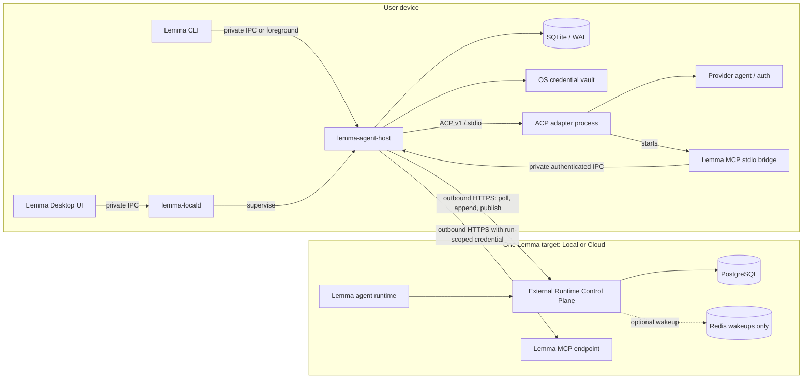
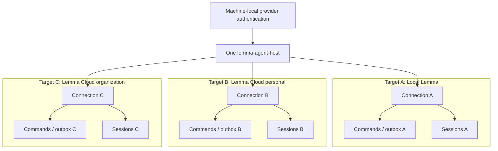
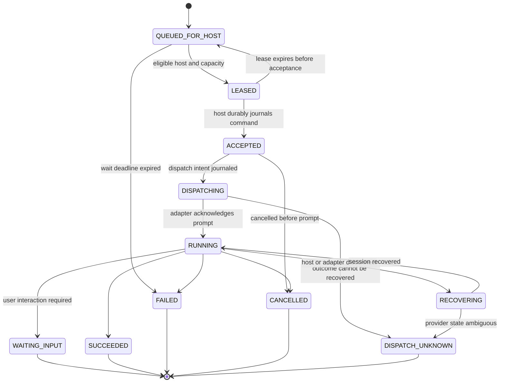
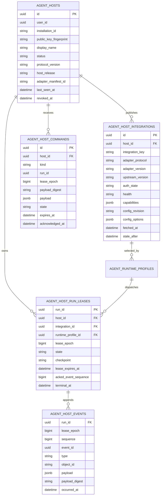

# Lemma External Agent Runtime v2

**Status:** Accepted — v2 baseline implemented; staged rollout gates remain

**Date:** 2026-07-27

**Replaces:** The user-host daemon under
[`lemma-cli/lemma_cli/daemon`](../../lemma-cli/lemma_cli/daemon/)

**Related:** [Lemma Desktop technical design](local-desktop-technical-design.md)

## 1. Executive summary

Lemma currently runs Codex, Claude Code, Cursor, OpenCode, Antigravity, and
similar user-owned agents through a Python daemon on the user's machine. The
daemon connects to Lemma over a custom WebSocket, discovers local providers,
starts provider-specific subprocesses, injects Lemma MCP tools, parses each
provider's output, and streams normalized events back to the Lemma agent
runtime.

This proved the product concept, but it is the wrong long-term boundary. The
daemon owns too many concerns, transport liveness is entangled with run
correctness, provider integrations depend on hand-maintained parsers, catalogs
are copied rather than discovered dynamically, and the detached process has
poor lifecycle visibility.

This design replaces it with a new system built around three independent
contracts:

1. **Lemma Agent Host:** a small, durable Rust service on the user's machine.
   Desktop's `lemma-locald` supervises it when Desktop is installed; an OS user
   service supervises it for headless CLI installations.
2. **Host control protocol:** a versioned, durable, outbound-HTTPS protocol
   between the Agent Host and each Lemma target. Commands are leased and
   acknowledged, events are sequence-numbered and replayable, and PostgreSQL is
   the source of truth.
3. **Agent integration protocol:** ACP v1 over stdio is the primary boundary
   between the Agent Host and local agents. A generic ACP driver replaces
   provider-specific transport logic. Native adapters are permitted only as
   explicit, capability-limited compatibility integrations.

CLIProxyAPI and similar projects solve a different problem: they expose local
provider authentication through OpenAI-, Anthropic-, or provider-compatible
model APIs. They are useful as a future **external model gateway**, but they do
not replace an agent-session protocol and will not be embedded into the core
Agent Host.

The first production release certifies Codex, Claude Code, Cursor, and OpenCode.
Antigravity may ship as a clearly labelled preview compatibility adapter because
it does not currently expose an official ACP or equivalent rich control
protocol. Adapter versions are released with Lemma CLI/Desktop rather than
updating independently. Model and configuration discovery remains dynamic, so
new models do not require a Lemma release when the installed agent exposes them.

This is a clean product cutover. Existing Lemma conversations and messages
remain, but daemon-backed profiles, in-flight runs, and provider session pointers
are not migrated to the new runtime.

## 2. Decisions

| Area | Decision |
| --- | --- |
| Product name | Lemma Agent Host |
| Host implementation | Separate cross-platform Rust binary |
| Desktop ownership | Supervised by `lemma-locald`; never owned by the Tauri UI process |
| Headless ownership | Foreground mode plus launchd, systemd-user, or Windows user-service installation |
| Lemma-to-host transport | Outbound HTTPS long polling plus idempotent append APIs |
| Correctness authority | PostgreSQL on the server and SQLite/WAL on the host |
| Host-to-agent protocol | ACP v1 over stdio |
| ACP v2 | Shape internal IDs and updates for it, but do not enable until stable |
| Agent access | Lemma MCP tools only; no advertised filesystem or terminal client capabilities |
| Model discovery | Dynamic ACP configuration snapshots with revisions and freshness |
| Adapter updates | Pinned and released with CLI/Desktop |
| Initial GA agents | Codex, Claude Code, Cursor, and OpenCode |
| Antigravity | Preview native compatibility adapter, if its baseline suite passes |
| CLIProxyAPI | Optional external model-gateway integration in a later phase |
| Target topology | One host may serve multiple isolated Local Lemma and Lemma Cloud targets |
| Offline behavior | Bounded profile-configured wait, followed by a typed failure or explicit fallback |
| Migration | Clean cutover; no live dual-stack migration |

## 3. Context and current-state assessment

### 3.1 What the current daemon does

The current daemon is not merely a network client. It owns:

- detached process lifecycle and PID/log files;
- user authentication refresh;
- a custom WebSocket protocol and reconnect backoff;
- run admission and concurrency;
- in-memory per-run buffers;
- reconnect grace periods and run reattachment;
- provider process creation and termination;
- provider-specific configuration and environment construction;
- provider-specific streaming, JSON-RPC, SSE, or text parsing;
- session creation and resumption;
- MCP configuration file generation;
- provider model discovery and normalization;
- tool-call normalization and missing tool-return repair; and
- catalog publication and runtime-profile creation.

The server side mirrors much of this complexity. The
[daemon hub](../../lemma-backend/app/modules/agent/infrastructure/daemon_hub.py)
uses process-local queues plus Redis Pub/Sub to route commands and events across
backend replicas. Reconnect sentinels, orphan queues, and grace windows attempt
to preserve live harness consumers when the WebSocket disappears.

The resulting system has two sources of truth:

- the backend process currently consuming a run; and
- the daemon process currently holding its buffer and provider subprocess.

Neither side has a complete durable log of the dispatch decision and event
acknowledgments. Redis Pub/Sub is ephemeral, and the WebSocket connection itself
implicitly carries run ownership.

### 3.2 Observed design failure modes

The present implementation has required repeated fixes for:

- disconnects while the provider continues running;
- events generated while the socket is unavailable;
- reconnecting a run to a different backend worker;
- multiple simultaneous runs;
- background-process death and stale PID state;
- Windows child-process cleanup;
- provider OAuth and token rotation;
- provider output that omits expected tool returns;
- model aliases changing or becoming stale; and
- new provider versions changing commands or event shapes.

These are not isolated bugs. They are consequences of the abstraction:

1. A live transport connection is being used as a run lease.
2. Provider protocols and catalogs are duplicated inside Lemma.
3. A detached CLI process is being used as an always-on product service.
4. The server cannot distinguish “command not received,” “accepted but not
   dispatched,” and “provider accepted the prompt but the acknowledgment was
   lost.”

### 3.3 WebSocket is not the root cause

WebSocket can be a valid streaming transport. Replacing it with another
long-lived socket without changing the application protocol would preserve the
same failure modes.

The new design removes WebSocket from the correctness path because ordinary
HTTPS requests, load balancers, proxies, authentication, retries, and
observability are easier to operate. The substantive change is that commands,
leases, checkpoints, and event acknowledgments become durable and idempotent.
An SSE or HTTP/2 wakeup channel may be added later without changing those
semantics.

## 4. Goals and non-goals

### 4.1 Goals

- Use a stable common protocol for rich agent sessions, streaming, plans, tool
  calls, permissions, cancellation, and session configuration.
- Ensure backend, host, and adapter restarts do not lose acknowledged events.
- Never blindly repeat a provider prompt whose dispatch outcome is ambiguous.
- Discover new models and configuration values without provider-specific
  hardcoded catalogs.
- Keep provider authentication on the user's machine.
- Expose only Lemma-scoped MCP tools to the remote agent runtime.
- Support Local Lemma and multiple Lemma Cloud targets without mixing their
  credentials, queues, sessions, or events.
- Make connection, authentication, version, capacity, active-run, and error
  state visible in Desktop and CLI.
- Allow Lemma to certify, pin, diagnose, and support exact adapter contracts.
- Preserve a separate path for direct model-provider APIs and future local model
  gateways.

### 4.2 Non-goals

- Providing Lemma Cloud with arbitrary access to the user's filesystem or shell.
- Treating ACP itself as a security sandbox.
- Proxying provider OAuth credentials through Lemma Cloud.
- Automatically running the newest artifact from the public ACP registry.
- Embedding or forking CLIProxyAPI into Lemma.
- Shipping production support for draft ACP v2.
- Failing over one external-agent conversation between physical user devices.
- Preserving in-flight runs or provider-native session continuity across the
  legacy-to-v2 cutover.

## 5. Research and alternatives

### 5.1 Agent Client Protocol

[ACP v1](https://agentclientprotocol.com/protocol/v1/overview) is a JSON-RPC
protocol between an agent client and an agent. It standardizes:

- initialization and protocol/capability negotiation;
- authentication methods;
- new, loadable, resumable, listable, and closable sessions;
- streaming agent messages and thoughts;
- tool-call state and results;
- plans;
- permission and elicitation requests;
- cancellation;
- MCP server injection; and
- session configuration such as model, mode, and reasoning level.

ACP's stable transport is stdio JSON-RPC. Its HTTP transport remains draft, so
ACP is a strong local Agent Host-to-agent boundary but is not selected as the
Lemma Cloud transport. See the official
[transport specification](https://agentclientprotocol.com/protocol/v1/transports).

The most important improvement for Lemma is
[session configuration](https://agentclientprotocol.com/protocol/v1/session-config-options).
An ACP agent can expose its current model and other choices as configuration
options, return the complete current state, and notify the client when those
options change. Lemma no longer needs to infer catalogs from `--help` output or
maintain provider alias tables.

The [ACP registry](https://github.com/agentclientprotocol/registry) provides
discoverable agents and distributions. It is useful input to certification, but
the registry updates independently and its entries have different distribution
and licensing models. Lemma therefore consumes only reviewed, pinned entries in
a release lock manifest.

The [ACP v2 draft](https://agentclientprotocol.com/announcements/acp-v2-draft)
introduces stable update IDs, upsert-style updates, a clearer queued/background
work lifecycle, richer diffs and permissions, and stronger session lifecycle
requirements. The canonical Lemma event model adopts stable IDs and upserts now,
but the production driver negotiates only ACP v1 until v2 is stable and the
certification suite is complete.

### 5.2 Official and native agent protocols

The [Codex ACP adapter](https://github.com/agentclientprotocol/codex-acp) is
jointly maintained by OpenAI, JetBrains, and Zed contributors. It wraps Codex's
[app-server protocol](https://github.com/openai/codex/blob/main/codex-rs/app-server/README.md),
which already exposes typed thread, turn, item, model, configuration, permission,
and authentication behavior over stdio JSON-RPC. Lemma should use the ACP
adapter instead of maintaining its own app-server client.

The [Claude ACP adapter](https://github.com/agentclientprotocol/claude-agent-acp)
wraps the Claude Agent SDK and exposes sessions, permissions, tool calls, images,
MCP servers, and other rich updates. Its adapter and underlying distribution
licenses must be reviewed and pinned independently.

Cursor's current
[ACP registry entry](https://github.com/agentclientprotocol/registry/tree/main/cursor)
uses native `cursor-agent acp`; OpenCode exposes native `opencode acp`.
OpenCode also offers a documented
[headless HTTP server](https://dev.opencode.ai/docs/server/) with an OpenAPI
schema and generated SDK. Those native interfaces are useful for diagnostics or
as temporary fallbacks, but ACP remains Lemma's common semantic boundary.

As of this design, Antigravity documents
[MCP integration](https://antigravity.google/docs/mcp) but not an official ACP
server. Lemma's current adapter invokes a one-shot prompt and receives final
plain text. A new native compatibility adapter may preserve that limited
capability, but it cannot claim equivalent streaming, session recovery, or
configuration semantics.

### 5.3 CLIProxyAPI

[CLIProxyAPI](https://github.com/router-for-me/CLIProxyAPI) is a maintained Go
project that exposes OpenAI-, Anthropic-, Gemini-, Codex-, and related compatible
APIs backed by local provider authentication. Its
[SDK](https://github.com/router-for-me/CLIProxyAPI/blob/main/docs/sdk-usage.md)
supports routing, authentication, translation, model registration, streaming,
and hot reload.

This is valuable, but it is a model API compatibility layer. It does not own the
agent semantics Lemma needs:

- conversation/session lifecycle;
- plans and thoughts;
- permission requests;
- agent tool-call progress;
- local process cancellation;
- session resume/load;
- provider turn dispatch ambiguity; or
- rich adapter configuration.

Therefore:

- Local Lemma may already use a CLIProxyAPI endpoint as an
  OpenAI-/Anthropic-compatible runtime profile.
- A later Lemma Cloud feature may use Agent Host as an outbound bridge to a
  user-approved local compatible endpoint.
- CLIProxyAPI is not embedded, forked, or given privileged access inside Agent
  Host.
- Agent integrations and model gateways use separate profile kinds, commands,
  quotas, events, and threat models.

### 5.4 Managed runner precedents

The lifecycle model follows established outbound worker systems:

- [GitHub self-hosted runners](https://docs.github.com/en/actions/reference/runners/self-hosted-runners)
  register a machine, advertise labels/capabilities, connect outbound, and are
  version-gated.
- [Buildkite agents](https://buildkite.com/docs/agent/lifecycle) separate
  polling, running, draining, cancellation, and shutdown.
- [AWS Systems Manager Agent](https://docs.aws.amazon.com/systems-manager/latest/userguide/session-manager.html)
  uses outbound authenticated connections and exposes device/session
  observability without inbound ports.

The common lesson is that a host is a managed worker with identity, capacity,
leases, drain, and diagnostics. It is not a transparent socket attached to an
application process.

### 5.5 Alternatives matrix

| Approach | Agent semantics | Catalog freshness | Recovery | Operational ownership | Decision |
| --- | --- | --- | --- | --- | --- |
| Repair custom WebSocket daemon | Lemma-specific | Provider parsers | More bespoke buffering | Detached Python process | Reject |
| Implement every native provider protocol | Rich but inconsistent | Provider-specific | Provider-specific | Large permanent adapter surface | Reject as common boundary |
| ACP locally, durable Lemma protocol remotely | Rich and negotiated | Dynamic config | Durable host/server plus ACP resume | Managed host service | Adopt |
| ACP end-to-end over draft HTTP | Rich | Dynamic config | Draft/uneven | Unnecessary protocol coupling | Defer |
| CLIProxyAPI as agent bridge | Model API only | `/models` | No agent-session semantics | Third-party gateway | Reject for agents |
| CLIProxyAPI as optional model gateway | Model API | Dynamic `/models` | Separate request bridge | User-approved endpoint | Phase two |

## 6. System architecture

### 6.1 Topology



There is no inbound listener exposed to the network. Local IPC uses a private
Unix-domain socket or Windows named pipe with per-user ACLs and a capability
token.

### 6.2 Component responsibilities

#### External Runtime Control Plane

- Enrolls and revokes hosts.
- Negotiates host protocol and release compatibility.
- Persists host/integration snapshots.
- Queues commands and atomically leases eligible runs.
- Receives checkpoints and idempotent event batches.
- Enforces lease fencing and run deadlines.
- Presents host/profile availability to the agent runtime and UI.
- Converts accepted canonical events into existing Lemma messages, tool calls,
  usage, realtime events, and terminal run state.

#### Lemma Agent Host

- Manages multiple isolated target connections.
- Reports connection, integration, version, authentication, model, and capacity
  state.
- Persists commands before acknowledgment.
- Supervises ACP/native adapter processes and their descendants.
- Maintains external session bindings.
- Normalizes adapter output into canonical events.
- Journals events until the server acknowledges them.
- Enforces cancellation, deadlines, quotas, and backpressure.
- Owns the local MCP bridge and run-scoped credential rotation.
- Produces redacted logs and diagnostic bundles.

#### Agent adapter

- Implements one versioned `AgentAdapter` contract.
- Negotiates ACP capabilities or reports an explicit native capability set.
- Owns provider-specific authentication interaction.
- Starts, resumes, prompts, cancels, and closes provider sessions.
- Does not connect to Lemma Cloud directly.
- Does not decide retry, lease, queue, or event-delivery policy.

#### Desktop and CLI

- Configure, start, stop, and inspect the host.
- Launch provider authentication flows.
- Show upgrade, unsupported-version, stale-catalog, capacity, and run state.
- Never become the correctness owner for a run.

## 7. Multi-target isolation

One Agent Host process may serve:

- a Local Lemma installation;
- a personal Lemma Cloud account;
- one or more Lemma Cloud organizations.

Each target is a separate `TargetConnection` with:

- server origin and immutable target ID;
- device identity and public-key registration;
- vault entry for its device credential;
- control cursor and last acknowledged command;
- local run journal partition;
- event outbox partition;
- session namespace;
- capacity allocation; and
- logs and health state.

Provider installation and provider login may be machine-wide, but no Lemma
target credential, prompt, MCP capability, session binding, event, or fallback
policy is shared across targets.



Scheduling uses weighted round-robin across connected targets, followed by
per-integration concurrency. A busy or failing target cannot consume every host
worker or block command polling for another target.

## 8. Device enrollment and authentication

### 8.1 Pairing

1. Agent Host generates an Ed25519 keypair for the target connection.
2. The private key is stored in the OS credential vault.
3. Desktop or CLI requests a short-lived pairing code from the authenticated
   Lemma target.
4. The user approves the device name, organization, and requested
   `external-agent-host` capability in a browser or Desktop-authenticated view.
5. Agent Host submits the pairing code, public key, installation ID, host release,
   and protocol range.
6. The target creates an `AgentHost` record and returns its immutable host ID.
7. Agent Host proves key possession to exchange for a short-lived device access
   token.

Pairing codes are one-use and expire quickly. A device access token is target-,
host-, and capability-scoped. It is not a user access token and cannot call
ordinary user APIs.

### 8.2 Revocation and rotation

- Users may revoke a host from any signed-in Lemma surface.
- Revocation invalidates device tokens, pending commands, active MCP credentials,
  and leases.
- The host key may be rotated through a command signed by the existing key.
- Loss of the local private key requires re-pairing; it never triggers server-side
  credential recovery.
- Provider login state is neither uploaded nor deleted when a Lemma target is
  disconnected.

## 9. Host control protocol

### 9.1 Version negotiation

Every authenticated control request includes:

```json
{
  "protocol_min": 2,
  "protocol_max": 2,
  "host_release": "2026.8.0",
  "adapter_manifest_id": "sha256:...",
  "installation_id": "local-installation-uuid",
  "instance_id": "new-uuid-for-this-process-start"
}
```

The server selects one protocol version and returns its policy revision. If no
version overlaps, the host becomes `UPGRADE_REQUIRED` and receives no run
commands. Compatibility is based on a protocol range and adapter manifest, not
only a human-readable app version.

### 9.2 API surface

The protocol consists of ordinary HTTPS endpoints. Exact route prefixes may
follow backend conventions, but the operations are normative:

| Operation | Authentication | Purpose |
| --- | --- | --- |
| `pairing/create` | User | Create a one-time device pairing |
| `pairing/complete` | Pairing code + signature | Register host public key |
| `token/exchange` | Host signature | Mint short-lived device token |
| `host/poll` | Device token | Heartbeat, capacity, checkpoints, command ack, long-poll commands |
| `host/events:append` | Device token | Idempotently append ordered run events |
| `host/integrations:publish` | Device token | Publish integration/config/catalog snapshot |
| `host/diagnostics` | Device token | Publish bounded health metadata, never raw secrets |
| `host/revoke` | User | Revoke target connection |

`host/poll` is held by the server for up to the configured long-poll duration.
When a command becomes available, the request completes immediately. Empty
responses are normal and are followed by the next poll with jitter.

### 9.3 Command envelope

```json
{
  "command_id": "uuid",
  "kind": "START_RUN",
  "created_at": "2026-07-26T12:00:00Z",
  "expires_at": "2026-07-26T12:05:00Z",
  "run_id": "uuid",
  "lease_epoch": 3,
  "payload_sha256": "hex",
  "payload": {}
}
```

Command kinds:

- `START_RUN`
- `CANCEL_RUN`
- `DRAIN`
- `RESUME`
- `REFRESH_INTEGRATION`
- `CLOSE_SESSION`
- `ROTATE_DEVICE_KEY`

The host deduplicates by `command_id`. Run-affecting commands additionally
validate `(target_id, run_id, lease_epoch)`. A lower epoch is stale and cannot
start a process, append an event, or execute an MCP call.

### 9.4 Run specification

A `START_RUN` payload contains only what the local agent requires:

```json
{
  "agent_run_id": "uuid",
  "conversation_id": "uuid",
  "integration_id": "uuid",
  "profile_revision": 7,
  "config_selections": {
    "model": "provider-model-id",
    "mode": "default",
    "thought_level": "medium"
  },
  "system_prompt": "...",
  "prompt": [{"type": "text", "text": "..."}],
  "context": {},
  "mcp_route_id": "opaque-run-route",
  "run_deadline": "2026-07-26T13:00:00Z"
}
```

It does not contain provider credentials, provider OAuth tokens, a user access
token, a direct local filesystem path, or another target's data.

### 9.5 Local acceptance

The host processes `START_RUN` in this order:

1. Validate target, lease epoch, deadline, integration state, profile revision,
   configuration selections, and available capacity.
2. Begin a local SQLite transaction.
3. Insert or locate the run journal row.
4. Persist the immutable request digest and `ACCEPTED` checkpoint.
5. Commit.
6. Acknowledge the command through the next poll.
7. Allocate an adapter worker.
8. Persist `DISPATCH_INTENT` before sending `session/prompt`.

The host never acknowledges acceptance before the run can survive a host process
restart.

### 9.6 Event envelope and acknowledgment

```json
{
  "run_id": "uuid",
  "lease_epoch": 3,
  "sequence": 42,
  "event_id": "uuid",
  "occurred_at": "2026-07-26T12:00:12.456Z",
  "type": "tool_call_update",
  "object_id": "stable-adapter-or-host-id",
  "payload": {},
  "integration": {
    "key": "codex",
    "adapter_version": "pinned-version"
  }
}
```

The host assigns `sequence` in the same SQLite transaction that inserts the
event into the outbox. It may batch adjacent events, but it never removes them
until the target returns:

```json
{
  "run_id": "uuid",
  "lease_epoch": 3,
  "acked_through": 42
}
```

The server has a unique constraint on `(run_id, lease_epoch, sequence)`. Replayed
batches return the same acknowledgment. An existing sequence with a different
event digest is a protocol violation that fences the host.

Canonical event types:

- `run_state`
- `user_message`
- `agent_message_chunk`
- `agent_message_upsert`
- `agent_thought_chunk`
- `agent_thought_upsert`
- `plan_upsert`
- `tool_call_upsert`
- `tool_call_update`
- `usage_update`
- `config_update`
- `permission_request`
- `input_request`
- `warning`
- `terminal`

Stable `object_id` plus upsert semantics prevent duplicated message, plan, and
tool-call objects during ACP replay and prepare the model for ACP v2.

### 9.7 Backpressure

The host has bounded per-target and global journal quotas.

- It stops claiming new runs before the quota is exhausted.
- It continues cancellation, checkpoint, event-upload, and terminal work.
- It never drops accepted events to admit a new run.
- High-frequency token chunks may be coalesced before durable insertion only
  when no externally visible ordering boundary is crossed.
- Tool-call transitions, permission/input requests, usage totals, warnings, and
  terminal events are never coalesced away.
- A fully exhausted or unwritable journal cancels undispatched work and marks
  already-dispatched work `LOCAL_STORAGE_FAILURE`; it does not continue
  unjournaled execution.

## 10. Run lifecycle and recovery semantics

### 10.1 State machine



`WAITING_INPUT` is terminal for the current Lemma run. User input creates a new
run against the same conversation/session binding.

### 10.2 Delivery guarantees

The system deliberately avoids claiming impossible end-to-end “exactly once”
semantics.

- **Commands:** at-least-once delivery, idempotent acceptance.
- **Event upload:** at-least-once delivery, idempotent server persistence.
- **Provider prompt:** at-most-once automatic dispatch after local
  `DISPATCH_INTENT`.
- **Terminal state:** one server terminal transition, selected through
  lease-fenced conditional updates.

An ACP provider may accept a prompt immediately before the Agent Host crashes.
If neither ACP session recovery nor provider history can prove the prompt's
state, retrying may duplicate real work. The correct result is
`DISPATCH_UNKNOWN`, not an automatic replay.

### 10.3 Recovery cases

| Failure point | Recovery |
| --- | --- |
| Before server lease | Run remains queued |
| Lease delivered, host did not accept | Lease expires and command may be issued again |
| Host accepted, before dispatch intent | Local journal proves safe redispatch |
| Dispatch intent persisted, prompt not provably accepted | Adapter recovery; otherwise `DISPATCH_UNKNOWN` |
| Provider running, server unavailable | Host journals output and renews when target returns |
| Host process restarts | Reload journal, fence stale workers, resume target polls, recover ACP session |
| Backend replica restarts | Another replica reads PostgreSQL state; Redis history is unnecessary |
| Duplicate event batch | Unique sequence returns existing acknowledgment |
| Cancel races with completion | First valid terminal conditional update wins; the other becomes a no-op |
| Device revoked | Fence leases, invalidate MCP capabilities, terminate target-owned workers |

### 10.4 Offline and capacity policy

An external-agent profile has:

- `host_wait_timeout_seconds`, initially defaulting to five minutes;
- an optional explicit `fallback_profile_id`; and
- a visible availability reason.

While queued, Lemma reports one of:

- `HOST_OFFLINE`
- `HOST_UPGRADE_REQUIRED`
- `INTEGRATION_UNAVAILABLE`
- `AUTH_REQUIRED`
- `CONFIG_INVALID`
- `NO_CAPACITY`
- `HOST_DRAINING`

When the wait deadline expires, the run either moves to its explicitly configured
fallback profile or fails with the last availability reason. There is no implicit
model/provider substitution.

## 11. ACP adapter contract

### 11.1 Internal interface

All integrations implement the same conceptual interface:

```rust
trait AgentAdapter {
    async fn probe(&self) -> Result<IntegrationSnapshot, AdapterError>;
    async fn authenticate(&self, request: AuthRequest) -> Result<AuthState, AdapterError>;
    async fn open_session(&self, request: SessionRequest) -> Result<SessionHandle, AdapterError>;
    async fn resume_session(&self, request: ResumeRequest) -> Result<SessionHandle, AdapterError>;
    async fn apply_config(&self, session: &SessionHandle, config: ConfigSelections)
        -> Result<ConfigState, AdapterError>;
    async fn prompt(&self, session: &SessionHandle, prompt: Prompt)
        -> Result<AdapterEventStream, AdapterError>;
    async fn cancel(&self, session: &SessionHandle) -> Result<(), AdapterError>;
    async fn close(&self, session: SessionHandle) -> Result<(), AdapterError>;
}
```

This is a design contract, not a requirement to expose a public Rust trait
unchanged. Provider implementations cannot define their own run retry or event
acknowledgment policy.

### 11.2 ACP initialization

For each worker, Agent Host:

1. Launches the exact adapter command from the signed adapter manifest.
2. Uses stdio JSON-RPC framing.
3. Sends `initialize` with ACP v1 and only the client capabilities Lemma
   supports.
4. Records the negotiated agent capabilities.
5. Rejects a protocol version or required capability outside the certification
   record.
6. Creates or resumes a session in a private scratch directory.
7. Supplies only the Lemma MCP bridge.
8. Applies configuration selections by stable option/category IDs.

ACP filesystem and terminal client capabilities are absent. No
`additionalDirectories` are sent.

### 11.3 Worker and session ownership

- A conversation is bound locally by
  `(target_id, integration_id, conversation_id)`.
- The binding stores the provider's external session ID only in the host journal.
  Lemma receives a host-generated opaque session reference, not the provider ID.
- One ACP worker owns one active conversation at a time.
- Prompts for a conversation serialize.
- Different conversations use independent workers up to integration and global
  capacity.
- A worker may remain idle for a short TTL and is then closed.
- If the agent advertises `session/resume` or `session/load`, a later worker
  restores the session.
- If neither capability is available, the integration snapshot reports
  `durable_session_recovery=false`; after worker loss, Agent Host starts a new
  provider session using Lemma's supplied conversation context.

### 11.4 ACP update normalization

ACP update streams are translated once in the generic driver:

| ACP concept | Canonical Lemma event |
| --- | --- |
| Agent/user message chunk | `agent_message_chunk` / `user_message` |
| Thought chunk | `agent_thought_chunk` |
| Tool call and update | `tool_call_upsert` / `tool_call_update` |
| Plan | `plan_upsert` |
| Usage | `usage_update` |
| Config option update | `config_update` |
| Permission request | `permission_request` |
| Elicitation request | `input_request` |
| Prompt result / stop reason | `terminal` or `run_state` |

Raw ACP payloads may be retained only in bounded, redacted local diagnostics.
They are not the backend's domain model.

### 11.5 Native compatibility adapters

A native adapter is allowed only when:

- no viable ACP adapter exists;
- the provider exposes a stable machine-readable contract, or the integration is
  clearly marked preview;
- it implements the common lifecycle and error types;
- it reports unsupported capabilities rather than synthesizing them; and
- it passes the baseline adapter suite.

The first such adapter is Antigravity preview. Its expected initial capability
set is one-shot prompt, cancellation through process termination, final text,
and Lemma MCP injection. It does not advertise rich streaming, durable external
sessions, plans, or dynamic ACP configuration.

## 12. Lemma MCP bridge

### 12.1 Why a bridge is necessary

ACP supplies MCP servers during session creation, load, or resume. Lemma MCP
credentials are intentionally short-lived and run-scoped. Recreating every
external session merely to rotate an HTTP authorization header would lose warm
session state and couple credential lifetime to ACP process lifetime.

Agent Host therefore exposes an adapter-private stdio MCP bridge.

### 12.2 Operation

The ACP session receives:

```json
{
  "name": "lemma",
  "command": "/absolute/path/lemma-agent-host",
  "args": ["mcp-bridge"],
  "env": [
    {
      "name": "LEMMA_AGENT_SESSION_CAPABILITY",
      "value": "opaque-local-capability"
    }
  ]
}
```

The value is not a Lemma Cloud bearer token. It authorizes only a connection to
the host's private local IPC for one target, integration, and session.

For each run:

1. The host obtains a short-lived Lemma MCP credential scoped to the agent run.
2. It atomically binds the local session capability to the current
   `(run_id, lease_epoch, credential)`.
3. It sends the ACP prompt.
4. MCP requests arriving through the bridge are checked against the active
   binding and current lease.
5. The host forwards allowed MCP traffic to the target over HTTPS.
6. On terminal state, cancellation, deadline, or lease fencing, the binding is
   removed and the remote credential is revoked or allowed to expire.

An idle ACP session cannot call Lemma tools. A stale worker cannot reuse a
credential from another turn or target.

### 12.3 Permission behavior

- Agent Host never auto-approves native filesystem, shell, network, browser, or
  arbitrary MCP permissions.
- Requests attributable to the injected Lemma MCP server are allowed by the MCP
  bridge's scoped policy rather than by a broad provider permission.
- Every other permission request is denied with a stable reason.
- User-facing approval or input requested through Lemma tools continues through
  Lemma's existing waiting-run workflow.

## 13. Integration discovery and model configuration

### 13.1 Integration snapshot

Agent Host publishes a revisioned `IntegrationSnapshot`:

```json
{
  "integration_key": "codex",
  "display_name": "Codex",
  "adapter_protocol": "ACP_V1",
  "adapter_version": "pinned-version",
  "upstream_version": "detected-version",
  "auth_state": "READY",
  "health": "READY",
  "capabilities": {
    "load_session": true,
    "resume_session": true,
    "close_session": true,
    "images": true,
    "plans": true,
    "usage": true,
    "durable_session_recovery": true
  },
  "config_revision": "opaque-revision",
  "config_options": [],
  "fetched_at": "2026-07-26T12:00:00Z",
  "stale_after": "2026-07-26T13:00:00Z",
  "stale_reason": null
}
```

Capabilities are measured from the negotiated agent plus Lemma certification.
An agent advertising a capability does not make it supported until its certified
adapter version passes the corresponding contract tests.

### 13.2 Configuration discovery

For ACP agents, the host creates a probe session in an empty scratch directory,
captures the complete session configuration, and closes it. Relevant categories
include:

- model;
- mode;
- reasoning or thought level;
- model-specific configuration; and
- other certified adapter settings.

The exact option IDs and values are provider-owned. Lemma stores them as opaque
selections plus display metadata and does not translate them into a hardcoded
provider enum.

Refresh triggers:

- target connection;
- host or adapter update;
- upstream agent version change;
- provider authentication change;
- explicit Desktop/CLI/UI refresh;
- configured TTL expiry; and
- ACP configuration-update notification.

If refresh fails, the server retains the last-known snapshot with a timestamp and
typed stale reason. A stale snapshot may be displayed, but run admission follows
the integration's certification policy.

### 13.3 Runtime profiles

The new external profile shape is:

```json
{
  "kind": "EXTERNAL_AGENT",
  "host_id": "uuid",
  "integration_id": "uuid",
  "integration_snapshot_revision": "opaque",
  "config_selections": {
    "model": "opaque-provider-option",
    "mode": "opaque-provider-option"
  },
  "host_wait_timeout_seconds": 300,
  "fallback_profile_id": null
}
```

Profiles no longer copy a model catalog as their source of truth.

The UI may offer an explicit `FOLLOW_ADAPTER_DEFAULT` sentinel. Any other
selection must still exist at run admission. A removed model or invalidated
configuration makes the profile `CONFIG_INVALID`; Lemma does not silently
select a similarly named model.

### 13.4 “New models appear automatically” guarantee

Lemma can guarantee:

- when an installed, certified adapter exposes a new model through dynamic
  configuration, the host publishes it without a Lemma backend or application
  release;
- explicit refresh makes it visible promptly; and
- existing profiles do not need recreation to see it in the selector.

Lemma cannot guarantee discovery before the provider's installed CLI/adapter
exposes the model. If a provider requires an upstream binary update, the
integration reports that requirement.

## 14. Adapter packaging and compatibility

### 14.1 Release lock manifest

Every CLI/Desktop release includes or downloads a signed host pack containing an
`agent-adapters.lock.json` equivalent:

```json
{
  "schema_version": 1,
  "host_protocol": {"min": 2, "max": 2},
  "integrations": [
    {
      "key": "codex",
      "adapter_protocol": "ACP_V1",
      "artifact": {
        "url": "https://...",
        "sha256": "hex",
        "size": 123
      },
      "supported_platforms": ["darwin-arm64", "darwin-x64", "linux-x64", "windows-x64"],
      "upstream_version_range": "certified-range",
      "certification_revision": "sha256:...",
      "license": "reviewed-identifier"
    }
  ]
}
```

The Desktop public application need not embed every adapter. Existing Desktop
artifact installation rules can download and verify an immutable host/adapter
pack for the application release.

### 14.2 Update policy

- Adapter artifacts change only with a Lemma CLI/Desktop release.
- Updates are not pulled hourly from the ACP registry.
- The backend knows which host protocol and adapter manifest revisions it may
  dispatch to.
- A newly updated user-installed provider CLI is probed before use.
- If its version is outside the certified range, the integration becomes
  `UNSUPPORTED_VERSION`; it is not launched optimistically.
- The previous verified host/adapter pack is retained for application rollback.
- Model/config refresh is independent from binary updates.

### 14.3 Certification tiers

| Tier | Meaning |
| --- | --- |
| GA | Full required lifecycle, event, cancellation, MCP, catalog, fault, and cross-platform suite |
| Preview | Baseline safety and lifecycle suite; missing capabilities are visible and support is limited |
| Detected | Binary found, but no profile or run may use it |
| Blocked | Authentication, version, policy, or certification prevents execution |

Initial classification:

| Integration | Boundary | Initial tier |
| --- | --- | --- |
| Codex | Official ACP adapter over app-server | GA |
| Claude Code | ACP adapter over Claude Agent SDK | GA |
| Cursor | Certified ACP mode | GA |
| OpenCode | Certified ACP mode; native HTTP for diagnostics only | GA |
| Antigravity | Lemma native one-shot adapter | Preview |

## 15. Desktop and headless lifecycle

### 15.1 Desktop

Agent Host is not part of the Tauri UI process. `lemma-locald`:

- installs/verifies the host and adapter pack;
- starts Agent Host at user login or when the feature is enabled;
- records the exact process identity in its process ledger;
- restarts unexpected exits with bounded backoff;
- exposes status and logs through private IPC;
- drains the host during application updates; and
- keeps it running after the Desktop window closes.

Desktop adds a **Local Agents** control center with:

- target cards clearly labelled Local or Cloud;
- connected account/organization;
- host online/offline/draining/update state;
- integration binary, adapter, upstream, and authentication versions;
- current models and last refresh;
- active and queued runs;
- capacity;
- reconnect, refresh, authenticate, drain, restart, and disconnect actions;
- redacted logs and “copy diagnostics”; and
- precise remediation for unsupported versions or expired authentication.

### 15.2 Headless CLI

`lemma agent-host` replaces `lemma daemon`:

- `connect`
- `disconnect`
- `list`
- `status`
- `start`
- `stop`
- `drain`
- `refresh`
- `doctor`
- `logs`
- `install-service`
- `uninstall-service`
- `serve`

`serve` runs in the foreground and is suitable for containers or external
supervisors. `install-service` uses:

- launchd LaunchAgent on macOS;
- systemd user service on Linux; and
- a per-user Windows service mechanism with user-session startup.

When locald is present, CLI uses locald's private IPC and does not install or
start a competing service.

## 16. Data model

### 16.1 Server



Required constraints include:

- unique host installation identity within its target/user scope;
- unique integration key per host;
- unique command ID;
- unique `(run_id, lease_epoch, sequence)`;
- conditional lease updates on current epoch; and
- one terminal transition per run.

### 16.2 Host SQLite

Host state is partitioned by target and contains:

- `target_connections`
- `integration_installations`
- `session_bindings`
- `run_journal`
- `event_outbox`
- `command_receipts`

Secrets are represented only by vault reference IDs. SQLite uses WAL, foreign
keys, checksums for immutable payloads, transactional sequence allocation,
bounded retention, and corruption detection on startup.

Completed run rows and acknowledged events are retained for a bounded diagnostic
window and then compacted. Active or unacknowledged state is never removed by
age-based cleanup.

## 17. Security model

### 17.1 Trust boundaries

Trusted local components:

- Lemma Agent Host;
- the signed Lemma MCP bridge;
- certified adapter artifacts; and
- the installed provider binary selected by the user.

Untrusted inputs:

- prompts and model output;
- ACP messages and content;
- provider tool names, arguments, paths, and metadata;
- server commands before signature/authentication and schema validation; and
- public registry metadata.

The provider/adapter process runs as the user to access its provider-owned login
state. The v1 “Lemma tools only” guarantee is a certified product-policy boundary,
not a claim that a compromised provider executable is contained by an OS sandbox.

### 17.2 Required controls

- No inbound network port.
- TLS for every target connection.
- Per-target device keys and short-lived tokens.
- Private local IPC with OS ownership checks and capability tokens.
- Exact adapter artifact digest and supported upstream version validation.
- Empty per-session scratch directory.
- Minimal allowlisted environment.
- No user project directory as ACP `cwd`.
- No ACP filesystem/terminal client capabilities or additional directories.
- Denial of native permission requests.
- Only the Lemma MCP bridge in `mcpServers`.
- Run-scoped MCP credentials and lease fencing.
- Structured schema validation and bounded frame/event sizes.
- Process-tree termination on cancellation and host shutdown.
- Redaction of prompts, credentials, authorization headers, environment values,
  and MCP capabilities from normal logs.
- No provider credential in server state or diagnostics.

### 17.3 Future native-workspace support

Native filesystem or shell access is out of scope. It requires a separate design
with:

- explicit per-profile workspace roots;
- interactive permission and audit semantics;
- provider-independent policy enforcement;
- macOS, Windows, and Linux process containment;
- network egress policy;
- symlink/path escape tests; and
- a clear statement of which component is the security boundary.

It must not be enabled merely because an ACP agent advertises filesystem or
terminal support.

## 18. Observability and operations

### 18.1 Host status

Host states:

- `ONLINE`
- `OFFLINE`
- `DRAINING`
- `DEGRADED`
- `UPGRADE_REQUIRED`
- `REVOKED`

Integration states:

- `READY`
- `AUTH_REQUIRED`
- `UNSUPPORTED_VERSION`
- `CONFIG_INVALID`
- `PROBE_FAILED`
- `INSTALLING`
- `DISABLED`

Status always includes a typed reason, first-observed time, last transition,
recommended action, host release, and adapter manifest ID.

### 18.2 Metrics

Server:

- connected hosts by release/status;
- command queue age and lease attempts;
- command acknowledgment latency;
- event append latency, replay count, and sequence gaps;
- runs waiting by reason;
- lease recoveries and fenced epochs;
- `DISPATCH_UNKNOWN` rate;
- adapter/integration failure rate;
- catalog age and refresh failures; and
- cancellation latency.

Host:

- target poll status and backoff;
- active/idle workers;
- per-target and global capacity;
- local journal bytes and oldest unacknowledged event;
- adapter process starts, exits, and recovery attempts;
- MCP calls by result class, without arguments;
- model/config refresh duration; and
- service restart count.

### 18.3 Logs and diagnostics

Logs are structured and keyed by target ID, host instance ID, command ID, run ID,
lease epoch, integration key, and adapter version. They exclude message content
by default.

`doctor` produces a bounded bundle containing:

- release and protocol compatibility;
- service-manager state;
- target connectivity;
- integration executables and supported versions;
- authentication state, never credentials;
- catalog timestamps;
- journal health and capacity;
- recent typed errors;
- redacted process exits; and
- time-skew and TLS checks.

## 19. External model gateway phase

### 19.1 Purpose

This phase allows Lemma Cloud's in-process Lemma harness to use a model endpoint
that is reachable only on the user's machine, including a user-operated
CLIProxyAPI instance.

It uses the Agent Host installation and target identity but not the
`AgentAdapter` contract.

### 19.2 Separate contract

```text
ExternalModelGateway
  probe()
  list_models()
  begin_request()
  stream_response()
  cancel_request()
```

Profiles use `kind = EXTERNAL_MODEL_GATEWAY`. Gateway commands carry normalized
model requests and return model API chunks, tool calls, usage, and errors. They
do not carry ACP sessions, plans, permission requests, or provider-native agent
tool progress.

### 19.3 Safety requirements

- Endpoint must be explicitly configured and user-approved.
- Default policy permits loopback endpoints only.
- Host validates DNS/IP on every connection to prevent rebinding.
- Credentials remain in the local gateway or OS vault.
- Requests are bounded by target, profile, rate, token, byte, and concurrency
  quotas.
- No arbitrary URL is accepted from a run command.
- Legal and provider-terms review is required for subscription-backed OAuth
  proxying.
- CLIProxyAPI version is visible but Lemma does not manage its accounts,
  multi-account routing, or upstream policies.

This phase begins only after the ACP Agent Host is stable.

## 20. Clean cutover

### 20.1 User-visible behavior

- Users update Lemma Cloud/Desktop/CLI to the coordinated v2 release.
- They connect the new Agent Host to each target.
- The host detects integrations and runs authentication/probes.
- Users create new external-agent profiles from current integration snapshots.
- Existing conversations remain readable and may select a new profile.
- The first v2 run creates a new provider-native session.

Legacy daemon profiles are shown as unsupported until replaced. They are not
silently converted because their protocol, model selection, session identity,
and security evidence do not map reliably to the new system.

### 20.2 Deployment procedure

1. Ship backend schema and disabled v2 endpoints.
2. Run internal and selected-org certification using v2-only profiles.
3. Publish coordinated Desktop/CLI host and adapter packs.
4. Announce a cutover window and block creation of new legacy daemon profiles.
5. Drain or terminate in-flight legacy runs.
6. Enable v2 profile creation and dispatch.
7. Disable the old daemon WebSocket and daemon-backed run admission.
8. Retain legacy tables unchanged for one rollback release.
9. After the rollback window, remove old daemon code, routes, hub, profile
   protocols, parsers, and tests.

There is no period in which one production profile may dispatch through either
protocol nondeterministically.

### 20.3 Rollback

Rollback is release-level:

- stop v2 dispatch;
- drain accepted v2 work;
- restore the coordinated prior backend and client release; and
- re-enable the untouched legacy tables and protocol.

The first v2 migration does not drop or rewrite legacy daemon data. Later schema
cleanup is a separate irreversible release.

## 21. Verification strategy

### 21.1 Test layers

| Layer | Purpose |
| --- | --- |
| Domain unit/property | State transitions, fencing, deadlines, deduplication, sequence allocation |
| Protocol contract | Host envelopes, validation, compatibility, idempotent append |
| Fault simulation | Lost requests/responses, duplicate/reordered events, crashes, disk errors |
| ACP driver | Initialization, sessions, config, update normalization, cancellation |
| Adapter certification | Exact pinned adapter and upstream versions |
| Backend integration | Agent run/messages/tools/usage through durable control plane |
| Local/Cloud end-to-end | Desktop/locald and headless service against real targets |
| Security | Credential isolation, permissions, paths, processes, malformed input |
| Performance/soak | Long sessions, high event volume, reconnect loops, multi-target fairness |

### 21.2 Deterministic fault cases

The simulator can fail at every boundary:

- command created but poll response lost;
- command received but local transaction fails;
- accepted checkpoint persisted but acknowledgment lost;
- dispatch intent persisted before adapter write;
- adapter accepts prompt before host crash;
- output produced before local event transaction;
- event persisted before upload;
- server inserts events but response is lost;
- backend process exits during append;
- Redis is unavailable;
- target connection partitions while provider continues;
- stale host instance continues after a new instance starts;
- cancellation and terminal output arrive concurrently;
- local disk fills or becomes read-only;
- ACP frame is malformed or oversized;
- session load replays old messages/tool calls;
- model config changes between profile validation and dispatch; and
- one target continuously fails while another has queued work.

Tests assert exact command count, dispatch-intent count, adapter prompt count,
event sequence/digest, terminal transition, and cleanup behavior.

### 21.3 Adapter conformance

Every GA integration must pass:

- executable/version detection;
- authentication ready, missing, expired, and revoked states;
- ACP initialization and required capability negotiation;
- configuration and model discovery;
- new session and multiple turns;
- concurrent independent conversations;
- session resume/load where advertised;
- text, thought, plan, tool, usage, and terminal normalization where advertised;
- Lemma MCP invocation and credential rotation;
- native permission denial;
- cancellation during model output and MCP execution;
- adapter crash and process-tree cleanup;
- unsupported upstream version blocking;
- bounded output and malformed message handling; and
- macOS, Windows, and Linux release artifacts.

Preview Antigravity passes the baseline subset and publishes the missing
capabilities in its snapshot.

### 21.4 End-to-end scenarios

- Desktop closes while Agent Host continues a cloud run.
- locald restarts Agent Host and unacknowledged events replay.
- Headless service restarts after user login.
- Local Lemma and two Cloud targets execute concurrently without data leakage.
- Host is offline, returns within the wait window, and claims the queued run.
- Wait deadline expires with and without an explicit fallback.
- Backend workers restart and Redis loses all transient state.
- A stale lease tries to append or call MCP after a new epoch exists.
- User revokes the device during a tool call.
- Adapter session resumes after host restart.
- Ambiguous provider dispatch produces `DISPATCH_UNKNOWN`, not a second prompt.
- A new model appears after refresh without profile recreation.
- A removed selected model marks the profile invalid.
- Host/app release is incompatible with the server and receives no work.
- Adapter update and rollback preserve the prior verified artifact.

### 21.5 Acceptance invariants

The system is not production-ready until:

```text
acknowledged_event_loss == 0
automatic_duplicate_prompt_after_dispatch_intent == 0
events_with_same_run_epoch_sequence_and_different_digest == 0
stale_epoch_tool_or_event_acceptance == 0
provider_credentials_received_by_lemma_cloud == 0
implicit_provider_or_model_fallbacks == 0
```

Additionally:

- every accepted run reaches one deterministic terminal or waiting state;
- server and host restarts recover without process-memory history;
- explicit cancellation reaches a connected host promptly and completes within
  the configured grace unless the OS refuses termination;
- explicit catalog refresh updates a responsive integration without an
  application release;
- Desktop and CLI report the same host state;
- one target's outage does not prevent another target from polling or uploading;
  and
- all GA integration capability claims are backed by executable conformance
  cases.

## 22. Delivery sequence

### Phase 0: protocol and simulator

- Finalize canonical types, state machines, error catalog, and compatibility
  rules.
- Implement server repositories and deterministic fake host/ACP agent.
- Prove lease fencing, event replay, and ambiguous-dispatch behavior before
  integrating a real provider.

### Phase 1: Agent Host core

- Build Rust host, SQLite journal, target pairing, polling, event append,
  process supervision, MCP bridge, service installation, and diagnostics.
- Integrate with locald process ownership and Desktop status APIs.
- Exercise Local and Cloud targets with the fake ACP agent.

### Phase 2: ACP and initial integrations

- Implement the generic ACP v1 driver.
- Certify Codex, Claude Code, Cursor, and OpenCode.
- Add dynamic configuration/profile UI.
- Add Antigravity preview only if its baseline tests pass.

### Phase 3: product cutover

- Run release-coupled canaries.
- Drain legacy runs.
- Require new Agent Host connections and profiles.
- Disable the legacy protocol.
- Monitor dispatch-unknown, reconnect, catalog, and adapter error rates through
  the rollback window.

### Phase 4: external model gateway

- Design and certify the separate compatible-model request bridge.
- Support user-operated CLIProxyAPI endpoints without embedding them.
- Keep rollout independent from ACP agent integrations.

## 23. Final rationale

The central abstraction is no longer “a WebSocket connected to a CLI process.”
It is:

> A versioned, authenticated, durable user-owned execution host that leases
> Lemma work, runs a certified external-agent adapter, exposes only scoped Lemma
> tools, and reports an acknowledged canonical event log.

ACP removes most provider-specific session protocol work. It does not solve
device lifecycle, cloud dispatch, event durability, version governance, or
security policy; Agent Host and the Lemma control plane own those responsibilities.

CLIProxyAPI is kept useful without confusing it with an agent runtime. Desktop
becomes the natural control surface without becoming the service owner. New
models can appear dynamically, while adapter contracts remain pinned to known
client releases.

This separation makes adding an agent an adapter-certification exercise instead
of another rewrite of daemon transport, buffering, process, catalog, permission,
and recovery logic.

## 24. Implementation record and release disposition

This section records what was built with this design. It distinguishes an
implemented architecture from the operational gates required before a public GA
cutover.

### 24.1 Implemented baseline

| Design area | Implementation |
| --- | --- |
| Canonical protocol | Typed v2 host hello, commands, run specs, checkpoints, canonical events, configuration snapshots, and state machines in both Rust and Python |
| Server durability | PostgreSQL commands, run leases, event log, integration snapshots, encrypted MCP routes, pairing state, and Alembic migration |
| Device security | Per-target Ed25519 identities in the OS credential vault, signed pairing and token exchange, scoped short-lived device tokens, remote-first revocation, HTTPS enforcement, and replay windows |
| Dispatch correctness | Durable command acceptance, SQLite WAL/FULL journal, dispatch-intent checkpoint before prompting, lease fencing, capacity admission, recovery grace, and `DISPATCH_UNKNOWN` instead of blind prompt retry |
| Event correctness | Contiguous per-run sequences, payload digests, durable outbox replay, server de-duplication, stable object upserts, and deterministic terminal transitions |
| Agent boundary | Generic ACP v1 stdio driver built on the official Rust ACP SDK, run-scoped MCP injection, canonical event normalization, provider deadline, cancellation, and process cleanup |
| Configuration | Live ACP model/mode/effort discovery, revisioned publication, explicit refresh, optimistic profile creation, and run-time revalidation against the latest snapshot |
| Model freshness | Existing profiles consume the latest valid catalog. Adding a provider model does not invalidate a profile; removing its selected value does |
| Permission policy | Client filesystem/terminal capabilities are not advertised, permission requests fail closed, and known unrestricted or pre-approved provider modes are filtered and rejected again at dispatch |
| Fallback | Typed, explicit non-Agent-Host fallback after the configured unaccepted-host wait; no implicit provider or model substitution and no fallback chains |
| Multi-target operation | Independent target keys, tokens, queues, refresh controls, draining state, and failure loops in one host process |
| Desktop | Agent Host sidecar bundled and code-signed with Desktop; `lemma-locald` owns supervision, restart budgets, logs, authenticated IPC, and start/stop/restart controls |
| Headless lifecycle | Foreground service plus launchd LaunchAgent, systemd user unit, and Windows per-user Task Scheduler installation |
| Product UI | Authenticated Local Agents settings for pairing, host health/capacity, integration versions and errors, dynamic configuration, fallback, profile creation, and revocation |
| Public SDK/CLI | `lemma agent-host` lifecycle/diagnostic surface, TypeScript and Python management namespaces, and generated OpenAPI clients |
| Compatibility | Codex and Claude through pinned official ACP adapters; OpenCode and Cursor through native ACP commands |

The Desktop shell deliberately owns only local process lifecycle. The
authenticated Lemma settings surface owns cloud/local target identity,
organization context, provider catalogs, profiles, and revocation. This avoids
duplicating user authentication and organization authorization inside locald.

### 24.2 Qualification evidence

The baseline was verified on macOS with:

- 19 Rust unit tests, one real-process fake ACP test, and two loopback HTTP
  control-plane tests;
- 402 backend agent-module unit tests;
- two PostgreSQL end-to-end tests covering the migration round trip, pairing,
  token exchange, publication, zero-capacity admission, command durability,
  lease expiry and recovery, MCP fencing, event replay/de-duplication, terminal
  fencing, live catalog revision, and self-revocation;
- 634 CLI tests;
- 143 TypeScript SDK tests and 60 Python SDK tests;
- 124 frontend tests, strict type checking, lint/design audit, and a production
  Next.js build;
- 42 locald tests and 26 Desktop tests, both under strict Clippy;
- a release-mode, locally code-signed Desktop sidecar build with smoke checks
  for locald, Agent Host, the runtime bridge, and the Virtualization.framework
  entitlement; and
- isolated real ACP runs that returned exact sentinels through installed Codex,
  Claude Code, and OpenCode agents.

Live ACP probes succeeded for those three installed agents and returned current
model/configuration catalogs and structured capabilities. The final Codex probe
returned eight models; Claude Code returned five; OpenCode returned 21. The
probe also demonstrated policy filtering of full-access and bypass-permission
modes. Cursor was not installed on the qualification machine and correctly
reported `PROBE_FAILED` without affecting the other integrations.

In total, 1,455 automated tests passed across the changed runtime, product, SDK,
CLI, and supervision surfaces. Provider-authenticated smoke runs are a release
qualification job rather than public CI because they require private local
accounts.

### 24.3 Staged-rollout and GA gates

The following are explicit release gates, not reasons to reintroduce the legacy
architecture:

1. Build and distribute an offline Lemma-signed adapter pack, including the
   exact transitive dependency graph and required JavaScript runtime. The
   current beta bootstrap pins the root npm package version and records its
   registry SRI while relying on npm's integrity verification.
2. Pass the existing macOS/Linux/Windows Agent Host CI matrix and run one real
   installed-Cursor conformance pass. Cursor remains disabled for GA if that
   pass is unavailable or fails.
3. Run Local Lemma and Lemma Cloud canaries while measuring the acceptance
   invariants in section 21.5, especially `DISPATCH_UNKNOWN`, lease recovery,
   event gaps, provider crashes, and catalog staleness.
4. Drain v1 daemon runs, migrate users by creating new Agent Host profiles, and
   only then disable the legacy WebSocket endpoint. The v1 CLI remains present
   during this rollback window but is not offered for new connections.
5. Retain the prior verified Desktop/host pack through the rollback window.

Antigravity is not enabled in this baseline because it lacks an equivalent
certified ACP contract. CLIProxyAPI remains a separate compatible-model gateway
option and does not enter the Agent Host trust boundary.
