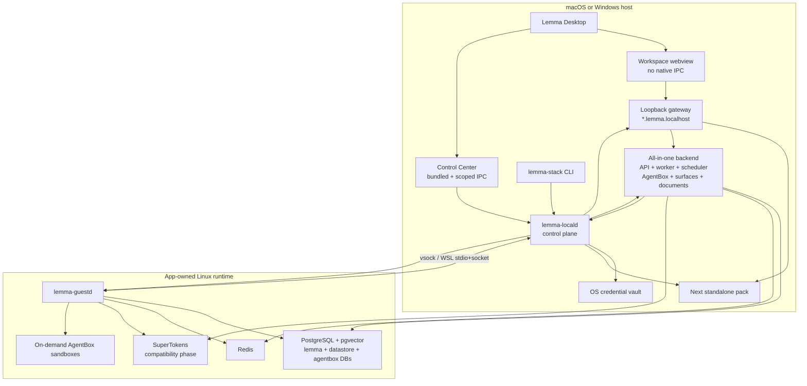
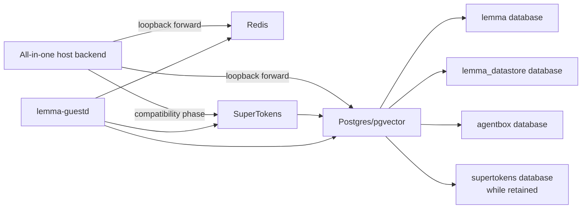
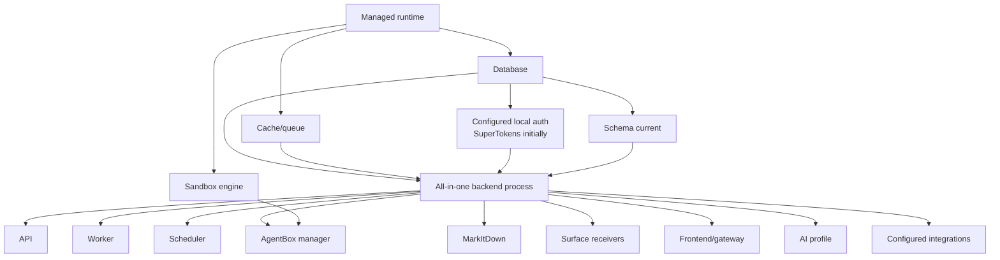

# Lemma Local Desktop: Technical Design

**Status:** Accepted; implementation in progress · **Companion:** [Local Desktop Product Specification](local-desktop-product-spec.md)

**Scope:** `desktop`, `lemma-stack`, local release packaging, AgentBox local provider · **Last updated:** 2026-07-22

## 1. Summary of the decision

Refactor Lemma Local into a native host control plane plus an app-owned Linux data/sandbox plane.

- A new long-lived **`lemma-locald`** daemon owns desired state, configuration, secrets references, releases, processes, health, networking, migrations, backup, and the managed Linux runtime.
- **`lemma-stack`** becomes a thin CLI and compatibility library over the daemon's versioned local API. It no longer contains a second independent orchestration path.
- **Lemma Desktop** becomes a native client of the daemon. It hosts two different trust surfaces: an unprivileged workspace webview and a privileged, bundled Control Center webview.
- Lemma has exactly two application processes: one **all-in-one backend pack** and one **frontend pack**. The backend extends the already-used `standalone_app:app` composition to include API, worker, scheduler, native surface receivers, AgentBox manager, and in-process MarkItDown document conversion.
- **PostgreSQL, Redis, and initially SuperTokens** run inside a private managed Linux runtime. AgentBox uses a separate `agentbox` database on that PostgreSQL instance. Kreuzberg is not part of the managed local release.
- **AgentBox sandbox containers** run in the managed runtime initially. The AgentBox component embedded in the backend talks to a narrow Lemma runtime API rather than mounting a Docker/Podman socket.
- macOS uses an app-owned lightweight VM based on Apple Virtualization.framework. Windows imports a private WSL2 distribution. Docker and Podman remain optional expert providers, never auto-selected.
- A loopback **local gateway** owns `*.lemma.localhost`, routing, stable origins, port collision handling, and request hardening. Privileged daemon control stays on a Unix socket or Windows named pipe.
- Secrets are stored in Keychain/Credential Manager. TOML contains opaque secret references, not secret values.
- Releases are split into independently signed core, backend, frontend, guest, infra-image, and sandbox artifacts. Download is resumable; activation is atomic; migrations are snapshot-backed.

`lemma-locald`, the gateway, VM helper, and `lemma-guestd` are orchestration/runtime helpers, not additional Lemma application services. The user-visible and application-level topology is therefore backend + frontend, with background infrastructure. A follow-on local-auth provider may remove the SuperTokens service only after compatibility, security, migration, and rollback gates pass.

The architecture deliberately keeps a Linux runtime. macOS cannot execute Linux containers without virtualization, WSL2 is the practical Windows Linux-compatibility layer, and AgentBox requires real Linux isolation. The design removes Podman Machine and Docker Desktop from the user's responsibility rather than weakening the workload boundary.

## 2. Context and current architecture

### 2.1 Current production-local topology

`lemma-stack` currently builds declarative service specs and uses either the Docker or Podman CLI to reconcile:

1. PostgreSQL/pgvector;
2. Redis Stack;
3. SuperTokens;
4. optional Kreuzberg;
5. AgentBox manager, with the runtime socket mounted into its container;
6. Lemma backend;
7. Next.js frontend.

The desktop starts the Python `lemma-stack supervise` sidecar and exchanges JSONL commands/events over stdio. The shell owns window/tray behavior, while the supervisor owns runtime detection, image pulls, services, migrations, CLI/skills installation, and readiness.

On macOS/Windows, the Podman path creates/starts a managed machine. Its fixed defaults are 6 GiB RAM, four CPUs, and a 100 GiB disk. On macOS the desktop packaging flow stages Podman/krunkit runtime pieces. Windows desktop distribution is not implemented equivalently.

### 2.2 Current developer topology

The repository's supported `make dev` flow is already hybrid:

- Postgres, Redis, SuperTokens, and Kreuzberg run as containers.
- `standalone_app:app`, the Next frontend, and AgentBox manager run as host processes. `standalone_app:app` already embeds API, Streaq worker, and scheduler.
- AgentBox uses a local container provider only for actual sandbox compute.

This is the compatibility baseline, but not the final process topology. The redesign embeds the AgentBox manager lifecycle into `standalone_app:app`, packages that composition as one backend process, and keeps only sandbox compute in the managed runtime. AgentBox already has a PostgreSQL state store, and the current development bootstrap already creates an `agentbox` database.

### 2.3 Current boundaries worth preserving

- One orchestration implementation is shared by desktop and CLI.
- Release manifests pin images and can use digests.
- Service reconciliation is declarative and hash-based.
- The workspace webview is not granted Tauri IPC permissions.
- Desktop auth uses a PKCE-style browser handoff and does not put session tokens in a deep link.
- Internal services bind to loopback/private networks.
- Config rendering is centralized and generated values are separated from user input.

## 3. Design goals and constraints

### 3.1 Goals

- No external runtime or developer tool prerequisite.
- Identical lifecycle semantics from desktop, CLI, automation, and recovery after restart.
- Host app processes and Linux-only infra can be updated independently but activated as one compatible release.
- Normal start/stop does not require elevation.
- The managed runtime is private, adaptive, sparse, and replaceable without losing user data.
- A corrupted optional artifact cannot prevent Control Center from opening.
- Configuration changes are typed, validated, atomic, and secret-safe.
- All default network listeners are loopback-only; privileged lifecycle actions are OS-local IPC only.
- Sandbox isolation is no weaker than the current container provider.
- Existing local data can migrate with verification and rollback.
- Local application code runs in one backend process and one frontend process.
- Backend subcomponents expose independent health even though their OS lifecycle is shared.

### 3.2 Constraints

- Backend currently requires Python 3.14 and a large native dependency graph.
- Frontend uses Next.js standalone output and requires a Node runtime.
- AgentBox is currently packaged as a separate FastAPI application and its local providers assume Docker/Podman/Kubernetes-style compute APIs.
- SuperTokens core is a separate PostgreSQL-backed service, and the backend/frontend use enough SuperTokens recipes and SDK behavior that replacement requires a captured compatibility contract.
- PostgreSQL requires `pgvector`.
- Backend runtime configuration is largely environment-based and read at process start.
- Local app/widget routing requires stable subdomains and shared session semantics.
- macOS 26 Apple Containerization is Apple-silicon-only and still a distinct support tier from macOS 14/15.
- Windows WSL feature enablement may require elevation and reboot even though daily operation does not.

## 4. High-level architecture



### 4.1 Control plane versus data plane

`lemma-locald` is the authority for desired and observed state. It does not proxy arbitrary user workload I/O. `lemma-guestd` is a minimal, authenticated guest agent that applies narrowly scoped runtime operations. Containers are not directly controlled from the workspace webview or backend.

The split avoids:

- mounting a general container socket into AgentBox;
- making Tauri own long-running child handles;
- teaching every desktop feature Docker/Podman commands;
- relying on a supervisor's stdin remaining open to maintain control state;
- using TCP for privileged local administration.

## 5. Component responsibilities

### 5.1 `lemma-locald`

Implement as a signed Rust daemon shared by both platforms, with small platform-specific helpers where native framework access is required.

Responsibilities:

- single-instance lock and API endpoint;
- install state machine and resumable artifact downloads;
- release manifest verification and compatibility selection;
- desired-state reconciliation for host processes and guest services;
- runtime creation/start/stop/reclaim/update;
- process groups, crash restart, backoff, and log capture;
- config schema, non-secret store, vault references, render/apply/rollback;
- health graph and event stream;
- migrations, backups, restore, data move, uninstall plan;
- gateway lifecycle and route registration;
- resource sampling and idle policy;
- support bundle generation/redaction;
- update staging/activation/rollback;
- compatibility bridge for existing `lemma-stack` operations.

`lemma-locald` must remain operable when frontend, backend, guest runtime, or network downloads are broken. It has no dependency on Python, Node, PostgreSQL, or Redis.

### 5.2 `lemma-stack`

Keep the user-facing command name. Rewrite or progressively replace the Python package with a thin client that:

- discovers the daemon socket/pipe;
- negotiates API version;
- starts the daemon on demand when installed;
- renders human or JSON output;
- streams operations and logs;
- offers expert shells through explicit daemon methods;
- provides a standalone bootstrap path for CLI-only Linux installations.

The Python implementation can remain during migration, but it must call the daemon when one is present. It must not silently fall back to a second local state root after the managed desktop has claimed ownership.

Command mapping:

| Current | Target |
| --- | --- |
| `install` | `install` operation on daemon/bootstrapper |
| `start/stop/restart` | lifecycle API |
| `status --json` | status snapshot API |
| `logs` | log stream API |
| `doctor --json` | diagnostics API |
| `config` | typed config API |
| `db shell/sql/url` | short-lived credentialed local tunnel/tool API |
| `redis cli` | diagnostic exec API, disabled from workspace webview |
| `uninstall` | generated uninstall plan + explicit execute |
| `supervise` | deprecated; desktop connects to `lemma-locald` |

### 5.3 Desktop shell

The Tauri process owns only native application concerns:

- windows, tray, menus, deep links, notifications, start-at-login;
- daemon discovery and a narrow native bridge for bundled Control Center UI;
- loading the local workspace origin after readiness;
- system-browser OAuth launches and focus return;
- app update handoff that requires replacing the desktop executable.

It does not own service process lifetimes. Quitting or crashing the shell does not orphan control state; `lemma-locald` continues according to the user's keep-ready policy.

### 5.4 Control Center

Control Center assets are bundled with the desktop and receive a dedicated capability file. Commands are narrowly typed—such as `local_status`, `local_operation_start`, `secret_set`, and `support_bundle_create`—rather than generic shell, filesystem, or arbitrary daemon request access.

The workspace product loads from `http://app.lemma.localhost:<port>` in a separate webview/window with no Tauri IPC capability. A frontend compromise therefore reaches only the normal authenticated Lemma API, not OS secrets or lifecycle controls.

### 5.5 Local gateway

Implement inside `lemma-locald` or as a small Rust child process if fault isolation warrants it.

Responsibilities:

- bind only `127.0.0.1` and `[::1]`;
- own the selected stable port;
- route by host and path to frontend, API, auth, widgets, and app proxies;
- add security headers and request size/time limits;
- perform WebSocket/SSE forwarding;
- reject DNS-rebinding-style Host headers outside the generated allowlist;
- expose a small unauthenticated `/health/live` with no sensitive data;
- retain stable external origins while internal process ports are random;
- support graceful backend/frontend swaps during updates.

Preferred origins:

```text
http://app.lemma.localhost:<port>                     frontend
http://api.lemma.localhost:<port>                     API/auth/widgets
http://<public-slug>.apps.lemma.localhost:<port>      built pod React/web apps
http://<sandbox>-<app>.workspaces.lemma.localhost:<port> ephemeral AgentBox apps
```

The gateway routes by a validated, lower-cased Host header:

| Host class | Upstream | Notes |
| --- | --- | --- |
| `app.lemma.localhost` | frontend | Main Next application only. |
| `api.lemma.localhost` | backend | Normal API, auth, public SDK, datastore assets, widgets, MCP/WebSocket/SSE. |
| one DNS label before `.apps.lemma.localhost` | backend | Preserve Host; `AppHostRoutingMiddleware` resolves the public slug and serves `/public/apps` assets. |
| one DNS label before `.workspaces.lemma.localhost` | embedded AgentBox private app proxy | Label remains `<sandbox-id>-<runtime-app-slug>`; route never reaches frontend. |

Strip any inbound `X-App-Public-Slug` or internal routing/capability header at the gateway. Either preserve the validated app Host for the existing backend middleware or inject the slug on the private hop, but never trust a browser-supplied routing header. Unknown, bare, multi-label, Unicode/punycode-confusable, overlong, or invalid app hosts return `421 Misdirected Request` before an upstream is contacted.

#### 5.5.1 Built pod app compatibility contract

Local built apps must use the existing production serving path, not a second desktop-only static server:

1. `APP_BASE_DOMAIN=apps.lemma.localhost:<gateway-port>` makes `AppHostRoutingMiddleware` map `<public-slug>` to the existing `/public/apps` controller.
2. Entrypoint HTML remains no-cache and receives `window.__LEMMA_CONFIG__` with the gateway API/auth origins and pod/app context.
3. Hashed JS/CSS/media assets retain immutable cache headers and ETags; non-hashed assets retain current revalidation behavior.
4. SPA deep links, query/fragment navigation, module scripts, dynamic imports, source maps where enabled, Web Workers, WebSockets, SSE, file downloads, and the public `lemma-client.js`/`lemma-ui.js` routes behave as in production.
5. The frontend receives `NEXT_PUBLIC_APPS_DOMAIN_SUFFIX=apps.lemma.localhost` so post-auth redirects and app launch links accept only the exact local suffix.
6. Backend credentialed CORS accepts exactly `http://<valid-slug>.apps.lemma.localhost:<gateway-port>` and the configured main origins. It does not use an unanchored wildcard.
7. The session provider scopes cookies to `.lemma.localhost` only after the browser/WebView matrix proves Domain/SameSite behavior. Apps remain separate origins even though they are same-site for session purposes.
8. Each app origin has independent localStorage, IndexedDB, Cache Storage, and service-worker scope. Update/uninstall tooling can enumerate and clear local app site data only with explicit user intent.

Production `sales.apps.lemma.work` therefore maps mechanically to local `sales.apps.lemma.localhost:<port>`; the public slug and asset/API code paths do not change.

RFC 6761 reserves `localhost` and names beneath it for loopback, and modern browsers consider `http://*.localhost` potentially trustworthy. Before adoption, test cookies, WebSockets, WKWebView, WebView2, and OAuth console acceptance. If any supported environment fails, use one origin with path routing:

```text
http://localhost:<port>/
http://localhost:<port>/api/
http://localhost:<port>/apps/<slug>/
```

Do not fall back to a public wildcard-DNS service. The single-origin path mode is acceptable as a repair surface for the main frontend/API only. It is not a safe substitute for arbitrary user-authored app origins; if private wildcard localhost behavior fails on a supported client, local built-app readiness remains blocked until a private per-origin alternative is implemented.

#### 5.5.2 Sandbox-to-API callback contract

Code sandboxes must call the local API because agents and functions run
`lemma-cli` inside the sandbox. Runtime topology is therefore explicit launch
configuration, never backend URL inference:

- `lemma-locald` renders `WORKSPACE_CALLBACK_API_URL`,
  `WORKSPACE_CALLBACK_AUTH_URL`, and `WORKSPACE_CALLBACK_FRONTEND_URL` for the
  backend pack;
- the backend passes these values through exactly and does not rewrite
  `localhost`, `.localhost`, or any other hostname based on a runtime label;
- local providers map the sandbox-private name `host.lemma.internal` to their
  authenticated host bridge. Docker/Podman use their host gateway, the VZ guest
  uses a vsock-backed forward, and WSL uses the private host/guest forward;
- the bridge exposes only the required gateway/API ports to the managed guest
  network. It never creates a LAN listener;
- `LEMMA_BASE_URL` is mandatory in the local AgentBox profile. Before publishing
  a sandbox as ready, the provider makes an HTTP request from inside that exact
  sandbox to `<LEMMA_BASE_URL>/health/live`. Missing configuration, DNS failure,
  bridge failure, or an unreachable API keeps the sandbox unready with a scoped
  diagnostic;
- the semantic release test then runs a real authenticated `lemma-cli`
  read/write/read round trip from a fresh sandbox, proving more than liveness.

The provider retains compatibility aliases only at its network boundary; they
must not leak back into backend application logic. Callback URL changes are part
of the sandbox desired generation so retained sandboxes are replaced or
revalidated rather than silently keeping a stale route.

### 5.6 Host process packs

#### Backend pack

Package a relocatable, signed directory rather than one monolithic self-extracting binary:

- portable CPython runtime pinned to the release;
- installed wheels/native libraries from the lockfile;
- Lemma backend, AgentBox manager, connector package, SDK/client packages, pod-bundle package, built-in skills/catalog assets, and the compiled `lemma-client.js`/`lemma-ui.js` browser bundles used by pod apps;
- Alembic migrations and a launch manifest;
- AgentBox PostgreSQL dependencies and mandatory MarkItDown dependencies;
- SBOM and license inventory.

Launch a local composition derived from `standalone_app:app` through a small signed shim that receives configuration through inherited handles/files and binds a random loopback port. The composition contains API, Streaq worker, scheduler, native surface receivers, AgentBox manager, and MarkItDown. The shim reports build ID plus subcomponent health to `lemma-locald`.

Do not merge AgentBox domain code into backend modules. Instead:

1. add an `agentbox` local-runtime dependency/extra to the backend pack;
2. refactor AgentBox startup/shutdown from its module-global FastAPI app into a reusable `AgentBoxComponent` async context manager;
3. let that component own provider, PostgreSQL store, reconciliation, cleanup, and lease-renewal tasks;
4. expose its existing routers under a private `/internal/agentbox` sub-application for compatibility and diagnostics;
5. use an in-process manager adapter from backend workspace services, with the HTTP `AgentBoxClient` retained as a cloud/separate-process adapter and black-box contract oracle.

The embedded component must not reconfigure process-global logging or shut down shared telemetry. Its background-task failures update `agentbox` subhealth and trigger bounded component reinitialization; a corrupted interpreter/event loop remains a backend-process failure and `lemma-locald` restarts the complete backend. Uvicorn must run one worker in local mode—starting multiple workers would duplicate the embedded scheduler and AgentBox reconciliation loops.

Slim AgentBox packaging before producing the backend pack: move Kubernetes and every non-local provider SDK behind provider extras, keep provider imports lazy, and install only core + PostgreSQL + `lemma_local` provider dependencies. The current mandatory Kubernetes client should not inflate or broaden the local backend pack.

“In-process document conversion” means no long-lived document service or container. MarkItDown/PDF conversion remains off the asyncio loop through the existing bounded blocking-work limiter. Apply concurrency and memory/file-size limits so simultaneous conversions cannot starve API, worker, scheduler, or AgentBox tasks; event-loop lag and conversion-queue depth are backend subhealth inputs.

The pack is read-only after verification. Mutable caches go under the cache root. No `uv sync`, `pip`, compiler, or network dependency resolution occurs on the user's machine.

#### Frontend pack

Use Next.js `output: "standalone"`:

- standalone server output;
- static/public assets;
- pinned platform Node runtime;
- runtime config template consumed at process start;
- SBOM/license inventory.

Bind to a random loopback port known only to the gateway. The frontend must not expose the internal backend port; browser calls use the gateway origin.

### 5.7 Managed Linux runtime

The guest contains only:

- minimal signed Linux kernel/root filesystem;
- containerd and runc (or equivalent pinned OCI runtime);
- CNI/network helpers;
- `lemma-guestd`;
- filesystem and metrics helpers;
- no general SSH server;
- no package manager required for normal operation.

OCI application images remain release artifacts. `lemma-guestd` accepts declarative service specs over an authenticated channel, pulls/imports verified images, and reports status/events. It does not expose the raw containerd socket to the host network.

The shipping macOS appliance uses Ubuntu 24.04 userspace and initramfs with the
exact container-optimized Kata kernel pinned by Apple's Containerization build
(`kata-static` 3.17.0, kernel 6.12.28-153). The source archive, kernel, initrd,
and root filesystem hashes are recorded in `runtime.json`; clean builds verify
the Kata archive before extraction. This avoids depending on Ubuntu's moving
GA/HWE kernel packages, both of which produced reproducible VZ faults under
the Lemma container workload. CNI selects the legacy iptables backend because
this minimal kernel does not provide Ubuntu's nftables module set.

Fresh PostgreSQL provisioning is idempotent across the official image's
temporary-server restart. Database existence queries are the source of truth:
after any ambiguous `createdb` result, including a committed transaction whose
connection closed with exit 1, `lemma-guestd` rechecks the catalog before it
attempts another create. The same PostgreSQL instance owns `lemma`,
`lemma_datastore`, `agentbox`, and `supertokens` databases.

## 6. Platform runtime implementations

### 6.1 macOS provider

#### Initial provider: shared lightweight VM

Use Apple Virtualization.framework through a small Swift `lemma-vm-service` XPC/helper embedded and signed with the app/runtime. The Rust daemon communicates through a private XPC or Unix-socket protocol.

Configuration:

- Apple silicon only;
- a minimal arm64 Linux kernel and rootfs;
- sparse APFS-backed disk image;
- VIRTIO block, network, entropy, socket, filesystem, and memory-balloon devices;
- VirtioFS shares restricted to Lemma runtime/data/workspace roots;
- NAT networking; no bridged/LAN listener by default;
- vsock for control and port-forward channels;
- adaptive memory ceiling derived from physical RAM, with balloon reclaim;
- CPU count as a maximum, not a user-visible reservation.

Resource policy example:

| Host RAM | Guest maximum | Reclaimed idle target | Max vCPU |
| --- | ---: | ---: | ---: |
| 8 GiB | 3 GiB | 384–512 MiB | 2 |
| 16 GiB | 6 GiB | 512 MiB | 4 |
| 32+ GiB | 10 GiB | 512 MiB | 6 |

These are adaptive defaults subject to measurement. Control Center exposes Balanced/Low resource/Performance policies and advanced ceilings, not a required machine-size form.

The host VZ helper owns one persistent virtio-vsock RPC channel to
`lemma-guestd` and multiplexes authenticated local Unix-socket requests over it
serially. Opening and closing a guest connection for every 250 ms readiness
probe triggered faults in VZ container kernels and is prohibited. The helper
reconnects only after guest-channel failure, drains each response before
serving the next local client, and keeps the channel valid even if a local
caller times out. The packaged helper is separately code-signed with only the
`com.apple.security.virtualization` entitlement and is then sealed into the
outer application signature.

#### Follow-on provider: Apple Containerization

On macOS 26+, add an AgentBox provider built on Apple's open-source Containerization framework. Each sandbox gains VM-level isolation, dedicated file shares, and dynamic resource allocation. Do not make this default until it passes:

- OCI image and architecture parity;
- network proxy/app exposure parity;
- workspace persistence and file-notification parity;
- browser/Chromium reliability;
- suspend/resume/delete semantics;
- five-concurrent-sandbox resource tests;
- upgrade and crash recovery.

Always-on infra may remain in the shared VM initially to avoid three additional always-on VMs. A later benchmark can decide whether Apple Containerization should own infra too.

### 6.2 Windows provider

Use a private imported WSL2 distribution named with a collision-resistant product ID, displayed as “Lemma Runtime” in product UI.

- Import a signed minimal rootfs tar or sparse VHDX into `%LOCALAPPDATA%\Lemma\runtime` using supported `wsl --import`/`--import-in-place` commands.
- Never change the user's default distribution.
- Store high-I/O guest data and sandbox workspaces in the ext4 VHD for performance. Expose approved workspace locations through `\\wsl.localhost\LemmaRuntime\...` and an **Open in Explorer** action.
- Use Windows-to-WSL localhost forwarding for data-plane endpoints and a named-pipe/stdio bootstrap that authenticates the guest control channel.
- Use sparse VHD behavior where supported.
- Do not edit global `.wslconfig` silently. Detect `autoMemoryReclaim`; recommend or apply changes only with explicit user confirmation because the file affects every WSL distribution.
- Terminate only the Lemma distribution during idle/repair. Never call global `wsl --shutdown` during normal operation.

If WSL is missing, `lemma-locald` reports the stable `wsl-required` state;
startup never elevates implicitly. The native splash or `lemma-stack prepare`
must explicitly request the authenticated `runtime.prepare` operation. On that
operation only, the runtime opens UAC and executes the fixed command
`wsl.exe --install --no-distribution --no-launch`. Cancellation removes the
pending marker. A successful command that still fails `wsl.exe --status`
records `runtime/wsl-setup-pending.json`, reports `wsl-reboot-required`, and
continues startup automatically after the next Windows launch. No caller can
supply PowerShell or WSL arguments, and remote workspace webviews cannot invoke
the native preparation command.

### 6.3 External provider

Retain Docker/Podman through the existing runtime adapter for development, CI, migration, and advanced users. Requirements:

- explicit opt-in;
- no automatic takeover of the user's default Docker context or Podman connection;
- service names/labels remain namespaced;
- managed-runtime data is not silently mounted into external containers;
- health UI states that resource and lifecycle guarantees differ;
- no promise of zero-config SLOs.

## 7. AgentBox local-provider redesign

### 7.1 Current problem

The AgentBox manager runs inside a container and mounts the host Docker/Podman socket. This requires the app container to have broad compute authority, creates SELinux labeling exceptions, and makes the entire local stack depend on a general-purpose runtime API.

The development topology improves this by running AgentBox on the host, but still launches a third application process and preserves HTTP/process lifecycle overhead that the local product does not need.

### 7.2 New provider contract

Add `LemmaLocalProvider` to AgentBox. The AgentBox component embedded in the backend calls a narrow daemon API using a provider credential delivered through an inherited OS-local channel.

Required operations:

```text
ensure_sandbox(logical_id, image_digest, env_non_secret, mounts, limits)
start_sandbox(logical_id)
inspect_sandbox(logical_id)
suspend_sandbox(logical_id)
delete_sandbox(logical_id)
exec_runtime_probe(logical_id, probe_id)
resolve_routes(logical_id)
stream_events(after_sequence)
```

The daemon translates these into guest operations. AgentBox never receives:

- raw containerd/Docker/Podman socket access;
- arbitrary image references not present in the active release/allowlist;
- arbitrary host bind paths;
- privileged container flags;
- runtime-global list/delete operations.

Managed local installs set `AGENTBOX_STATE_DATABASE_URL` to a dedicated `agentbox` database on the same PostgreSQL server used by Lemma. Use a unique least-privilege role for that database; sharing an instance does not mean sharing schemas, ownership, or migration history. AgentBox migrations run before its component reports ready and use the existing PostgreSQL advisory-lock protection.

### 7.3 Mount and token policy

- The host daemon resolves logical mount IDs to pre-approved directories.
- macOS exposes only those directories through VirtioFS.
- Windows keeps sandbox workspaces inside the guest and exposes host-selected imports through explicit copy/share actions.
- Persistent non-secret environment belongs to sandbox state.
- Delegated Lemma tokens and dynamic credentials remain session-scoped and short-lived as they are today.
- Browser profile/cookie caches remain ephemeral unless a product requirement explicitly changes that boundary.

### 7.4 Lifecycle mapping

AgentBox's `ensure`, session, suspend, and delete semantics remain unchanged. The provider allocation stores a daemon runtime ID and generation. Reconciliation is idempotent:

- missing compute + existing logical sandbox → create from desired spec;
- digest/spec mismatch → replace compute while preserving approved durable workspace;
- AgentBox component restart or backend restart → recover from PostgreSQL desired state and daemon inventory scoped to its provider namespace;
- daemon/guest crash → report transient unavailable, then reconcile after recovery;
- permanent delete → remove compute and workspace after AgentBox records intent.

## 8. Local daemon API

### 8.1 Transport

- macOS: Unix domain socket under the per-user application support directory, mode `0600`.
- Windows: named pipe with an ACL granting only the installing user and SYSTEM.
- Protocol: versioned HTTP/2 or framed JSON over local IPC. gRPC is acceptable if client distribution size and debugging remain reasonable.
- Every request is authenticated by OS peer identity. Sensitive sub-clients such as AgentBox also use a rotated capability token bound to purpose.
- No privileged API listens on TCP.

### 8.2 Version negotiation

Handshake returns:

```json
{
  "api": {"major": 2, "minor": 0},
  "daemon_version": "1.0.0",
  "install_id": "...",
  "platform": "macos-arm64",
  "state_revision": 418,
  "supported_features": [
    "managed-runtime",
    "host-packs",
    "vault-v1",
    "backup-v1"
  ]
}
```

Clients may use a lower minor version but must reject an unsupported major. Desktop bundles a minimum/maximum daemon API range. Updating a release stages a compatible daemon before activating host packs.

### 8.3 Core resources

```text
GET    /v2/status
GET    /v2/events?after=<sequence>
POST   /v2/operations/install
POST   /v2/operations/start
POST   /v2/operations/stop
POST   /v2/operations/restart
POST   /v2/operations/update
POST   /v2/operations/repair
GET    /v2/operations/{id}
POST   /v2/operations/{id}/cancel

GET    /v2/config/schema
GET    /v2/config
PATCH  /v2/config
POST   /v2/config/validate
PUT    /v2/secrets/{name}
DELETE /v2/secrets/{name}

GET    /v2/profiles
POST   /v2/profiles/validate
GET    /v2/integrations
POST   /v2/integrations/{id}/validate
GET    /v2/surfaces
POST   /v2/surfaces/{id}/validate

GET    /v2/services
POST   /v2/services/{id}/restart
GET    /v2/logs/{source}
GET    /v2/diagnostics
POST   /v2/support-bundles

GET    /v2/storage
POST   /v2/backups
POST   /v2/restores
POST   /v2/storage/move
POST   /v2/uninstall/plan
POST   /v2/uninstall/execute
```

All mutations return an operation resource; none hold the request open for a multi-minute download/migration.

### 8.4 Event envelope

```json
{
  "sequence": 419,
  "time": "2026-07-22T10:30:00Z",
  "kind": "service.state_changed",
  "operation_id": "op_...",
  "payload": {
    "service": "database",
    "from": "starting",
    "to": "healthy",
    "health_code": "postgres.ready"
  }
}
```

Events persist to a bounded local journal so a desktop reconnect gets deltas. Slow clients fall back to a new snapshot revision. Logs use independent bounded streams to avoid flooding state events.

### 8.5 Operation model

Operations are persisted as small JSON records:

```text
queued -> running -> waiting_for_user | succeeded | failed | cancelled
```

Each step records an idempotency key, attempt, progress bytes/count, and rollback boundary. Daemon restart resumes safe steps. A migration step marked non-repeatable must write its own durable checkpoint before execution.

## 9. Desired-state and reconciliation model

### 9.1 Service declaration

Generalize the existing `ServiceSpec` into a runtime-neutral model:

```yaml
id: backend
kind: host_process
artifact: backend@sha256:...
command: [lemma-backend-shim, serve-local]
dependencies:
  database: healthy
  redis: healthy
  auth: healthy_if_enabled
config_revision: 42
health:
  type: http_components
  path: /health/ready
  required: [api, worker, scheduler, agentbox, document_processor]
restart:
  policy: on-failure
  burst: 3
  window_seconds: 60
```

Guest container specs use image digests, private network attachments, volumes, resource ceilings, health checks, and restart policy. They do not include arbitrary Docker CLI fragments.

### 9.2 Reconciliation loop

For every component:

1. derive desired release/config/runtime state;
2. inspect observed state;
3. calculate no-op/start/stop/replace/repair;
4. execute dependency-ordered actions;
5. gate on semantic health;
6. publish state revision and event;
7. back off on repeated failure and surface a stable health code.

Hash reconciliation remains, but hashes include artifact digest, rendered non-secret config, secret-reference revision (not secret value), launch schema, and data-schema compatibility.

The daemon reconciles the all-in-one backend only as a process unit. Backend-owned subcomponents remain separate health nodes, but their first repair action is an internal component reinitialize request where supported; the fallback is restarting the complete backend process. The daemon never launches worker, scheduler, or AgentBox as hidden extra processes in managed local mode.

### 9.3 Process supervision

- macOS: spawn each host process in its own process group; daemon is maintained by a per-user LaunchAgent.
- Windows: put host processes in daemon-owned Job Objects with kill-on-close disabled only where the keep-ready policy requires daemon survival; daemon starts through a per-user scheduled/startup task or installer-approved service model.
- Rotate logs by size/time and retain bounded history.
- Send graceful termination first, enforce a timeout, then terminate the group/job.
- Use exponential backoff with jitter and a circuit breaker after repeated crashes.
- Never use PID files as proof of identity; validate process start token/executable/build ID.

## 10. Configuration and secrets

### 10.1 Data model

```toml
schema = 2
install_id = "..."

[release]
channel = "stable"
version = "1.2.3"

[runtime]
provider = "managed"
policy = "balanced"
idle_stop_minutes = 15

[application]
backend_mode = "all_in_one"
document_processor = "markitdown"

[auth]
provider = "supertokens_compat"

[network]
gateway_port = 3711
lan_enabled = false

[ai.system]
protocol = "openai_compatible"
base_url = "http://localhost:11434/v1"
api_key_ref = "vault://ai/system/api-key"
default_model = "gpt-oss:20b"
models = ["gpt-oss:20b"]

[integrations.google]
client_id = "..."
client_secret_ref = "vault://integrations/google/client-secret"
```

The actual schema is machine-readable and richer than TOML. The file is an implementation representation, not the source of UI metadata.

### 10.2 Schema entry

```json
{
  "path": "ai.system.api_key",
  "type": "secret",
  "label": "API key",
  "group": "ai.system",
  "required_when": "ai.system.protocol != 'local_no_auth'",
  "restart_scope": ["backend"],
  "validator": "ai_provider_probe",
  "redaction": "presence_only"
}
```

The schema is checked into the release and may be extended by backend-provided capability catalogs. The daemon accepts only known fields unless an explicit experimental namespace is enabled.

### 10.3 Vault implementation

- macOS: Keychain generic-password items under service `work.lemma.local` and per-install access group.
- Windows: Credential Manager or DPAPI-protected per-user vault; select the implementation that supports reliable enumeration, rotation, and uninstall.
- Store a random master install secret used to derive local capability tokens and encrypt any secret metadata that must be persisted outside the vault.
- Vault values are never placed in command-line arguments or world-readable environment files.
- Prefer anonymous pipes/inherited handles for process secret injection. If environment variables are temporarily required for backend compatibility, construct them only in the daemon child environment and redact them from crash/log collection.

### 10.4 Apply transaction

1. Client sends non-secret patch plus separately entered secret values.
2. Daemon validates schema and stores new secrets as staged vault versions.
3. Daemon renders config into a new revision directory.
4. Offline and provider probes run where possible.
5. Affected processes hot-reload or restart in dependency order.
6. Semantic health gates must pass.
7. Commit config revision and retire old vault versions.
8. On failure, restore old render, restart old config, delete staged secret versions, and return the failure code.

### 10.5 Local web/app render contract

For gateway port `P`, schema rendering produces the following logical values (the final implementation may deliver them through structured config rather than environment variables):

```text
# backend
API_URL=http://api.lemma.localhost:P
FRONTEND_URL=http://app.lemma.localhost:P
AUTH_FRONTEND_URL=http://app.lemma.localhost:P/auth
APP_BASE_DOMAIN=apps.lemma.localhost:P
SESSION_COOKIE_DOMAIN=.lemma.localhost
CORS_ORIGIN_REGEX=<anchored generated regex for exact main/API/app origins on P>
AGENTBOX_APP_DOMAIN=workspaces.lemma.localhost:P

# frontend runtime config
NEXT_PUBLIC_API_URL=http://api.lemma.localhost:P
NEXT_PUBLIC_SITE_URL=http://app.lemma.localhost:P
NEXT_PUBLIC_AUTH_URL=http://app.lemma.localhost:P/auth
NEXT_PUBLIC_SESSION_TOKEN_DOMAIN=.lemma.localhost
NEXT_PUBLIC_SHARED_SESSION_DOMAIN=lemma.localhost
NEXT_PUBLIC_APPS_DOMAIN_SUFFIX=apps.lemma.localhost
```

`P` is substituted before process launch and excludes the colon placeholder syntax above. Local app settings are one atomic config group: gateway allowlist, backend app-base/CORS/cookie settings, frontend redirect suffixes, and AgentBox workspace-app domain cannot be applied independently. A mismatch fails configuration validation before either application process starts.

## 11. Model-provider discovery and validation

### 11.1 Discovery

Probe only fixed loopback endpoints by default:

- Ollama: `GET http://127.0.0.1:11434/api/tags`;
- LM Studio: `GET http://127.0.0.1:1234/api/v1/models` and OpenAI-compatible fallback;
- stored custom endpoints.

Do not scan LAN ranges or mDNS for model servers.

### 11.2 Compatibility rendering

Until the backend exposes an operator-settings/profile API, render the chosen system profile to the existing variables:

```text
LEMMA_DEFAULT_MODEL_TYPE
LEMMA_OPENAI_API_KEY
LEMMA_OPENAI_BASE_URL
LEMMA_OPENAI_DEFAULT_MODEL
LEMMA_OPENAI_MODEL_NAMES
LEMMA_OPENAI_VISION_MODEL_NAMES
LEMMA_ANTHROPIC_API_KEY
LEMMA_ANTHROPIC_BASE_URL
LEMMA_ANTHROPIC_DEFAULT_MODEL
LEMMA_ANTHROPIC_MODEL_NAMES
```

For an unauthenticated loopback provider such as Ollama, the compatibility renderer supplies a non-secret local sentinel for the currently required OpenAI-compatible key field; Ollama documents that this field is required by clients but ignored locally. The target backend profile model should make credentials optional for explicitly trusted loopback endpoints so this shim can be removed.

The user-facing model stays profile-based. Environment names never become the UI contract.

### 11.3 Probe isolation

Provider probes execute in the daemon or a short-lived helper with:

- explicit timeouts and response-size caps;
- proxy policy;
- TLS verification by default;
- no redirects from loopback to non-loopback without confirmation;
- redacted error extraction;
- a tiny token budget and an identifiable validation request;
- cancellation when the user leaves/retries.

## 12. Guest service topology

### 12.1 Core services



Use release-pinned OCI digests. Internal service ports stay on a private guest network. `lemma-locald` creates authenticated/allowlisted loopback forwards for host processes. Do not publish database/cache/auth ports for general host access; diagnostic tools request a time-bounded tunnel.

### 12.2 Slimming decisions

- Enforce an always-on container budget: three in the first compatibility release (PostgreSQL, Redis, SuperTokens), two after local-auth cutover (PostgreSQL, Redis). Backend, frontend, AgentBox manager, scheduler, worker, and document processing never consume additional containers. On-demand sandbox compute is measured separately.
- Replace `redis-stack` with standard Redis after a release-blocking command audit; current application code uses Redis clients, streams, pub/sub, cache, and keys but no located Redis Stack module calls.
- Set `DOCUMENT_PROCESSOR=markitdown`, include the dependency in the backend pack, and do not ship a Kreuzberg image, URL, optional pack, or managed-local configuration surface. Cloud/external deployments may retain other adapters independently.
- Use a minimal pgvector PostgreSQL image and initialize separate `lemma`, `lemma_datastore`, `agentbox`, and initially `supertokens` databases. Give each consumer a least-privilege role; enable `vector` only where used.
- Keep SuperTokens separate for the first managed release. Its removal is a later, explicitly gated optimization described in section 13.3; it is not on the critical path for the two-process application topology.
- Pre-import compressed OCI images with the guest artifact where this improves first-run time; otherwise use resumable layer pulls through the host downloader.

### 12.3 Credentials

Generate unique per-install PostgreSQL roles/passwords, Redis auth, SuperTokens API key where supported, AgentBox provider capability, endpoint-state keyring, session/crypto roots, and internal gateway tokens. The embedded AgentBox manager does not need a network API key for in-process calls; its private HTTP compatibility route still requires an internal credential. Development defaults never ship.

Rotate internal credentials through a coordinated config revision. Database password rotation creates the new role/credential, updates clients, verifies, then removes the old credential.

## 13. Networking and authentication

### 13.1 Port allocation

- Gateway prefers 3711 but binds atomically and persists a different free port if occupied.
- Internal host processes bind port `0`; the daemon reads the selected port from an inherited control channel.
- Guest forwards use random loopback ports and are never persisted as public configuration.
- CLI server registration reads the current gateway endpoint from the daemon, not a hard-coded port.

### 13.2 Local owner bootstrap

Add a one-time backend endpoint available only when:

- database has no local owner;
- request comes through the daemon-authenticated local gateway bootstrap route;
- a single-use capability matches a daemon-held hash;
- the bootstrap deadline has not expired.

The endpoint creates the owner and consumes the capability in one transaction. It must become permanently unavailable once an owner exists. Desktop may exchange this for a session from the configured auth provider, but the browser path still needs a real login method.

### 13.3 Lightweight local-auth follow-up

Do not remove SuperTokens during the initial all-in-one backend work. The backend imports the SuperTokens SDK across middleware, session retrieval, user lookup, token creation, OAuth recipes, worker startup, CLI/MCP flows, and tests. Reimplementing “compatible APIs” safely is a bounded project, but not a configuration-only change.

The follow-up uses an `AuthProvider` boundary selected only in local composition:

```text
AuthProvider
  bootstrap_owner(...)
  sign_in_password(...)
  begin/complete_third_party(...)
  get/refresh/revoke_session(...)
  get_user(...)
  create_scoped_token(...)
```

Implementation rules:

- capture frontend/backend/CLI/MCP traffic against a pinned SuperTokens version and turn it into a black-box contract suite before writing the replacement;
- preserve current gateway paths, cookie names/attributes, refresh semantics, CSRF behavior, error shapes, and only the recipe endpoints demonstrably used;
- store users, identities, password hashes, sessions, refresh-token families, OAuth state, and revocations in PostgreSQL under a versioned local-auth schema;
- use Argon2id (or another security-reviewed memory-hard password KDF), rotating signing/encryption roots from the OS vault, hashed refresh tokens, one-time OAuth state, constant-time comparisons, and per-account/IP loopback-aware rate limits;
- maintain normal browser authentication even though Desktop can offer OS-mediated unlock;
- import auth data into a staging schema/database, verify a test session, switch the provider atomically, and retain the SuperTokens database/image for rollback through a bounded grace period;
- never claim full SuperTokens compatibility or expose the replacement in cloud deployments.

Release gates include a dedicated security review, fuzz/negative tests for cookie and token parsing, session fixation/rotation tests, CSRF tests, password migration tests, third-party account-linking tests, multi-window refresh races, CLI/MCP token tests, and rollback after first login. Only then may new installs omit the SuperTokens image and database.

### 13.4 Desktop/browser OAuth

Follow RFC 8252:

- open the system browser;
- authorization code + PKCE S256;
- cryptographic state and OIDC nonce where applicable;
- random loopback port callback preferred;
- custom `lemma://` deep link only focuses the app or carries a non-secret request ID;
- token/code exchange occurs over the authenticated loopback/native flow;
- strict redirect allowlist and short expiry.

Connector OAuth redirects use the provider-approved local callback where possible. When a provider requires HTTPS/static callbacks, use the optional Lemma Relay or a user-configured tunnel; never fake completion in the webview.

### 13.5 LAN and public ingress

LAN access is a separate feature:

- disabled by default;
- binds a chosen interface, not `0.0.0.0` indiscriminately;
- requires TLS and a local access credential;
- warns that local-owner assumptions change;
- firewall rule creation is explicit and reversible.

Public ingress is outbound-tunnel-only in the managed path. It exposes only registered webhook routes, not database, daemon, frontend administration, or sandbox APIs.

## 14. Artifact and release model

### 14.0 Shipping transition format

The first managed-runtime release deliberately keeps the additive schema-1
`lemma-local.json` used by current `lemma-stack` releases. It adds
`host_packs[target]` and `guest_runtimes[target]` entries containing an HTTPS
URL, exact byte size, SHA-256 digest, and `zip` format. The online desktop embeds
that manifest inside the platform-signed application, requires its release to
equal the desktop version, and safely stages both archives under Application
Support. The offline installer bundles the same extracted payloads.

The online artifact is the default download. For the current macOS arm64
release, the online `.app` is approximately 10 MiB installed and the measured
compressed runtime payload is approximately 307 MB for the host pack plus 224
MB for the guest appliance. The offline `.app` expands to approximately 3.0
GiB because it embeds both packs, including the guest's 2 GiB sparse root disk.
Release notes and install preflight must distinguish online package size,
first-run download size, expanded immutable runtime, and writable user/data
headroom; presenting the offline installed size as the normal download
expectation is a product defect.

Downloads use system proxy settings, bounded redirects/timeouts, resumable
range requests, exact `Content-Range` validation, archive and expanded-size
ceilings, entry-count limits, traversal/symlink/overlap rejection, and immutable
release directories. Windows Python and Node entrypoints are Authenticode
signed before their archive digest is published. macOS application bundles and
both DMGs are Developer ID signed, notarized, and stapled. The schema-2 format
below remains the update/rollback target; it is not required to bootstrap the
first managed release.

The shipping schema-1 activator now enforces an exact desktop/runtime release
match on every launch, stages into an immutable release directory, atomically
replaces the flushed desktop pointer (including through `MoveFileExW` on
Windows), and retains the prior verified release. A non-destructive Control
Center repair stops only Lemma, quarantines the current release, redownloads and
revalidates the exact signed artifacts, then starts them; any repair failure
restores the original directory and pointer. Schema 1 has no data rollback
classification or pre-update logical snapshot, so its UI must not expose a
manual runtime downgrade. Retention is recovery preparation, not a rollback
claim. Manifest v2 plus section 16's snapshot transaction remains the gate for
that action.

### 14.1 Release manifest v2

```json
{
  "schema": 2,
  "release": "1.2.3",
  "min_daemon": "1.1.0",
  "platforms": {
    "macos-arm64": {
      "desktop": {"url": "...", "sha256": "...", "signature": "..."},
      "daemon": {"url": "...", "sha256": "...", "signature": "..."},
      "packs": {
        "backend": {"url": "...", "sha256": "...", "size": 0},
        "frontend": {"url": "...", "sha256": "...", "size": 0}
      },
      "guest": {"url": "...", "sha256": "...", "format": "raw.zst"}
    }
  },
  "images": {
    "postgres": "registry/ref@sha256:...",
    "redis": "registry/ref@sha256:...",
    "supertokens": {"ref": "registry/ref@sha256:...", "required_when": "auth.provider == 'supertokens_compat'"},
    "agentbox-runtime": "registry/ref@sha256:..."
  },
  "optional_packs": {
    "workspace": {"size": 0, "artifacts": []}
  },
  "data_schema": {"from": [41, 42], "to": 43, "rollback": "snapshot_only"},
  "signature": "..."
}
```

The top-level manifest is signed with an offline-rooted release key. Each artifact is hashed and signed. Platform code signing/notarization is required in addition to manifest verification.

### 14.2 Directory activation

```text
releases/
  1.2.2/
  1.2.3.staging/
current -> releases/1.2.2
previous -> releases/1.2.1
```

Windows uses an atomic pointer file/junction strategy compatible with locked executables. New processes launch from the selected immutable release; the old release is retained until health and migration policy permit cleanup.

### 14.3 Download behavior

- Host daemon downloads through system proxy settings.
- Chunked/resumable transfers store expected digest and ETag.
- Verify before unpack; unpack into a staging directory with path traversal and size limits.
- Verify every executable/library after unpack.
- Enforce release artifact size budgets in CI.
- Offline bundles contain the same signed manifest/artifacts and use the same verification path.

## 15. Install and startup sequences

### 15.1 Fresh install

```mermaid
sequenceDiagram
  participant U as User
  participant D as Desktop
  participant L as lemma-locald
  participant R as Managed runtime
  participant B as Backend
  participant C as Control Center

  U->>D: Launch signed app
  D->>L: Start/connect
  L->>L: Preflight OS, disk, virtualization, proxy
  L-->>C: Preflight + artifact sizes
  U->>C: Confirm core install
  C->>L: POST install operation
  L->>L: Download, verify, stage host/guest artifacts
  L->>R: Create/start runtime and core containers
  L->>B: Run DB migrations, then start all-in-one backend
  L->>L: Start frontend/gateway and semantic checks
  L-->>C: Core ready; owner bootstrap available
  U->>C: Create owner and configure AI
  C->>L: Save secret + validate profile + apply
  L->>B: Restart/hot-apply backend config
  L-->>D: Ready snapshot
  D->>D: Navigate workspace webview
```

### 15.2 Normal start

1. Desktop/CLI connects to daemon.
2. Daemon loads last committed release/config desired state.
3. Start runtime if required.
4. Start guest core dependencies in parallel where safe; gate PostgreSQL before database migrations and the compatibility SuperTokens service when enabled.
5. Start the single all-in-one backend after PostgreSQL, Redis, migrations, and configured auth are healthy. Its lifespan starts worker, scheduler, AgentBox, surfaces, and document-processing subcomponents exactly once.
6. Start the single frontend and gateway; gateway can present maintenance/degraded UI earlier.
7. Gate readiness on backend subhealth, then publish ready/degraded state.

### 15.3 Crash recovery

- Desktop crash: no service effect; relaunch reconnects from last event sequence.
- Frontend crash: gateway shows a scoped retry page; daemon restarts with backoff.
- Backend crash: frontend remains, API routes return a structured local-unavailable response; daemon restarts the one backend process. PostgreSQL-backed jobs, schedules, and AgentBox desired state survive.
- AgentBox background-task failure: backend marks sandbox capability degraded and attempts bounded component reinitialization; active compute remains. If isolation cannot be restored, the daemon restarts the complete backend and AgentBox reconciles from PostgreSQL plus runtime inventory.
- Guest VM/WSL crash: daemon restarts it and reconciles containers from desired specs.
- Daemon crash: OS launcher restarts it; it validates process identity, adopts matching children, and reconciles.
- Power loss during update: activation journal selects the last fully verified release and checks migration state before start.

## 16. Updates, migrations, and rollback

### 16.1 Update classes

1. **Desktop-only:** use the [Tauri updater](https://v2.tauri.app/plugin/updater/) and platform signing, with no data-plane restart if API-compatible. Tauri's mandatory update signature is an additional check; it does not replace the release-manifest signature or macOS/Windows code signing.
2. **Application pack:** stage and switch the all-in-one backend or frontend pack under a compatible release manifest. Backend changes activate as one unit even if only an embedded subcomponent changed.
3. **Guest/image:** import/pull new image digests, recreate affected containers.
4. **Guest kernel/rootfs:** stop runtime, atomically swap boot assets, retain previous assets.
5. **Database migration:** create logical backup/snapshot, stop writers, migrate, verify, then activate.

### 16.2 Transaction

1. Resolve update and compatibility.
2. Download/verify all mandatory artifacts.
3. Run preflight: free space, backup destination, current health, incompatible processes.
4. Create consistent snapshot when migration/rootfs change requires it.
5. Write activation journal.
6. Stop affected services.
7. Activate daemon/runtime/packs in dependency order.
8. Apply migrations with durable checkpoints.
9. Start and run semantic verification.
10. Commit `current`; retain `previous` and snapshot.
11. On failure before irreversible boundary, switch back automatically.
12. On failure after irreversible migration, restore snapshot or remain in repair mode with data intact.

Never claim in-place rollback if the database schema is not backward compatible. The manifest states `rollback: compatible | snapshot_only | none` and UI explains it before update.

### 16.3 Catalog seeding

Connector catalog import and other release data seeding must be versioned, idempotent, and included in semantic verification. They must not depend on optional provider keys to complete core update.

## 17. Health model

### 17.1 Dependency graph



Core readiness requires Runtime, DB, Cache, configured Auth, Migrations, Backend process, API, Worker, Scheduler, and Frontend. Agent readiness additionally requires AgentBox, sandbox engine/workspace pack, and an AI profile. MarkItDown is required for document-ingestion readiness; a failure degrades document ingestion without hiding ordinary data access. Optional surface/integration failures affect only those capabilities.

### 17.2 Check shape

```json
{
  "id": "ai.system.tool_probe",
  "state": "blocked",
  "severity": "action_required",
  "capability": "agents",
  "summary": "Choose an AI model that supports tools",
  "detail": "The selected endpoint generated text but did not return a valid tool call.",
  "code": "ai.tool_call_incompatible",
  "retryable": false,
  "actions": ["open_ai_settings", "choose_other_model"]
}
```

Checks must never return raw exception dumps to the normal UI. Technical detail remains available in Diagnostics with redaction.

## 18. Resource management

### 18.1 Sampling

Daemon samples:

- host process CPU/RSS/open handles;
- runtime process/VM CPU and resident memory;
- guest memory available/cache/pressure and balloon state;
- container CPU/memory/IO;
- filesystem and image-store sizes;
- active AgentBox sessions and last activity.

Store only a rolling local window (for example, 24 hours at coarse resolution). Export nothing by default.

### 18.2 Idle controller

States:

```text
active -> cooling_down -> warm_idle -> stopped
```

- Active AgentBox sessions, jobs, schedules, surface receivers, migrations, downloads, or backups inhibit stop.
- Suspend idle sandboxes before shrinking/stopping the runtime.
- macOS requests guest cache drop and balloon reclaim before full VM stop.
- Windows stops guest services and terminates only the Lemma WSL distribution.
- A gateway request or CLI operation wakes services and receives an operation-aware retry page rather than connection refused.

### 18.3 Pressure response

When host memory pressure is high:

1. stop optional idle sandbox compute;
2. reduce guest cache through supported mechanisms;
3. pause optional document processing/downloads;
4. reject new sandbox creation with an actionable resource error rather than allow host thrash;
5. never kill PostgreSQL abruptly as a resource-saving action.

## 19. Data layout

Use OS conventions rather than assuming `HOME`.

### macOS

```text
~/Library/Application Support/Lemma/
  config/
  state/
  data/
  runtime/
  releases/
  backups/
~/Library/Caches/work.lemma.desktop/
  downloads/
  logs/
```

### Windows

```text
%APPDATA%\Lemma\config\
%LOCALAPPDATA%\Lemma\state\
%LOCALAPPDATA%\Lemma\runtime\
%LOCALAPPDATA%\Lemma\releases\
%LOCALAPPDATA%\Lemma\cache\
<user-selected or default>\Lemma Data\backups\
```

Keep configuration/state separate from large data so the user can relocate data without breaking the daemon install. The WSL VHD is runtime/data according to its contents; backup uses logical exports, not blind live copies.

`LEMMA_STACK_ROOT` remains a development/test override and must not be used by signed desktop releases except under an explicit developer mode.

## 20. Backup and restore design

### 20.1 Backup content

- `pg_dump` custom-format exports for Lemma, datastore, and AgentBox databases, plus SuperTokens while that provider is retained;
- object-storage files with checksums;
- pod/workspace durable files allowed by policy;
- versioned non-secret config;
- release/data-schema metadata;
- optional password-encrypted vault export.

Manifest every file with digest and size. Write to a temporary archive and atomically rename only after verification.

### 20.2 Restore

Restore into a staging data root/database cluster, run migrations and semantic checks, then swap. Do not destructively import into the only live copy. If free space does not permit staged restore, require the user to choose another location rather than silently drop rollback safety.

## 21. Observability and logs

- Keep existing OpenTelemetry instrumentation disabled by default for export.
- Daemon uses structured logs with install ID, release, operation, service, health code, and redacted error class.
- Capture stdout/stderr of host packs and structured guest/container logs.
- Central redactor removes schema-declared secrets, authorization/cookie headers, URL query secrets, known credential patterns, and vault values/canaries.
- Never log prompts, responses, tool arguments/results, document text, or file bodies in local operational logs by default.
- Rotate per source; expose merged timeline and per-service views.
- Support bundle generation runs a second redaction pass and a canary scan.
- Optional user-consented product telemetry reports event counts/durations/failure codes and coarse hardware/runtime categories, not content.

## 22. Security model

### 22.1 Trust boundaries

| Boundary | Threat | Controls |
| --- | --- | --- |
| Workspace webview → host | XSS/remote content attempts native privilege | No Tauri capability; normal authenticated local HTTP API only; strict navigation/new-window policy. |
| Built pod app origin → main/API origins | Arbitrary user app steals data or escapes its origin | Unique `<slug>.apps.lemma.localhost` origin, no Tauri capability, exact credentialed CORS, strict redirect suffix, validated Host, per-app storage/service-worker scope. |
| Control Center → daemon | Compromised bundled UI invokes excessive actions | Bundled assets, CSP, narrow command allowlist, OS peer auth, typed request validation. |
| CLI → daemon | Other local user/process controls stack | Socket/pipe ACL, peer identity, per-install token for sensitive sub-clients. |
| Host → guest | Guest/runtime compromise escapes or mutates host | VZ/WSL isolation, allowlisted VirtioFS shares, no SSH, signed guest, narrow `guestd` protocol. |
| Embedded AgentBox component → runtime | Backend gains runtime-global control | Scoped provider API, allowed images/mounts/limits, purpose-bound credential; no raw runtime socket in the backend process. |
| Local auth → browser/backend | Session theft, CSRF, weak password storage, compatibility gaps | Retain SuperTokens initially; contract suite, memory-hard KDF, key rotation, hashed refresh tokens, strict cookies/origins, security review before replacement. |
| Gateway → internal services | DNS rebinding/cross-origin attack | Loopback bind, Host allowlist, CSRF/session controls, origin checks, request limits. |
| Update service → install | Supply-chain artifact replacement | Signed manifest, digests, platform signing/notarization, immutable staging, key rotation/revocation. |
| Config/vault → processes | Secret leakage through files/args/logs | OS vault, inherited secret transport, redaction, restricted child environment. |
| Public tunnel → backend | Internet exposure of local admin/data | Route allowlist, authenticated tunnel, webhook verification, no daemon/admin route, visible enablement. |

### 22.2 Webview navigation

Tighten the current broad behavior that allows ordinary HTTP(S) navigation in the main webview. The workspace webview should allow:

- the exact local gateway origins and app subdomains;
- the exact hosted origin in cloud mode;
- explicit auth-wait routes.

External HTTP(S) links open in the system browser. Untrusted widgets/apps use sandboxed frames with explicit CSP/permissions rather than navigating the primary workspace window to arbitrary origins.

### 22.3 Release keys

- Offline root key delegates stable/beta artifact signing keys.
- Bundle current and next trusted public keys to support rotation.
- Manifest contains expiry and monotonically increasing release metadata to resist freeze/rollback attacks.
- Emergency revoke list ships through the update channel and website.
- CI produces provenance, SBOM, vulnerability scans, and reproducible inventory for each pack/image.

### 22.4 Local threat limits

The managed runtime protects against ordinary cross-process and sandbox escape risks; it does not claim protection from an administrator/root user or a fully compromised operating system. Local-owner browser access must still authenticate because other unprivileged local processes may reach loopback.

## 23. Migration design

### 23.1 Detection

Detect:

- `~/.lemma/local/config.toml` and release manifest;
- `lemma-local-*` containers and labeled volumes;
- runtime provider and socket;
- installed desktop config/mode;
- port and origin settings;
- backend environment secrets;
- PostgreSQL major/data schema.

### 23.2 Migration algorithm

1. Acquire migration lock in old and new state roots.
2. Run current `doctor`; block on corrupt database/unreadable volumes.
3. Download/verify the new runtime and packs.
4. Stop old frontend/backend/AgentBox writers; keep old infra until export finishes.
5. Run logical database dumps from old containers, including existing `agentbox` state when present. If the old manager uses SQLite, import its records through the AgentBox state-store migration path into the new `agentbox` PostgreSQL database.
6. Copy object/workspace files with checksums.
7. Parse old config; map known fields to schema v2.
8. Stage secret values in the OS vault and record source-file warning.
9. Start isolated new runtime, restore data, migrate schema, and seed catalogs.
10. Run semantic verification:
    - database/table/migration state;
    - user/org/pod/record counts;
    - object inventory checksum/count;
    - authentication owner/session test;
    - all-in-one backend API/worker/scheduler/AgentBox subhealth;
    - AgentBox state count and sandbox smoke test.
11. Switch gateway/CLI registration to new runtime.
12. Record rollback plan and leave old containers/volumes stopped.
13. After grace period/user confirmation, remove old app containers. Volume removal is a separate explicit action.

### 23.3 Rollback

Before cleanup, rollback stops the new stack, restores CLI/gateway registration, and restarts old containers using the pinned old manifest/config. New writes after cutover make rollback divergent; therefore keep the first post-migration session under a short rollback warning or take an immediate new backup and require confirmation before reverting.

## 24. Test strategy

### 24.1 Unit and contract tests

- daemon state machine/reconciliation/idempotency;
- config schema, secret refs, validation, render rollback;
- release signature/digest/expiry/key rotation;
- gateway Host/origin/routing/port-collision behavior;
- generated local app-domain config remains identical across gateway/backend/frontend, rejects spoofed routing headers, and maps only one valid public-slug label;
- process identity, restart backoff, log rotation/redaction;
- guest protocol auth, allowlists, mount/image/limit validation;
- AgentBox `LemmaLocalProvider` contract against a fake daemon;
- reusable `AgentBoxComponent` lifespan, PostgreSQL migration, component restart, and no process-global logging/telemetry shutdown;
- all-in-one composition starts exactly one worker, scheduler, AgentBox reconciler, surface receiver set, and document processor;
- backend readiness reports every embedded component and fails closed on duplicated local worker count;
- backup manifest and staged restore;
- migration mapping from every released config schema.
- black-box SuperTokens compatibility fixtures for every frontend/backend/CLI/MCP flow before any local-auth replacement is enabled.

### 24.2 Platform integration tests

macOS hardware runners:

- clean DMG install and notarization;
- VZ guest create/start/balloon/stop/recreate;
- sleep/wake, network/proxy/VPN changes;
- WKWebView `*.localhost`, cookies, WebSockets, downloads, OAuth handoff;
- Safari/WKWebView built-app origin, credentialed API call, SPA deep link, dynamic asset, service-worker isolation, SSE/WebSocket, and post-auth redirect;
- abrupt daemon/VM/host-process kill;
- low disk/memory pressure;
- VoiceOver and reduced motion.

Windows hardware/VM runners with nested virtualization:

- clean signed install;
- WSL absent/stale/present flows and post-reboot resume;
- private import without changing default distro;
- NTFS/WSL file behavior and Explorer integration;
- WebView2 cookies/WebSockets/OAuth;
- Edge/WebView2 built-app origin, credentialed API call, SPA deep link, dynamic asset, service-worker isolation, SSE/WebSocket, and post-auth redirect;
- unrelated distro survives stop/repair/uninstall;
- Job Object crash recovery and locked-file update;
- Narrator and high DPI.

### 24.3 End-to-end journeys

1. Clean install → owner → Ollama detection → first agent tool call.
2. Clean install → Anthropic/OpenAI key → validated model → first run.
3. Defer AI → open app degraded → configure from first agent action.
4. Lazy workspace pack → create session → shell/Python/browser → suspend/resume.
5. Configure Google connector OAuth → connect account → use tool.
6. Configure Slack Socket Mode/Telegram polling without public ingress.
7. Enable tunnel for a webhook surface → verify route isolation → disable.
8. Update with host pack, guest image, database migration, and injected failure at every boundary.
9. Migrate current Docker and Podman installs → verify → rollback → re-migrate → cleanup.
10. Backup → factory reset → restore → semantic equality.
11. App/daemon/runtime abrupt termination during active agent work.
12. Offline restart and local-model agent run.
13. Kill/fail each embedded backend component → verify scoped degradation or one-unit backend recovery with durable jobs, schedules, and AgentBox state.
14. When local auth is feature-gated: copy-migrate SuperTokens users/sessions → switch → refresh/login/logout/OAuth/CLI/MCP tests → rollback.
15. Build/upload a representative React app → open `<slug>.apps.lemma.localhost` → hard-refresh a deep route → load hashed chunks and public SDK → make authenticated API calls → stream events → verify a second app cannot read its storage/service worker. Run the same fixture against a production-shaped `<slug>.apps.example.test` configuration.

### 24.4 Performance gates

- compressed and installed size by artifact;
- clean install and warm/cold start spans;
- idle CPU/RSS/disk IO before and after reclaim;
- one and five concurrent sandboxes;
- large workspace file IO on VirtioFS and WSL ext4;
- backup/update peak disk usage;
- gateway throughput/streaming latency;
- cold/warm built-app entrypoint and hashed-asset latency through the gateway;
- model probe timeout impact.
- event-loop lag and peak RSS for the combined backend under simultaneous API, worker, AgentBox, scheduling, and document-processing load.

Compare the managed provider with current Podman on representative minimum hardware. The target must improve user-visible behavior and meet the product SLOs, not merely change components.

## 25. Delivery plan and code boundaries

### 25.1 Phase A: daemon facade over current stack — implemented

Add a `locald/` Rust workspace and make it call the current `lemma-stack` orchestration as a compatibility adapter. Desktop switches from stdio supervisor ownership to daemon API. This establishes IPC, operation/event models, Control Center, config schema, and process independence without immediately changing runtime topology.

Expected changes:

- `desktop/src`: daemon client, two-webview boundary, updater, platform UX;
- `desktop/ui`: split splash/onboarding and Control Center assets;
- `lemma-stack`: daemon client/compatibility adapter and schema v2 migration;
- new `locald/`: core service, API, state journal, downloader, health graph.

### 25.2 Phase B: host packs — implemented for managed local

First refactor AgentBox's lifecycle into an embeddable component and extend `build_standalone_app` (or add `build_local_app`) to start it with the API, worker, and scheduler. Configure AgentBox PostgreSQL state in the existing `agentbox` database and make MarkItDown mandatory for this composition. Add CI packaging for exactly one backend pack and one frontend pack. Extend manifest v2 and the locald host-process supervisor. Initially continue using Docker/Podman for PostgreSQL, Redis, SuperTokens, and sandbox compute to isolate composition/host-pack bugs from managed-runtime bugs.

### 25.3 Phase C: guest protocol and managed providers — core implemented

Add:

- `local-runtime/guestd` minimal agent;
- image/rootfs build pipeline;
- macOS VZ helper/provider;
- Windows WSL provider;
- service-spec translation;
- resource/idle controller;
- managed data backup/restore.

The guest daemon, authenticated protocol, platform launchers, VZ disk/runtime,
private WSL distribution, and service reconciliation are implemented. Adaptive
resource policy and user-facing backup/restore remain open release work.
Windows clean-host enablement is exposed as the explicit authenticated
`runtime.prepare` operation with UAC cancellation and post-reboot resume UX.
The macOS implementation now uses a hash-pinned Kata kernel, persistent vsock
RPC channel, legacy-iptables CNI compatibility, and catalog-verified
PostgreSQL database creation. A clean offline bundle has reached Ready on its
first Start, created a real sandbox, run the bundled Lemma CLI, and reached the
host API through the explicit `host.lemma.internal` bridge.

### 25.4 Phase D: AgentBox provider — implemented

Implement `LemmaLocalProvider`, sandbox routes, approved mounts, lifecycle recovery, and remove general runtime-socket access from the embedded backend/AgentBox component on managed installs.

### 25.5 Phase E: default switch and cleanup — in progress

- managed provider becomes default on supported platforms;
- external runtimes move to Advanced;
- `supervise` is deprecated then removed after two compatibility releases;
- current release manifest v1 remains readable for migration but cannot describe new installs;
- Podman runtime staging is removed from the desktop bundle after migration coverage is stable.

Managed providers are now the packaged desktop default, and the PyInstaller
supervisor, bundled `uv`, and Podman runtime are absent from new online/offline
artifacts. The compatibility adapter remains in source for existing external
runtime installs and development until migration coverage permits removal.

### 25.6 Phase F: local-auth optimization

After the managed two-process release is stable, inventory and capture the used SuperTokens contract, implement the local-only `AuthProvider`, run the security/compatibility program in section 13.3, and feature-gate data migration. Remove the SuperTokens image from new installs only after the replacement passes every gate; retain rollback support for migrated installs for a bounded compatibility period.

## 26. Alternatives considered

### 26.1 Keep everything in Podman containers

**Rejected as the default.** It preserves deployment parity but keeps the large machine, nested socket authority, external/bundled runtime complexity, slow full-image updates, and container-centric UX. It remains a useful advanced/CI provider.

### 26.2 Require Docker Desktop

**Rejected.** It gives a polished general-purpose runtime but creates a heavyweight external prerequisite, license/policy friction, competing update/lifecycle behavior, and no product ownership of resource defaults.

### 26.3 Run every service natively

**Rejected.** The Lemma application does run natively as one backend plus one frontend, but placing PostgreSQL/Redis and sandbox compute directly on every host would create divergent Windows behavior and weaken or reimplement Linux isolation. SuperTokens may be removed later rather than moved to a third host application process.

### 26.4 Put everything in one managed VM

**Rejected for application UI/API, retained for Linux-only data/sandboxes.** A single appliance VM simplifies dependencies but pays file-sharing/networking costs for frontend/backend, makes native model/connector access harder, and delays the UI behind VM boot. The hybrid split gives immediate Control Center access and lighter upgrades.

### 26.5 Use Apple Containerization exclusively

**Deferred.** It is an excellent macOS 26+ sandbox candidate, but is Apple-silicon-only and cannot solve Windows. Maintaining it as the sole Mac topology immediately would also require separate always-on VMs for PostgreSQL, Redis, and the compatibility auth service while retained, plus a new provider before the control-plane work lands. Add after parity measurements.

### 26.6 Replace PostgreSQL/Redis with SQLite or in-process substitutes

**Rejected.** It would fork persistence, queue, RLS, pgvector, streams, cache, and concurrency behavior from production and create a second backend architecture. Replacing only SuperTokens is narrower and remains a separately gated local-auth optimization.

### 26.7 Make the desktop process the supervisor

**Rejected.** Shell updates/crashes/quit semantics should not define service ownership. A daemon provides stable CLI parity, recovery, and background behavior.

### 26.8 Keep AgentBox manager as a separate host process

**Rejected for managed local mode, retained for cloud/development compatibility.** Independent restart is useful at scale, but locally it adds packaging, configuration, port, logging, health, and lifecycle surface. AgentBox's async lifecycle and PostgreSQL state can be embedded without changing sandbox isolation. The combined backend accepts the larger failure domain and compensates with subhealth, bounded component reinitialization, and one-unit process restart.

## 27. Risks and mitigations

| Risk | Impact | Mitigation |
| --- | --- | --- |
| Packaging Python 3.14/native dependencies is large or brittle | Install size/start failures | Relocatable directory packs, locked builds on target OS, smoke each native import, size budgets, retain container fallback during Phase B. |
| Host/guest networking differs across VPN/security products | Core cannot connect | Gateway/forward abstraction, proxy tests, stable health codes, hardware/VPN matrix, no fixed guest IP assumptions. |
| WSL global resource behavior affects other distros | User trust/performance | Never change default distro or global config silently; terminate only Lemma distro; explain optional reclaim setting. |
| VZ memory is still perceived as reserved | Product goal missed | Balloon reclaim, full idle stop, current/peak UI, benchmark minimum hardware, tune caps adaptively. |
| `*.localhost` incompatibility | Auth or per-app origins break | Explicit browser/WebView compatibility gate; single-origin repair mode for core UI only; block local-app readiness or implement another private per-origin mechanism; never use public DNS fallback. |
| Secret injection through environment appears in child inspection | Credential exposure | Move toward inherited handle/provider API; restrict process ownership; redact; document compatibility interim. |
| Host backend has broader filesystem access than a container | Security regression | Run as normal user, pass only app data paths, sandbox executable user code exclusively in AgentBox, consider macOS sandbox profile/Windows AppContainer in a follow-up hardening phase. |
| One backend process increases blast radius of a component fault | API/worker/scheduler/AgentBox restart together | Persist all durable state first, expose component subhealth, contain background-task errors, bounded component reinit, one-unit daemon restart, load/event-loop-lag gates. |
| Lightweight auth underimplements SuperTokens security/behavior | Account/session compromise or broken clients | Retain SuperTokens by default; black-box contract first, security review, staged data copy, feature flag, canary migration, rollback window. |
| Dual runtime providers multiply testing | Release drag | One managed default per OS; external provider advanced; Apple Containerization feature-gated after parity. |
| Database migration breaks rollback | Data loss/downtime | Logical pre-migration backup, manifest rollback class, staging verification, fail closed in repair mode. |
| Local tunnel exposes more than intended | Remote compromise | Outbound authenticated route allowlist, webhook-only gateway, visible state, provider signature verification, security review. |

## 28. Acceptance criteria

The technical design is implemented when:

- desktop and CLI use `lemma-locald`; no Python stdio supervisor is required in managed mode;
- core local install succeeds without external Docker/Podman/Homebrew/Python/Node;
- exactly one all-in-one backend pack and one frontend pack pass signed clean-machine tests on macOS and Windows;
- PostgreSQL, Redis, conditional SuperTokens, and sandbox workloads reconcile through `lemma-guestd` in both managed providers;
- the backend starts API, worker, scheduler, AgentBox, surfaces, and MarkItDown once and reports their subhealth;
- AgentBox durable state uses the separate `agentbox` database on the managed PostgreSQL instance;
- AgentBox no longer mounts a general runtime socket in managed mode;
- configuration secrets reside in OS vaults and config transactions roll back on failed health;
- local owner and AI-profile onboarding produce a functionally ready system or an explicit degraded state;
- the public wildcard-DNS origin is removed;
- built pod apps use `<public-slug>.apps.lemma.localhost` and pass the production-parity routing, asset, SDK, auth/CORS, streaming, deep-link, and origin-isolation suite;
- updates, backup/restore, migration, repair, and tiered uninstall pass destructive-path tests;
- workspace web content has no privileged Tauri IPC;
- resource and performance gates in the product spec pass;
- stopping/uninstalling Lemma does not change unrelated Docker/Podman/WSL resources.

## 29. Immediate next engineering tasks

1. Record a baseline artifact/resource/startup report for the current released local manifest.
2. Write ADRs for `lemma-locald` transport, host-pack format, macOS helper boundary, and Windows installer/startup model.
3. Define config schema v2 by inventorying backend/frontend/AgentBox environment settings and classifying secret/restart/validation behavior.
4. Prototype the daemon API, persisted operation journal, event reconnect, and a read-only Control Center status page over the current container provider.
5. Build and smoke a relocatable backend pack on macOS arm64 and Windows x86-64; measure installed/compressed size and startup.
6. Validate `*.lemma.localhost` across the required browser/webview matrix.
7. Audit Redis commands and trial standard Redis under the backend e2e suite.
8. Prototype the `lemma-guestd` contract against containerd in a normal Linux VM before writing platform VM code.
9. Prototype `LemmaLocalProvider` against the fake guest API and run the existing real local-provider AgentBox contract.
10. Build migration fixtures from the last two released manifest/config schemas and keep them as permanent e2e inputs.
11. Add a production/local app-serving contract fixture and validate `APP_BASE_DOMAIN`, frontend app suffixes, cookie scope, gateway Host routing, and `AppHostRoutingMiddleware` together.

## 30. External technical references

- [Apple Virtualization framework](https://developer.apple.com/documentation/virtualization)
- [Apple shared directories / VirtioFS](https://developer.apple.com/documentation/virtualization/shared-directories)
- [Apple Containerization](https://github.com/apple/containerization)
- [Apple container technical overview](https://github.com/apple/container/blob/main/docs/technical-overview.md)
- [Podman Machine providers](https://docs.podman.io/en/latest/markdown/podman-machine.1.html)
- [Docker Desktop resource saver](https://docs.docker.com/desktop/use-desktop/resource-saver/)
- [Docker Desktop macOS VMMs](https://docs.docker.com/desktop/features/vmm/)
- [Docker Desktop networking](https://docs.docker.com/desktop/features/networking/)
- [Finch architecture](https://runfinch.com/architecture/)
- [WSL2 architecture](https://learn.microsoft.com/en-us/windows/wsl/compare-versions)
- [WSL import and lifecycle commands](https://learn.microsoft.com/en-us/windows/wsl/basic-commands)
- [WSL advanced settings](https://learn.microsoft.com/en-us/windows/wsl/wsl-config)
- [OAuth 2.0 for Native Apps (RFC 8252)](https://www.rfc-editor.org/rfc/rfc8252)
- [Special-use `localhost` names (RFC 6761)](https://www.rfc-editor.org/info/rfc6761/)
- [Tauri capabilities](https://v2.tauri.app/security/capabilities/)
- [Tauri CSP guidance](https://v2.tauri.app/security/csp/)
- [Tauri updater and update signing](https://v2.tauri.app/plugin/updater/)
- [Ollama OpenAI compatibility](https://docs.ollama.com/api/openai-compatibility)
- [LM Studio local server](https://lmstudio.ai/docs/developer/core/server)
