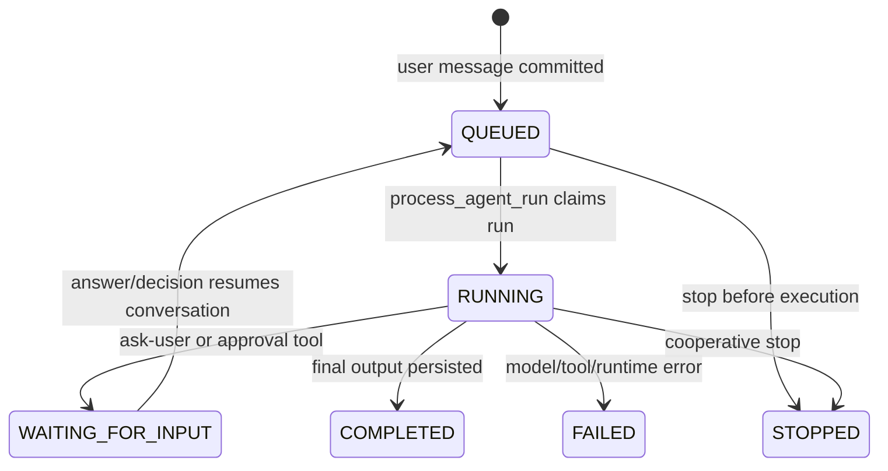

# Agent module

## Purpose

`app/modules/agent` owns agent definitions, conversations/messages, model runs,
runtime profiles, Agent Host dispatch, tool assembly, approvals, realtime
streaming, MCP access, widgets, and usage handoff. It is the central execution
module; external delivery belongs to [agent surfaces](agent_surfaces.md), and
sandbox lifecycle belongs to [workspace](workspace.md).

## Runtime contributions

| Contribution | Behavior |
| --- | --- |
| API routers | Agent CRUD/permissions, conversations/messages/SSE, runtime profiles, Agent Host pairing/dispatch, tools, widgets |
| Redis consumer | Converts agent lifecycle events into queued work and title generation |
| streaq tasks | Run agents, generate titles, reconcile orphaned runs |
| Published stream | `agent_events` |
| Mounted MCP apps | Conversation and pod tool servers are assembled by the backend root using agent services |

Durable lifecycle events are staged in the PostgreSQL outbox and reach Redis
Streams only through the core message bus. Transient token/status frames use the
core realtime-channel port with a Redis Pub/Sub adapter; each SSE connection
leases one subscription connection and releases it on completion, failure, or
cancellation.

## Main data model

| Table | Meaning |
| --- | --- |
| `agents` | Named prompt, schemas, toolsets, runtime selection, visibility |
| `agent_runtime_profiles` | Organization/user/system model provider configuration and encrypted credentials |
| `agent_host_pairings` | Single-use pairing codes a user authorizes; consuming one deletes the row, so presence is the whole validity check and a replayed code looks like one that never existed |
| `agent_hosts`, `agent_host_harnesses` | Paired Agent Host installations and their harness snapshots |
| `agent_host_commands`, `agent_host_run_leases` | Durable command handout and the single dispatch fence per run |
| `agent_conversations` | Pod thread, the agent it belongs to (the pod's assistant is a row like any other), parent/subagent and workspace metadata |
| `agent_messages` | User/assistant/tool messages and structured parts |
| `agent_runs` | One execution attempt, status, usage, errors, stop state, harness metadata |
| `agent_conversation_waits` | What a paused turn is waiting on — wait type, external reference, wake deadline, and the fire lease a timer tick takes; a partial unique index allows one `ACTIVE` row per conversation, mirroring `workflow_run_waits` |
| `agent_approval_decisions`, `agent_feedback` | Durable interaction/audit records |

## API groups

| Routes | What they do |
| --- | --- |
| `/pods/{pod_id}/agents` | Agent CRUD plus resource permission replacement |
| `/pods/{pod_id}/conversations` | Create/list/read/update, messages, approvals, send, stream, stop |
| `/organizations/{org}/agent-runtime/profiles` | Discover/create model runtime profiles |
| `/me/runtime/agent-hosts...`, `/agent-host/link` | Agent Host pairing and management; the host's link WebSocket (commands, events, harnesses, Lemma MCP) |
| `/tools/*` | Server-side web search and feedback endpoints used by runtimes |
| `/widgets/serve...`, `/pods/{pod}/widgets...` | Render/submit a tool widget and mint an authenticated embed URL |

## Run lifecycle

The runner resolves a runtime profile and harness (`pydantic_ai`, Agent Host,
or test harness), builds only the allowed toolsets, creates short UoWs for
message/status transitions, performs model/tool I/O outside them, publishes
realtime frames, and records usage. Tool calls receive a delegated workload
context; destructive operations require a standing grant or session approval.
Agent Host runs are fenced by a per-run lease row, so a host that reconnects
cannot double-dispatch a run already in flight.

Subagents are child conversations with inherited workspace context and reduced
toolsets. Widgets are tool outputs stored in conversation context and served
through signed, purpose-bound embed access.

## Prompt context

Prompts combine a compact pod resource map, the agent's role, reply guidance,
and fragments for its enabled toolsets. Resource authoring details live in
skills. Agent and conversation instructions follow
the static guidance; runtime context and the task list follow those to preserve
the cached prefix. In-process capabilities and Agent Host use the same fragments.

Table summaries include primary keys, column types and write constraints,
foreign keys, RLS, and visibility. Column descriptions are available through
table inspection rather than repeated in every prompt. Omission counts mark
truncated inventories and schemas.

## Scorecard counting

A scorecard counts rows of the teammate's work. The pod's `scorecard` table
holds one row per measure; `work` measures name a table with one row per unit
of work (`unit_table`), the DATE or DATETIME column that places a row in a week
(`time_column`), a SQL boolean over one row (`test`) and a `shape`:

| Shape | Number | Shown |
| --- | --- | --- |
| `share` | rows passing `test`, out of every row in the week | `31 of 40` |
| `count` | rows passing `test` (every row with no `test`) | `none`, `2`, `2 views` |
| `median` | middle `value` over rows passing `test`; a null value is in neither | `1.6 days`, `31 minutes` |

`aim` decides whether the number met `target`. A share of fewer than
`MIN_UNITS_TO_JUDGE` rows is `too_few` — counted, shown as `too few to judge
(3)`, no verdict — unless its target is every one. Rows written before shapes
read as a share when they aim higher and a count when they aim lower.

The other counters are the platform's own:

| Counter | Counted out of total |
| --- | --- |
| `approvals` | `request_approval` decisions approved, of those decided in the week; a DENY the platform recorded because the person moved on is not a verdict and is left out |
| `open_questions` | `ask_user`, `request_approval` and `browser_sign_in` calls still unanswered a day after they were asked, as of the week's end, of those asked in the week |
| `standing_work` | the schedule module's `count_standing_work` |
| `sql` | the row's own `query`, with only `{start}` and `{end}` replaced by ISO dates, one statement |

Any other counter scores `not_counted`. A `work` measure is checked before
anything runs (`domain/scorecard_work.py`): every name it gives must be a
lower-case identifier and a real column of its table, and `test`/`value` must be
one expression — no `;`, comments, braces, `$`, backslash, unbalanced
parentheses or quotes, and none of the words that start a subquery or a write.
A measure that fails says why and is never run. What does run goes through the
datastore's read-only query path as the caller, which is the boundary that
matters: it authorizes every table and applies row security.

Three readers share one counting path (`services/scorecard_counting.py`), so a
week previewed and the week later recorded come from the same statement:

- **`score_week`**, a deferred pod tool, counts the seven whole UTC days before
  `end` (default today; a later day is refused) for every measure that is on —
  a proposal is off until somebody keeps it — and writes `scorecard_weeks`
  (created on first use, shared rather than per person), replacing that week's
  rows. Nothing else is written.
- **`POST /pods/{pod_id}/scorecard/preview`** counts the last `weeks` (1–8,
  default 4) of those windows without writing: every measure that is on or
  proposed, the saved measures named in `keys`, or one unsaved `measure` (a
  draft, refused with 422 and the reason if it cannot run). One statement per
  measure per window, at most `MAX_PREVIEW_MEASURES` measures.
- **`GET /pods/{pod_id}/scorecard/measures/{key}/rows`** lists the units behind
  a `work` measure's number for one week — `id`, `label`, `link`, `at`,
  `passed` — misses first for a share. Other counters have no rows (422).

**`try_measure`**, a deferred pod tool beside `score_week`, is the preview of
one draft for the teammate: it is told to try every measure before proposing
it, and to propose one by writing it into `scorecard` with `is_on` false and
`proposed_from` set to the person's words.

Every count runs as the caller. The conversation counts read only the caller's
own conversations (`readable_by`, the history list's rule), because counting
across the pod would report other people's private conversations; a per-person
unit table is counted as each person sees it.

## Key dependencies

- Pod/identity: tenant, membership, authorization, delegation.
- Datastore/connectors/function: agent-callable resources.
- Workspace: shell, Python, browser, file, and long-lived process sessions.
- Usage: reserve and record model cost.
- Agent surfaces: surface context and platform tools; this dependency is
  currently bidirectional.

## Tests and operations

The test suite covers tool assembly, messages, approvals, cancellation,
runtime profiles, Agent Host dispatch, MCP, widgets, usage, subagents, and
mocked/real harness paths. This module carries the largest orchestration classes
in the backend; their size and cross-module coupling are held flat by the
`make architecture` ratchet rather than reduced.
