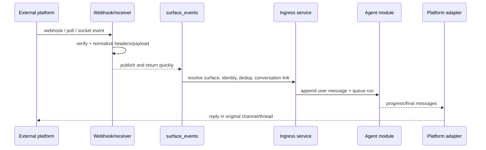

# Agent surfaces module

## Purpose

`app/modules/agent_surfaces` connects external messaging/email platforms to
pod-scoped agent conversations. It owns surface configuration, webhook/native
receiver ingress, signature verification, event normalization, external-user
identity resolution, thread-to-conversation links, attachment ingestion,
platform tools, progress rendering, and outbound delivery.

Supported adapters are Slack, Microsoft Teams, Telegram, WhatsApp, and Resend
for email. Gmail and Outlook are **connectors**, not surfaces: an agent reaches a
Gmail account through the connector, but a pod is reached *on* email at its own
Resend address.

## Runtime contributions

| Contribution | Behavior |
| --- | --- |
| API routers | Pod surface CRUD/setup/catalog/send, current-user defaults, public webhooks/verification |
| Redis consumers | Surface webhooks, schedule fires, and pod deletion |
| streaq task | Execute one prepared surface message outside the webhook request |
| Worker lifespan | Optional Telegram polling and Slack Socket Mode receivers |
| API/worker cleanup | Close Redis event-dedup clients |

## Main data model

| Table | Meaning |
| --- | --- |
| `agent_surfaces` | Pod/platform/name, the one agent it answers as, account binding, allowed channels, identity and send policy |
| `agent_surface_external_users` | Stable external identity to Lemma user/contact resolution |
| `agent_surface_conversation_links` | External channel/thread to agent conversation mapping |
| `surface_verified_identities` | One row per hashed platform/tenant/installation/actor binding: that this person proved who they are, and the pod and installation their private chat reaches. A check constraint keeps a revoked identity from holding a destination, so a live route beside a revoked proof is unrepresentable rather than merely unlikely |
| `surface_pending_onboarding` | Onboarding in flight for one binding — step, email challenge, offered pods, and the original inbound event held until there is a conversation to commit it to |
| `surface_onboarding_input_tokens` | Hashed handles for a native input form — a Slack modal, a Teams card, a WhatsApp prompt — each minted against one pending row, step and challenge. A submission is accepted only while all three still match, so a form left open across a step stops working rather than answering the wrong question; the cleanup sweep deletes handles at expiry |
| `surface_whatsapp_numbers` | The deployment's WhatsApp numbers, one row each and each independent: its own WABA, access token, verify token and Flow ids, every one falling back to settings when absent so a single-number deployment declares nothing. `role` separates the one `SHARED` line everybody rides from the `ALLOCATABLE` pool; `status` separates "stop handing this out" from "we no longer own it". Who holds a number is not stored here — it is `agent_surfaces.surface_identity_id`, so there is no second copy to disagree |
| `notifications` | Something the pod needs a person to see: recipient, actor, origin, body, optional background instruction, and open/expiry state. It lives in this module because delivery is surface work; the agent and workflow modules reach it through ports in `app/composition` |
| `agent_surface_groups` | A group chat a surface's bot is in, one row per (surface, chat): its title, whether the bot answers people outside the pod there, and `owner_user_id`, the member who answers for them. No owner means outsiders are not answered. A WhatsApp group the bot asked Meta to create exists here before its chat id does: `external_channel_id` is null and `request_id` set until the confirmation webhook fills in the id and `invite_link` |
| `agent_surface_group_messages` | What the bot heard in a group and what it said there, kept only where the platform keeps no readable history (Telegram, WhatsApp). Always read newest-first and bounded |

Conversation metadata records surface, platform, external user/channel/thread,
and message identifiers so delivery and debugging do not depend only on the
link table.

Onboarding storage is deliberately private rather than pod-scoped: a person
being recognised and a person having somewhere to talk are different states,
and the gap between them is one a real user sits in while they pick or wait for
a workspace.

A WhatsApp number is shared across organisations and exclusive within one:
`uq_agent_org_whatsapp_number` is unique over (organisation, number), so several
organisations may hold one number and exactly one surface in each of them does.
That makes an arriving number ambiguous by construction, which is why routing
resolves the *sender* first and uses the number only as an additional predicate
on candidates already narrowed to the sender's pods. `agent_surfaces` carries
`organization_id` for that rule rather than joining `pods` for it, and a
composite foreign key `(pod_id, organization_id)` makes the carried copy
impossible to leave stale.

## API groups

| Routes | What they do |
| --- | --- |
| `/pods/{pod_id}/surfaces` | CRUD surface installations and send a message |
| `/.../setup`, `/.../channels`, `/surface-setup`, `/available-surfaces` | Setup state/guides and platform/account catalog |
| `/surfaces/me` | List reachable user surfaces and choose a default |
| `/surfaces/webhooks/{platform}`, `/surfaces/{surface_id}/webhook` | Platform-wide or direct webhook ingest/verification |
| `/surfaces/teams/admin-consent/callback` | Teams tenant consent completion |
| `/pods/{pod_id}/groups` | Every group the pod's bots are in, one place: list, one group with its people and what is waiting on the reader, its timeline, the outsiders switch, starting a WhatsApp group and minting a Telegram add-to-group link |

## Ingress and egress

Adapters share a contract for parse, enrich, sender profile, `send_message`,
`deliver`, interaction parsing, processing indicator, and platform tool
construction. Attachments may be downloaded, stored through datastore,
transcribed, or referenced depending on size/type. Email surfaces use
subject/thread/address semantics rather than chat streaming.

**Outbound content goes through one seam.** An agent produces a
`SurfaceEnvelope` — text, resources, files, voice, choices, a decision — and
`deliver()` renders whatever the platform can and degrades the rest, returning a
`DeliveryReceipt` saying how each part landed (`NATIVE`, `DEGRADED`,
`UNDELIVERED`). The per-content `_render_*` hooks are a platform's private half
of that call and are reachable only from `deliver`; there is no public verb per
kind of content, which is what keeps "every platform gets the full product" a
behaviour rather than a promise each adapter keeps separately.

**How many messages a platform gets** is `DeliveryCardinality`. Chat platforms
are `MANY` and each part degrades on its own. Email is `ONE`: the whole envelope
folds into a single reply, so a file or a voice note is an attachment on it
rather than a second send.

`enrich_inbound_event` is optional for most adapters and **mandatory for
Resend**: its `email.received` webhook carries metadata only — no body, no
headers — so the adapter fetches the message from the Received Emails API and
drops the event if that fails. Running on what the webhook alone provides means
starting an agent on an empty prompt.

Each agent is provisioned its own inbound address, `{agent}.{pod}@{domain}` on
`RESEND_INBOUND_DOMAIN`, at creation. Inbound routing matches the surface by
that address, so it is unique-indexed: two pods colliding would silently deliver
one pod's mail into the other's.

### Interactive tools and indicators

`ask_user` and `request_approval` pause the agent run (`WAITING`); the run
observer renders them on the surface and a submission resumes the run.

- **Native first, text fallback, never swallowed.** `ask_user` renders as native
  choices and `request_approval` as native **Approve / Deny** (optionally
  **Approve for session** when the paused call carries `permission_ids`) buttons
  on Slack (Block Kit), Teams (Adaptive Card `Action.Submit`), Telegram (inline
  keyboard), and WhatsApp (reply buttons). Any platform without native support —
  or a native render that fails — falls back to a formatted text prompt.
- **Decision routing.** A tapped approval button carries its decision back
  through `parse_inbound_interaction` → `ParsedSurfaceInteraction.approval_decision`
  (a canonical `AgentRunApprovalDecision` value) → `handle_interaction`, which
  resolves the paused run APPROVE_ONCE / DENY / APPROVE_FOR_SESSION. `ask_user`
  answers ride back keyed by question header. Both reuse replay-dedup and
  submitter-owns-conversation authorization.
- **Indicators.** WhatsApp marks the inbound message read (blue ticks) and shows
  a typing bubble via one Cloud API `status:read` + `typing_indicator` call.
  Telegram/Teams use a refreshed typing indicator; Slack streams a status line;
  WhatsApp/email have no per-step streaming.
- **Email is interactive, asynchronously.** `ask_user`/`request_approval` on an
  email surface put the question in the one reply and end the run. The person
  answers by replying, and `maybe_resume_pending_interaction` resolves the pause
  through the same path a tapped Slack button takes. A typed reply that is not a
  decision is *not* consumed: it falls through to the ordinary message path,
  which supersedes the pending call with an explicit denial and delivers the
  person's actual words to the agent.

### Routing, defaults, and history

- **One precedence decides where a private message goes.** Routing answers only
  *which* pod, surface, agent and conversation a message belongs to, highest
  first: pod membership → a valid saved default (`/surfaces/me`) → a verified
  personal route → continuity → oldest-tiebreak. The saved default is the
  person's explicit choice, so it is **authoritative over a personal route and
  over continuity**; a stale default (pointing at a pod the user left) is cleared
  and ignored, and the personal route then answers again. `SurfaceRouter`
  documents the order; `select_surface` applies it to ordinary delivery and
  `deliverable_default` is how the personal route (Slack and Teams, which answer
  a private message from the person's own pod through a company installation)
  steps aside for a default that ordinary selection would honour on that
  delivery. WhatsApp and Telegram have no personal route -- their pod is a
  per-pod surface on the shared bot -- so selection alone decides there.
- **A private chat is one conversation wherever it is delivered.** The link key
  names a delivery address (surface, channel, thread id), and on WhatsApp that
  embeds the number the message arrived on. For a private chat that address is a
  delivery detail: when the exact key misses, selection and the binder look for
  the same person's latest private-chat link on a candidate surface (the pod's
  own surfaces, for the binder) and move that link to the new address, so a
  reassigned pool number keeps the conversation. Only a link whose conversation
  is the sender's own, in the route's pod and with the route's agent, is taken;
  the reset window still applies. Channel and email threads are never adopted.
- **A sender is a user only on proof.** A chat sender resolves to a Lemma user by
  the profile email or Telegram handle, or by a mobile number already
  *verified* on the profile. A number a profile merely lists does not match by
  default: it would hand the number's real owner's messages -- and the agent's
  replies, sent from the shared number -- to whoever typed it. That sender goes
  through signup instead. A deployment can accept that risk with
  `SURFACE_ALLOW_UNVERIFIED_PHONE_MATCH=true`: a number claimed by exactly one
  profile then routes to it, each such match is logged
  (`unverified_phone_match_used`). A verified owner always wins; a number claimed by several *unverified* profiles never matches.
- **DM reset window.** A DM starts a fresh Lemma conversation after
  `SURFACE_DM_CONVERSATION_RESET_AFTER_HOURS` (default 24) of inactivity, measured
  from the last *inbound* message. It is deployment-wide; the old per-surface
  `dm_conversation_reset_after_hours` field is accepted and ignored.
  This is the only place a surface decides which conversation a message joins.
- **History is not the surface's.** A surface never trims or reshapes what the
  model sees. Once a message is bound to a conversation, the agent module alone
  decides how much history the run carries (run cap, whole recent runs,
  collapsed older runs, token compaction).

### Groups, and people outside the pod

A group chat holds members of the pod and people who are not. Members are
answered there as themselves, each in their own conversation, exactly as in
private. Everybody else -- a vendor, a client, a colleague from another team --
is answered *for the pod*, in a group the pod has opened to them.

- **A pod comes to know a group** when a member who may configure the bot adds
  it (Telegram's `my_chat_member`, handled on the lifecycle path). That member
  becomes the group's owner: the person who answers for its outsiders. Owners
  and the "answers people outside" switch are managed through
  `/pods/{pod_id}/groups` (`api/group_access.py`): by the owner; by anybody who
  may configure the bot when nobody in the pod answers for the group, which
  makes them its owner; or by an admin of the pod, whose change lands in the
  owner's inbox. A member who has left the pod answers for nobody -- their
  groups read as ownerless and answer no strangers until someone takes them on.
- **The bot introduces itself.** When it is added to a Telegram group -- either
  way, and once -- it says how to ask it, that people outside the pod are
  answered from what is Public, and that the pod keeps what is said there for
  `GROUP_LOG_RETENTION` (90 days); a WhatsApp group it creates carries the same
  words as its description (`services/group_hello.py`).
- **The pod's groups are one page** (`services/space_groups.py`, read by every
  member). It is assembled from rows other parts already keep: the registry and
  its log for who has spoken and what was said, the `~outsiders` thread links
  for which conversations are a group's, and the open notifications those
  conversations sent the reader for what is waiting on them. A member's own
  conversation with the bot and a private note are never part of it. Each of
  the bot's lines in the log records whom it answered and whether that was from
  what is Public (`group_log.answered_in_group`), so the page can say so -- and
  an answer made with one member's own access shows its words to that member
  alone; every other reader sees whom it was for. The list asks each of its
  reads once for all of the pod's groups (`group_page_repository`).
- **A Telegram group can be added from Lemma.** `POST /pods/{pod_id}/groups/links`
  mints a one-use, hour-long code in Redis and returns
  `t.me/<bot>?startgroup=<code>` (`services/telegram_group_links.py`); Telegram
  asks the person which group, adds the bot, and the bot hears
  `/start@<bot> <code>` there. That message is claimed before anything treats it
  as a question (`services/telegram_group_join.py`): the group is adopted with
  the member the code was minted for as its owner, and the bot says hello. A
  spent or unknown code is swallowed, not answered. The code never links the
  Telegram account that used it to the member -- "add our bot to your group" is
  easily forwarded, and linking whoever used it would hand them the member's
  access in a private chat. Which account is theirs stays their profile's to say.
- **A Slack channel shared with another company is a group with outsiders.**
  Connected Slack channels and group DMs get a registry row the first time the
  bot hears them (`services/slack_groups.py`), marked `shared_externally` when
  Slack says the channel is Slack Connect (`is_ext_shared_channel`). There, and
  only there, a sender whose workspace is not the installing one is an outsider
  and answered from what is Public; everyone in the pod's own workspace is a
  colleague, and one who is not in the pod gets the invite nudge. No lines are
  logged: Slack keeps the history.
- **A WhatsApp group is one the bot opened.** A business number cannot be added
  to a group, only create one, so a member asks in their own WhatsApp chat and
  the agent calls `whatsapp_open_group` (offered only in a member's private
  chat; `platforms/whatsapp/tools.py`). Meta answers the creation with a
  `request_id` only, so the row is recorded pending
  (`services/whatsapp_groups.py`) and the member's turn waits a few seconds
  for the `group_lifecycle_update` webhook (`services/group_updates.py`), which
  gives the row its group id and invite link -- fetched when the webhook omits
  it. A confirmation that overtakes its pending row is handed back to the
  inbox to retry. Asking again for the same title answers from the row. The
  deployment's Meta app must subscribe to the `group_lifecycle_update` webhook
  field, or groups stay pending. Everything that names a group -- creating it,
  its link, a message to it -- goes to Graph `v23.0`, the version the Groups
  API was published under; ordinary messaging stays where it was.
- **A created group belongs to the pod that created it**
  (`bot_creates_groups`). Every pod on a shared number sees every message the
  number receives, so a WhatsApp group message is narrowed to the surfaces
  whose rows name the group before anything else is asked
  (`services/created_groups.py`), and a group no surface knows is dropped.
- **Nothing marks a mention on WhatsApp.** Meta documents no mention field and
  no reply context for groups, so the bot is addressed when the text
  `@`-mentions the business number, quotes the bot's own message, or speaks to
  the agent by name -- "Kit, ...", "hey Kit: ...", "Kit can you ...", "@Kit";
  a name merely at the start of a line ("Sales numbers are up") is not enough
  (`domain/addressing.py`, read in ingress once the surface's agent is known).
  The name is the one the app shows
  (`services/group_names.py`): the pod's own name for the pod's assistant --
  "Sales, ..." -- with the older "Lem" still heard, and an agent's own name
  otherwise. A group message nobody put to the bot is logged and left alone.
- **A group takes text.** Meta refuses interactive messages there, so questions,
  approvals and resource cards go as words (`WhatsAppRecipient.is_group`); read
  receipts, typing and reactions are not documented for a business in a group,
  so none are sent. Groups hold at most eight people.
- **Who counts as an outsider** is anyone not in the surface's pod, asked the
  way routing asks it. Membership is checked first, so members never pay for the
  group lookup.
- **Where their turn runs**: one conversation per group, owned by the owner,
  opened with `for_outsiders=True` and linked under the shared `~outsiders` key.
  The agent module then runs every turn in it as nobody: an anonymous
  authorization context pinned to the pod, which reads only what the pod marked
  Public. A run is a stranger's when the conversation's metadata *or* that link
  says so (the agent module's `services/outsider_audience`), asked on every
  run, so a conversation that lost its mark still never runs as its owner; a
  client can neither set nor clear the mark, and the binder moves the next
  stranger to a freshly marked conversation. What such a run may do:
  - **Tools, by name.** Toolsets are cut to pod reads, web search and
    messaging, and then each tool is allow-listed one by one
    (`tools/outsider_tools`): the pod's read tools, `web_search`,
    `message_user` and `check_messages`. `web_fetch` (it fetches inside the
    owner's sandbox) and the pod's write tools are withheld by name, and the
    harness's last capability (`capabilities/outsider_gate`) and the tool
    dispatcher drop anything not on the list, however it arrived. A workspace
    -- sandbox, host session, the owner's files -- is never opened for such a
    run (`refuse_owner_workspace`), and a test fails until any new tool in a
    kept toolset is classified.
  - **What it is told.** A brief naming the owner by display name only -- no
    email, no ids -- as who looks after the conversation; no task list; no
    sandbox described. The agent's and conversation's own instructions are
    pod configuration and stay.
  - **What it remembers.** Nothing a private note started: the owner's note in
    the strangers' thread, and its run's answer, are left out of every later
    stranger's history. From the group's log, nothing the bot answered with a
    member's own access (`answer_withheld_from`).
  - **Who it reaches.** `message_user` goes to the owner whatever `to` says,
    with nothing looked up first, so it says nothing about who is in the pod;
    `check_messages` reads only notifications this conversation sent, for every
    run; `list_pod_members` refuses.
  - **Where it runs.** Only in process, on a model the organization or the
    system provides -- never a coding agent's shell holding a token minted for
    the owner, and never the owner's personal model (the agent module's
    `services/outsider_runtime`).
- **A question passed on is answered only with the owner's say-so.** A
  notification from the strangers' thread is marked `from_outside` by the
  service, from the routing link, with the group it came from
  (`services/outside_questions.py`). The owner reads it framed and quoted by the
  server -- which group, who asked, their words as a block quote -- and their
  agent sees it the same way in its open requests. Their answer is recorded only
  as words they confirmed: typed in the app, or approved exactly as their agent
  drafted them -- `respond_to_notification` returns `needs_approval`, the agent
  calls `request_approval`, and the card is the server's
  (`services/outside_answer_card.py`): the group, every word, approve once,
  never for the session. A stranger's tap decides nothing, and an agent holding
  the owner's delegated token cannot answer over the API. Never structured
  data, and at most `MAX_OUTSIDE_ANSWER_CHARS`.
- **Nothing a stranger types resolves a pause.** Their conversation belongs to
  the owner, so a typed "approve" would be recorded as the owner's decision;
  `write_inbound_message` never consults a pending interaction for them, and
  their runs never pause.
- **Files** they send are not saved -- the owner's space is the only place they
  could go -- and the run is told so.
- **Limits**: `SURFACE_OUTSIDER_TURNS_PER_PERSON_PER_10_MINUTES` and
  `SURFACE_OUTSIDER_TURNS_PER_GROUP_PER_DAY`, counted in Redis and failing
  closed. Only a turn that runs is charged to the group, so one person looping
  cannot spend everybody's day. A member opens at most
  `OPENS_PER_MEMBER_PER_DAY` WhatsApp groups on one bot a day, and only one who
  may configure the bot may open any.
- **The bot's own switch.** `config.groups.answers_outsiders` on a surface,
  on by default, closes every group that bot is in to people outside the pod at
  once.
- **The group log** records every group message the bot receives, before
  anything decides whether it was addressed, and every answer once delivered.
  A run in a group is handed the recent lines as background, chosen by whose
  access it acts with (`group_log.group_background`): a stranger's run is not
  shown answers made with a member's access; a member's run is not shown what
  strangers wrote, nor the bot's answers to them -- on Slack, lines from another
  workspace are left out the same way. Each line is one quoted line however many
  it spanned. Lines older than `GROUP_LOG_RETENTION` go as new ones arrive.
- **A member answering in front of outsiders is told so.** A member's run keeps
  the member's access, but when people outside the pod read the answer -- they
  have spoken in the group, the group answers them, the Slack channel is shared,
  or an email reply-all copies them -- its message carries who they are and asks
  for an answer the member would give in front of them
  (`services/group_audience.py`, rendered by the agent module's
  `audience_notice`).
- **Own bots are no different.** A pod's own Telegram bot or WhatsApp number is
  delivered to at `/surfaces/{id}/webhook`; its group messages go through the
  same log, mention check, name addressing and admission as a shared bot's
  (`services/group_ingress.py`), and WhatsApp's confirmations are applied from
  there too.
- **A Slack group DM needs no channel route.** Somebody started it with the bot
  in it, so -- like a Telegram group -- being in it is the authorization
  (`is_slack_group_dm`): no allow-list entry, still only answered when the bot
  is @mentioned or a reply lands in its thread. It is a Slack conversation, so
  Slack's own history is its background and no group log is kept.
- **A notification is never delivered into a group.** Reaching a member
  proactively reuses only private threads; a member whose only thread with the
  bot is a group is reached by email or their Lemma inbox instead.
- **An email thread with other people on it is a group.** The inbound
  normalizer keeps To and Cc; a reply goes to the sender and copies the others
  (at most `MAX_REPLY_CC`). Copied is not asked: an email that only Cc's the
  pod is answered only when a line speaks to the agent by a name it goes by.
  Mail that names the pod in neither To nor Cc -- forwarded, an alias, a Bcc --
  was sent to it on purpose and is answered. A message that says nothing but
  thanks on a thread with others on it starts no run, and a refusal or sign-up
  reply goes to the sender alone (`platforms/resend/email_recipients.py`).
- **A private note stays in Lemma.** Every run in a conversation that lives on a
  platform answers there. A message written in Lemma with
  `metadata.private_note = true` starts a run marked private (see the agent
  module's `domain/private_notes`); the run observer then sends nothing of it to
  the platform -- no stream, no typing, no answer, no approval card -- and
  `display_resource` delivers only in Lemma, on Agent Host too. Later turns see
  the note labelled as unseen in the chat (in a person's own DM, only as not
  sent). A run answers one kind: a note typed while an answer to the platform
  is under way is not steered into it, a message for the platform is not
  steered into a note's run, and the follow-up, resume or retry that answers
  either keeps its kind. `surface_send_message` from a note's run is refused.
  In the strangers' thread a note is the owner's alone: no later stranger's
  run reads it.

## Authorization and security

Management routes use pod permissions and ensure connector account ownership.
Webhook security handles Slack signatures, Teams/Telegram/WhatsApp verification,
email provider metadata, timestamp windows, and challenge responses. Identity
policy controls whether unknown external senders are rejected, linked, or
represented as contacts. Redis dedup guards repeat provider deliveries.

A contact shared during Telegram signup is matched by `onboarding_contact`: a
verified profile number first, then -- only with
`SURFACE_ALLOW_UNVERIFIED_PHONE_MATCH` -- exactly one unverified claim, the same
rule identity resolution applies to later messages. Whether an account's email
must be verified to chat follows `AUTH_EMAIL_VERIFICATION_REQUIRED`
(`identity.infrastructure.chat_account_policy`).

A pooled WhatsApp number answers with its own pool row's credentials for
everything done to a message that arrived on it -- the read receipt, the typing
indicator, the media download, the fallback and the reply -- through
`SurfaceCredentialResolver`'s `arrived_on`. A delivery the per-number webhook
refuses logs `whatsapp_number_signature_rejected.denied` (the number, why, and
which secret was tried, never the secret) or `whatsapp_number_mismatch.denied`,
and counts on `lemma.surface.webhook.rejected` by `platform` and `reason`.

## Tests and operations

The large unit/e2e matrix uses real payload fixtures and mock provider servers
for platform parsing, signatures, conversation reuse, identity, attachments,
approvals/forms, progress, and delivery. Measure this module's coverage with
`uv run pytest -m "not e2e" app/modules/agent_surfaces --cov=app/modules/agent_surfaces`;
CI enforces the committed floor. The in-module README is a pointer back here and
deliberately carries no route examples of its own.
