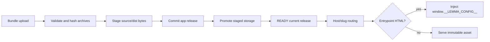

# Apps module

## Purpose

`app/modules/apps` hosts pod-specific operator applications. It owns app
metadata, versioned source/dist releases, bundle validation and storage,
authenticated pod asset access, public slug routing, browser SDK delivery,
runtime configuration injection into HTML entrypoints, and the reserved assets
that let a published app be installed to a home screen.

## Runtime contributions

| Contribution | Behavior |
| --- | --- |
| Pod API router | App CRUD, widget-to-app creation, bundle upload, assets, source/dist archive download |
| Public app router | Resolve an app by host/slug and serve its built assets |
| Public SDK router | Serve `lemma-client.js`, legacy alias, and `lemma-ui.js` |
| Middleware | `AppHostRoutingMiddleware` maps app subdomains/hosts to public app routes |

There are no event consumers or worker tasks in this module. Builds performed
during pod-bundle import use the sandbox runtime from the bundle module.

## Data and storage

| Table/storage | Meaning |
| --- | --- |
| `apps` | Pod/name, public slug, metadata, readiness/current release |
| `app_releases` | Immutable source/dist object keys, hashes, sizes, and release state |
| Object storage/local store | Source and distribution zip archives plus extracted assets |

## API groups

| Routes | What they do |
| --- | --- |
| `/pods/{pod_id}/apps` | Create/list/read/update/delete app records |
| `/.../apps/from-widget` | Promote a conversation widget into an app definition |
| `/.../apps/{name}/bundle` | Upload source and/or built distribution archives and finalize a release |
| `/.../assets...` | Serve an authenticated pod app asset |
| `/.../source/archive`, `/.../dist/archive` | Download stored release archives |
| `/public/apps...` | Host-based public app entrypoint/assets |
| `/.lemma/...` | Manifest, icons, service worker and offline page (on the app host) |
| `/public/sdk/*` | Browser SDK and web-component bundles |

## Release and serve flow

Storage uses a stage/commit/promote pattern with cleanup compensation. HTML
lint is advisory and reports obsolete SDK usage; it does not reject app code.
Entrypoints are no-cache and receive pod/API/auth context at serve time, while
hashed static assets use immutable caching and ETags.
`AppsSettings` owns source/dist/combined upload ceilings and archive-entry,
expanded-size, and compression-ratio protections.

## Home-screen install

An app is served on an origin of its own, which is what lets it carry a web app
manifest and be installed like any other application. `app.core.app_install`
owns the reserved `/.lemma/` paths and the offer script injected into public
entrypoints; `services/app_install_assets` answers those paths, and
`services/app_icon` draws the icon from the app's name and slug, since apps
carry no uploaded one.

The reserved assets are resolved ahead of the release lookup because none of
them describe a build, so a rebuild leaves an installed icon alone. They are
served through the ordinary public asset route, so the PUBLIC visibility gate
covers them: an unpublished app does not describe itself in a manifest. The
service worker exists only to satisfy the browser's installability check and
caches nothing but the offline page — caching app assets would pin a stale
release onto whoever installed it.

The offer never interrupts a first visit. The workspace marks its
"open in a tab" links with `#install` so the app's builder is asked at the
moment they asked for a tab; everyone else is asked on a second visit. Inside
the workspace's app frame the pill still appears, but installing is a top-level
operation, so it asks the workspace to open the app itself
(`lemma-frontend/lib/app/app-install.ts`).

## Authorization and security

Pod management/download routes use the normal pod context. Public apps are
intended to execute app-auth logic through the injected SDK; app origins are
separated by host routing. Path normalization and archive extraction prevent
asset traversal. Apps remain arbitrary user-authored HTML/JS, so isolation by
origin and response headers is part of the security boundary.

## Tests and operations

Tests cover lifecycle, host routing, public serving, storage compensation,
archive handling, HTML/SDK injection, CORS, and release deduplication.
