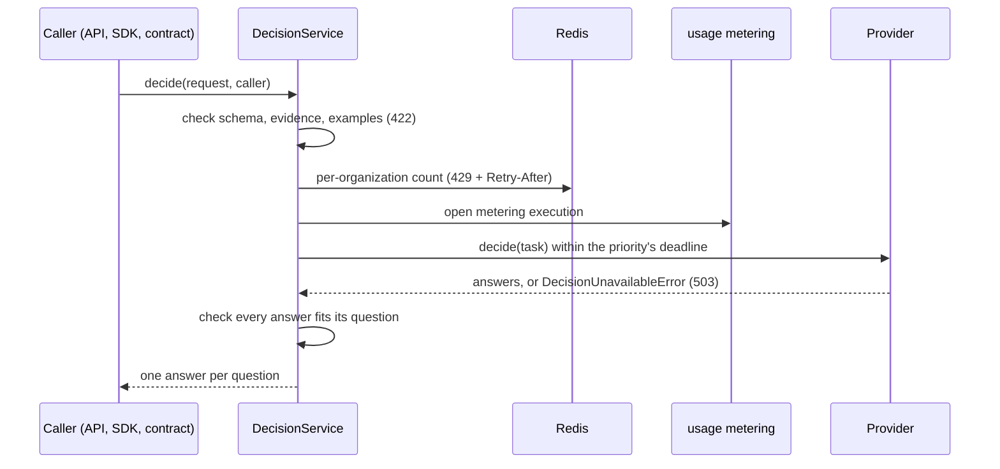

# Decisions module

## Purpose

`app/modules/decisions` answers closed questions about one piece of evidence:
which of these options, which of these apply, yes or no, where on a short
scale. It is one stateless call. Nothing is stored: the caller owns what the
decision is about, whether it was asked before, and where the answer is kept --
a function's own table, a schedule's run row, a workflow step's output.

A function reaches it through the SDKs (`pod.decisions.make(...)`,
`client.decisions.make(...)`); a backend module through
`app.modules.decisions.contracts.decide`.

## Runtime contributions and API

| Route | Behavior |
| --- | --- |
| `POST /pods/{pod_id}/decisions` | Check the questions, evidence and examples; admit against the organization's rate; ask the configured provider under the caller's usage metering; check the answers; return one per question |

The module owns no tables, events or workers. Its only state is a per-minute
counter per organization and priority in Redis.

## Questions and answers

The questions are a flat JSON Schema object, one property per question, the
property's `description` being the question. Only closed answers are accepted:

| Kind | Schema | Answer |
| --- | --- | --- |
| Choice | `{"type": "string", "enum": [...]}`, or `oneOf` of `{const, description}` | One of the options |
| Multi-choice | `{"type": "array", "items": <choice>, "uniqueItems": true}` | Any of the options, in schema order |
| Yes or no | `{"type": "boolean"}` | `true` or `false` |
| Scale | `{"type": "integer", "minimum": a, "maximum": b}` (2-11 levels), or `oneOf` of described integer levels | One level |

Free text, open-ended numbers, nesting and any keyword outside the subset are
refused with a 422 listing every problem. A closed answer can be checked, routed
on and counted; an open one is extraction, and free text is where evidence gets
copied into whatever reads the answer next.

Every answer is `{value, confidence}`. `value` is `null` when the evidence did
not support an answer -- an answer, not a failure. `confidence` is the
provider's probability for the value when it measures one, and `null` when it
does not (a language model's self-report is not used). A provider that could
not answer at all is an error: 503 `DECISION_PROVIDER_UNAVAILABLE`, retryable.

The instruction is the asker's and is trusted. The evidence and any examples
are not: they are capped (64 KiB of evidence, 20 examples totalling 32 KiB) and
refused rather than truncated when larger, and every provider keeps them apart
from the instruction.

## Providers

`DECISION_PROVIDER` picks one per deployment. Each provider answers every kind;
there is no fallback from one to another when a provider fails, so a caller
retries the same judgement rather than getting a different one. `typesafe`
chosen without `TYPESAFE_API_KEY` is not a failure but a deployment that cannot
use it: the `model` provider answers instead, and
`decisions.registry.typesafe_unconfigured.degraded` is logged once.

| Provider | How it answers | Confidence |
| --- | --- | --- |
| `model` (default) | The deployment's language model -- `DECISION_MODEL`, else the system profile's default, else the workspace's -- via `agent.contracts.model_runtime`, with structured output checked against the questions and one correction on a background decision | `null` |
| `typesafe` | Typesafe System One (`TYPESAFE_API_KEY`): a choice as `choice`, yes or no as `noul`, a scale as `score`, a multi-choice as one `noul` per option | The probability of the chosen value |

Adding a provider is an adapter implementing `DecisionProvider`
(`domain/ports.py`) and an entry in `infrastructure/providers/registry.py`.

## Limits and metering

| Setting | Meaning |
| --- | --- |
| `DECISION_INTERACTIVE_TIMEOUT_SECONDS` / `DECISION_BACKGROUND_TIMEOUT_SECONDS` | End-to-end deadline per priority; `interactive` also gets no second model attempt |
| `DECISION_RATE_LIMIT_PER_MINUTE` | Decisions per organization per clock minute, counted separately for `interactive` and `background`, so a schedule's backlog never leaves a live call unrouted; fails open when Redis does not answer within 0.25 s |
| `TYPESAFE_PRICE_PER_MILLION_INPUT_TOKENS_USD` | System One's price, so its calls count toward spend limits |

Model decisions are metered like any model call. System One calls are metered
through `usage.contracts.metering.metered_request` under the model name
`typesafe:<model>`. Both are recorded with `source_type` `decision` (or the
internal caller's own source) and attributed to the person, and to the function
or agent when one is asking with a delegated token.

## Tests and operations

Unit tests cover the schema subset, request bounds, the prompt's trust split,
both providers against scripted models and a mock transport, the service's error
mapping and answer check, the rate window, and the route. E2E tests cover a
member asking, a function asking in its own pod and refused in another, a
colleague outside the pod refused, metering, 422s, an unreachable provider (503)
and the rate limit (429).
