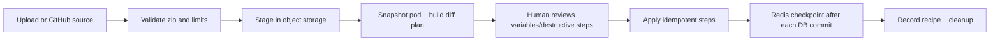

# Pod bundle module

## Purpose

`app/modules/pod_bundle` exports a pod as a portable bundle, plans the diff for
an uploaded/GitHub bundle, applies an approved plan step by step, and publishes
a bundle to GitHub through a connected account. Format primitives are shared
with the CLI through the top-level `lemma-pod-bundle` package.

## Runtime contributions

| Contribution | Behavior |
| --- | --- |
| API routers | Import/upload/plan/apply/replan/cancel/events, export/status/download, publish/status/events |
| streaq tasks | Export, plan URL/GitHub import, apply, GitHub publish |
| cron | Sweep expired staging objects, mark stuck states, delete job rows past retention |
| Realtime | Redis pub/sub SSE plus polling snapshots |
| SQL tables | `pod_bundle_jobs`, `pod_bundle_job_steps` |

Job state is authoritative in PostgreSQL and mirrored to Redis, not the other
way round: a Redis flush loses the realtime mirror, not the job. Every job
writes one `pod_bundle_jobs` row and one `pod_bundle_job_steps` row per plan
step, so the two tables grow with every export, import and publish — the sweep
cron deletes rows whose `completed_at` is past retention (30 days, the
`JOB_ROW_RETENTION_SECONDS` constant in `infrastructure/job_retention.py`), and
steps go with their job through the FK cascade. Zip archives are staged in
object storage. Completed import provenance is appended to `PodConfig.recipes`.

## Job state

| Job | Typical states |
| --- | --- |
| Export | `QUEUED -> EXPORTING -> READY` or `FAILED`; ready state includes signed download URL |
| Import | `QUEUED/FETCHING -> PLANNING -> AWAITING_CONFIRMATION -> APPLYING -> COMPLETED` or `FAILED/CANCELLED`; `PARTIALLY_CANCELLED` when steps had already been applied |
| Publish | `QUEUED -> EXPORTING/UPLOADING -> COMPLETED` or `FAILED` |

## API groups

| Routes | What they do |
| --- | --- |
| `/pods/{pod_id}/bundle/uploads` | Stage a local zip and mint a signed Lemma URL |
| `/.../bundle/imports` | Start URL/GitHub planning, poll, replan, approve apply, cancel, or stream SSE |
| `/.../bundle/exports` | Start/poll an export; authenticated signed-token download is `/pods/bundle/download` |
| `/.../bundle/publishes` | Start/poll/stream GitHub publication |

## Import flow

Every non-app apply step opens its own authorization/UoW scope and commits
before the Redis `DONE` checkpoint. App steps self-scope around a sandbox
build. A crash between commit and checkpoint replays an idempotent upsert. The
format handles tables/data, deciders, files, functions, agents/grants/toolsets,
workflows, schedules, apps/source, surfaces/account variables, and pod metadata.

### Deciders

A pod's deciders travel as `deciders/<name>/<name>.json`, holding the name and
the current definition (`infrastructure/exporter_deciders.py`). Their examples
and decisions never do: examples are people's answers about their own data.
Export reads them through the decisions contract and asks `decider.read` on the
pod first, because that contract does not authorize; a person without it gets
a bundle with no deciders and a warning.

The plan puts `DECIDER` steps straight after tables, before anything that can
name a decider -- a workflow's DECISION step, a schedule, an agent's
`decider:<name>:execute` grant (`infrastructure/decider_apply.py`). Each is
CREATE for a new name, UPDATE when the definition differs (the step saves the
next version; old versions stay), or SKIP when the pod's decider already has
exactly this definition, so importing an unchanged bundle again is a no-op. A
definition no pod could save refuses the plan before anything is written. The
step requires `decider.create` on the pod or `decider.update` on the decider,
and saves through `define_decider`, which commits in its own unit of work.

## Security and limits

Archive extraction is zip-slip and zip-bomb guarded. Import requires pod update;
export/publish require pod read plus account ownership where applicable.
Destructive table changes require explicit confirmation. Configurable per-item,
record, data, app, archive, and uncompressed-byte caps bound work, and a Redis
daily limiter bounds starts. Download URLs are purpose-signed and require a
logged-in user in addition to the token.

## Tests and operations

Unit/e2e tests cover format/diff, staging, limits, plan/apply idempotency,
variables, executable imported resources, apps, surfaces, GitHub import/publish,
SSE, expiry, and cleanup.
