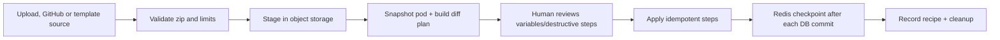

# Pod bundle module

## Purpose

`app/modules/pod_bundle` exports a pod as a portable bundle, plans the diff for
an uploaded, GitHub or shipped-template bundle, applies an approved plan step
by step, and publishes a bundle to GitHub through a connected account. Format
primitives are shared with the CLI through the top-level `lemma-pod-bundle`
package.

## Runtime contributions

| Contribution | Behavior |
| --- | --- |
| API routers | Import/upload/plan/apply/replan/cancel/events, export/status/download, publish/status/events |
| streaq tasks | Export, plan URL/GitHub import, apply, GitHub publish |
| cron | Sweep expired staging objects, mark stuck states, delete job rows past retention |
| Realtime | Redis pub/sub SSE plus polling snapshots |
| SQL tables | `pod_bundle_jobs`, `pod_bundle_job_steps` |

Job state is authoritative in PostgreSQL and mirrored to Redis, not the other
way round: a Redis flush loses the realtime mirror, not the job. Every job
writes one `pod_bundle_jobs` row and one `pod_bundle_job_steps` row per plan
step, so the two tables grow with every export, import and publish — the sweep
cron deletes rows whose `completed_at` is past retention (30 days, the
`JOB_ROW_RETENTION_SECONDS` constant in `infrastructure/job_retention.py`), and
steps go with their job through the FK cascade. Zip archives are staged in
object storage. Completed import provenance is appended to `PodConfig.recipes`.

## Job state

| Job | Typical states |
| --- | --- |
| Export | `QUEUED -> EXPORTING -> READY` or `FAILED`; ready state includes signed download URL |
| Import | `QUEUED/FETCHING -> PLANNING -> AWAITING_CONFIRMATION -> APPLYING -> COMPLETED` or `FAILED/CANCELLED`; `PARTIALLY_CANCELLED` when steps had already been applied |
| Publish | `QUEUED -> EXPORTING/UPLOADING -> COMPLETED` or `FAILED` |

## API groups

| Routes | What they do |
| --- | --- |
| `/pods/{pod_id}/bundle/uploads` | Stage a local zip and mint a signed Lemma URL |
| `/.../bundle/imports` | Start URL/GitHub/template planning, poll, replan, approve apply, cancel, or stream SSE |
| `/.../bundle/exports` | Start/poll an export; authenticated signed-token download is `/pods/bundle/download` |
| `/.../bundle/publishes` | Start/poll/stream GitHub publication |
| `/pods/bundle/templates` | The hiring shelf: every shipped template with a role card (any signed-in user) |

## Import flow

Every non-app apply step opens its own authorization/UoW scope and commits
before the Redis `DONE` checkpoint. App steps self-scope around a sandbox
build. A crash between commit and checkpoint replays an idempotent upsert. The
format handles tables/data, files, functions, agents/grants/toolsets, workflows,
schedules, apps/source, surfaces/account variables, and pod metadata.

## Templates

`templates/<name>/` holds bundles that ship with the backend; hiring a teammate
applies one. `kind=TEMPLATE` with `template=<name>` packs that directory, stages
it like an upload and enqueues `plan_pod_import` directly, so the job goes
`QUEUED -> PLANNING` with no fetch. An unknown name is a 404 listing the
templates that exist. The recipe records the source as `template:<name>`, and
the plan carries `pod.json`'s `description`. Template imports are not counted
against the daily import limit: their content is fixed by what ships, not
supplied by the person. `tests/unit/test_shipped_templates.py` holds every
template to an empty-pod plan with nothing to answer, typed seed rows that
carry their primary key, skills the catalog will list, and POD-visible files.

A template is a role on the hiring shelf when its `pod.json` has a `role`
block: the job in one line, the face's seed, up to three things it brings, up
to three first wins (each optionally naming the connector it needs) and up to
three standing-work offers with a cron. `GET /pods/bundle/templates` reads the
rest of the card off the template itself: its skills from `files/skills`, its
tables (all but `scorecard`), and what it is judged on from the seeded
scorecard's turned-on measures, less the reliability ones every teammate has.
The frontend keeps no list of roles, so adding one is adding a template. A
malformed block drops that template from the shelf with a warning rather than
failing the list; the shipped-template tests hold every card to the model.

## Security and limits

Archive extraction is zip-slip and zip-bomb guarded. Import requires pod update;
export/publish require pod read plus account ownership where applicable.
Destructive table changes require explicit confirmation. Configurable per-item,
record, data, app, archive, and uncompressed-byte caps bound work, and a Redis
daily limiter bounds starts (template imports are not counted). Download URLs
are purpose-signed and require a logged-in user in addition to the token.

## Tests and operations

Unit/e2e tests cover format/diff, staging, limits, plan/apply idempotency,
variables, executable imported resources, apps, surfaces, GitHub import/publish,
SSE, expiry, and cleanup.
