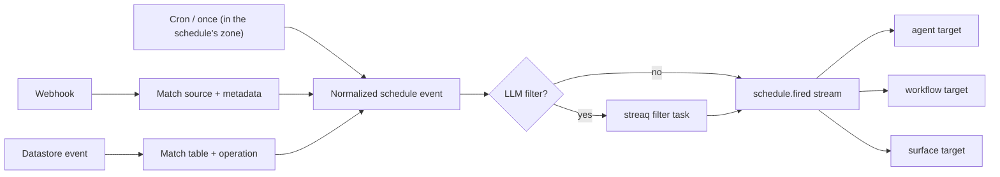

# Schedule module

## Purpose

`app/modules/schedule` turns time, webhooks, datastore changes, and application
events into normalized `schedule.fired` events. Targets are agents, workflows,
or surfaces; target modules decide how to execute the fire.

## Runtime contributions

| Contribution | Behavior |
| --- | --- |
| API routers | Pod schedule CRUD and public webhook ingress/verification |
| Redis consumers | Schedule commands, datastore events, pod deletion, scheduler notifications |
| streaq task | Evaluate LLM filters off-request |
| Worker poller | Claims due TIME schedules with `FOR UPDATE SKIP LOCKED` and advances their cursor |
| Published stream | `schedule_events` |

## Data and schedule types

`schedules` stores target, active state, type-specific config, an optional
instruction, optional filter instruction/schema, and external scheduler
metadata. The target is two columns, `agent_id` and `workflow_id`, kept
exclusive by `ck_schedules_single_target`. The pod's default assistant is named
through `agent_id` like any other agent: its `agents` row carries the pod's own
id, so a foreign key reaches it and the target needs no third arm. On the wire
that target reads as `agent_name: "POD_DEFAULT"`, the selector the API takes
rather than the row's internal name. `instruction` says what the target should *do* when the
schedule fires and reaches an agent as its run's conversation instructions;
`filter_instruction` decides whether to fire at all. A schedule targeting the
default assistant must carry an instruction, because that assistant has no
standing one to fall back on. `schedule_runs` is the
durable idempotency/delivery ledger keyed by schedule plus source event; it
records the run's single user owner, attempts, target run, payload, and terminal
outcome. RLS datastore events assign that ownership to the row owner; other
schedule sources assign it to the schedule owner. Supported logical
types include time/cron or once, webhook, datastore, and application-triggered
schedules.

A TIME schedule's config carries `cron` or `scheduled_at`, and optionally
`timezone` — an IANA name the wall-clock times are read in. The key absent
means UTC, which is what every schedule written before zones existed meant, so
absence and a stored `"UTC"` behave identically and no config needs rewriting.
Across a daylight-saving transition a schedule fires once: on a spring-forward
day a skipped wall-clock time fires at the instant it would have been (reading
locally as an hour later), and on a fall-back day the repeated hour fires on its
first, pre-transition occurrence. The zone is resolved once, in
`domain/cron.py`, and every arm point reaches it through
`due_schedule_claimer.next_cursor_for`; `schedules.next_fire_at` is always a UTC
instant. Zone names are checked against `zoneinfo.available_timezones()` rather
than by constructing a `ZoneInfo`, which succeeds for a miscased name on a
case-insensitive filesystem.

The poller owns the concrete time job set: `next_fire_at` is the whole index,
claimed with `FOR UPDATE SKIP LOCKED` and advanced in the claiming transaction.

## API groups

| Routes | What they do |
| --- | --- |
| `/pods/{pod_id}/schedules` | Create/list/get/update/delete logical schedules |
| `POST /webhooks/{source}` | Validate/map a provider payload, match schedules, and publish or enqueue filtering |
| `GET /webhooks/{source}/verify` | Provider challenge/verification path |

## Trigger and run flow

The service mirrors provider-backed webhook schedules into the connector through
an adapter. Each `schedule.fired` trigger claims one durable schedule run;
PostgreSQL deduplicates target dispatch and tracks retry/dead-letter state.
`DISPATCHED` means the target run was created, not that the target completed.
Consecutive-failure policy is durable on the schedule row, and a
deactivation event is staged in the same transaction as that state change —
including the poller's own retirements, so no schedule goes inactive silently.
A schedule whose target was deleted keeps its row (`workflow_id` and `agent_id`
are `SET NULL`) and records each firing as failed saying the target is missing.
Publishers use the shared transactional outbox/core Redis Streams bus.

## Authorization and security

Schedule CRUD is pod-authorized. Webhook ingress is public by necessity and
uses source-specific verification adapters plus schedule matching. Deletion of
a pod is consumed as a system event to tear down schedules and external jobs.

## Tests and operations

Tests cover normalization, filters, adapters, CRUD, scheduler calls, event
consumers, concurrent schedule-run deduplication, retry, and atomic deactivation.
