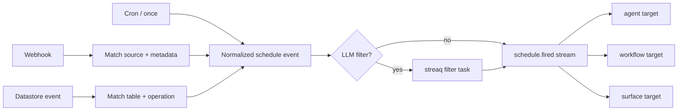

# Schedule module

## Purpose

`app/modules/schedule` turns time, webhooks, datastore changes, and application
events into normalized `schedule.fired` events. Targets are agents, workflows,
or surfaces; target modules decide how to execute the fire.

## Runtime contributions

| Contribution | Behavior |
| --- | --- |
| API routers | Pod schedule CRUD and public webhook ingress/verification |
| Redis consumers | Schedule commands, datastore events, pod deletion, scheduler notifications |
| streaq task | Evaluate LLM filters off-request |
| Scheduler process | APScheduler service and internal `/scheduler/jobs` control API |
| Published stream | `schedule_events` |

## Data and schedule types

`schedules` stores target, active state, type-specific config, an optional
instruction, optional filter instruction/schema, and external scheduler
metadata. The target is two columns, `agent_id` and `workflow_id`, kept
exclusive by `ck_schedules_single_target`. The pod's default assistant is named
through `agent_id` like any other agent: its `agents` row carries the pod's own
id, so a foreign key reaches it and the target needs no third arm. On the wire
that target reads as `agent_name: "POD_DEFAULT"`, the selector the API takes
rather than the row's internal name. `instruction` says what the target should *do* when the
schedule fires and reaches an agent as its run's conversation instructions;
`filter_instruction` decides whether to fire at all. A schedule targeting the
default assistant must carry an instruction, because that assistant has no
standing one to fall back on. `schedule_runs` is the
durable idempotency/delivery ledger keyed by schedule plus source event; it
records the run's single user owner, attempts, target run, payload, and terminal
outcome. RLS datastore events assign that ownership to the row owner; other
schedule sources assign it to the schedule owner. Supported logical
types include time/cron or once, webhook, datastore, and application-triggered
schedules. APScheduler owns the concrete time job store.

## API groups

| Routes | What they do |
| --- | --- |
| `/pods/{pod_id}/schedules` | Create/list/get/update/delete logical schedules |
| `POST /webhooks/{source}` | Verify a delivery against its source plugin, normalize it, match schedules, and publish or enqueue filtering |
| `GET /webhooks/{source}/verify` | Provider challenge/verification path |
| `/scheduler/jobs...` | Internal create/list/status/pause/resume/delete operations used by the scheduler client |

## Webhook sources

`POST /webhooks/{source}` takes its source from the URL, so the *sender* picks
it. The registry in `app/modules/schedule/domain/webhook_source.py` is the
allow-list that makes that safe: a source with no plugin is refused before
anything reaches matching, a run, or an agent's first message. Plugins live in
`app/composition/webhook_sources/` — `composio` and `github` today.

Each plugin does two things, and they are separate because they fail
differently. `verify` proves the delivery came from the source and parses it; a
failure there is an attack or a misconfiguration, and answers 403. `normalize`
turns it into a routing key and a payload, or returns `None` to acknowledge and
do nothing — which is the ordinary case for an event nothing is subscribed to,
and must answer 2xx, because a provider that collects non-2xx responses retries
them and then disables the hook.

Matching is JSONB containment, `schedules.config @> criteria`. The direction
matters: every key in the routing key must be present in every schedule that
could match, so an *optional* narrowing key — only this repository, only these
actions — cannot live in it. Those are a second pass, `NormalizedWebhook.refine`,
which keeps the knowledge of what they mean with the source that defined them.

`source_event_id` is derived from the event's content, not from the provider's
delivery id: providers issue a new delivery id when they retry, and
`uq_schedule_run_source_event` is what stops one event running a schedule twice.

## Provisioning

Creating a webhook schedule that names a connector trigger asks
`ExternalScheduleWriter` to provision it. There are three outcomes and they are
now distinguishable, which they were not:

- a provider subscription is created, and its id is stored;
- nothing needs creating, and the source supplies the routing key it can derive
  instead — a GitHub App has one webhook URL and its installation decides the
  repositories, so there is no remote subscription;
- nothing knows how to do either, which raises. It used to return `None` and
  look like success: the row was written, nothing was subscribed, and the
  schedule could never fire. Slack's three triggers were inert for years for
  exactly that reason.

## Trigger and run flow

The service mirrors logical changes into the external scheduler through an
adapter. Each `schedule.fired` trigger claims one durable schedule run;
PostgreSQL deduplicates target dispatch and tracks retry/dead-letter state.
`DISPATCHED` means the target run was created, not that the target completed.
Consecutive-failure policy is durable on the schedule row, and a
deactivation event is staged in the same transaction as that state change.
Publishers use the shared transactional outbox/core Redis Streams bus.

## Authorization and security

Schedule CRUD is pod-authorized. Webhook ingress is public by necessity and
uses source-specific verification adapters plus schedule matching. Deletion of
a pod is consumed as a system event to tear down schedules and external jobs.

## Tests and operations

Tests cover normalization, filters, adapters, CRUD, scheduler calls, event
consumers, concurrent schedule-run deduplication, retry, and atomic deactivation.
