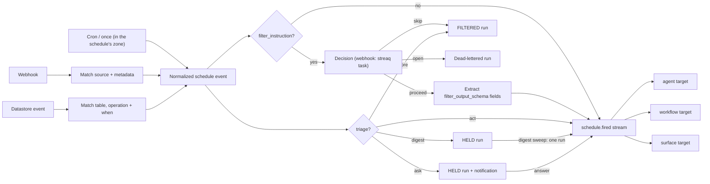

# Schedule module

## Purpose

`app/modules/schedule` turns time, webhooks, datastore changes, and application
events into normalized `schedule.fired` events. Targets are agents, workflows,
or surfaces; target modules decide how to execute the fire.

## Runtime contributions

| Contribution | Behavior |
| --- | --- |
| API routers | Pod schedule CRUD and public webhook ingress/verification |
| Redis consumers | Schedule commands, datastore events, pod deletion, scheduler notifications, and how a triage's question closed (`surface_events`, group `schedule-triage-answers`) |
| streaq task | Evaluate a webhook event's filter or triage off-request |
| streaq cron | `dispatch_schedule_digests`, every minute: sends the triage digests that are due |
| Worker poller | Claims due TIME schedules with `FOR UPDATE SKIP LOCKED` and advances their cursor |
| Published stream | `schedule_events` |

## Data and schedule types

`schedules` stores target, active state, type-specific config, an optional
instruction, optional filter instruction/schema, and external scheduler
metadata. The target is two columns, `agent_id` and `workflow_id`, kept
exclusive by `ck_schedules_single_target`. The pod's default assistant is named
through `agent_id` like any other agent: its `agents` row carries the pod's own
id, so a foreign key reaches it and the target needs no third arm. On the wire
that target reads as `agent_name: "POD_DEFAULT"`, the selector the API takes
rather than the row's internal name. `instruction` says what the target should *do* when the
schedule fires and reaches an agent as its run's conversation instructions;
`filter_instruction` decides whether to fire at all (see [Filters](#filters)), and
only a WEBHOOK or DATASTORE schedule may carry one -- or a `triage` instead,
which routes each event by a decider's answer (see [Triage](#triage)). A schedule targeting the
default assistant must carry an instruction, because that assistant has no
standing one to fall back on. `schedule_runs` is the
durable idempotency/delivery ledger keyed by schedule plus source event; it
records the run's single user owner, attempts, target run, payload, and terminal
outcome. RLS datastore events assign that ownership to the row owner; other
schedule sources assign it to the schedule owner. Supported logical
types include time/cron or once, webhook, datastore, and application-triggered
schedules.

A TIME schedule's config carries `cron` or `scheduled_at`, and optionally
`timezone` — an IANA name the wall-clock times are read in. The key absent
means UTC, which is what every schedule written before zones existed meant, so
absence and a stored `"UTC"` behave identically and no config needs rewriting.
Across a daylight-saving transition a schedule fires once: on a spring-forward
day a skipped wall-clock time fires at the instant it would have been (reading
locally as an hour later), and on a fall-back day the repeated hour fires on its
first, pre-transition occurrence. The zone is resolved once, in
`domain/cron.py`, and every arm point reaches it through
`due_schedule_claimer.next_cursor_for`; `schedules.next_fire_at` is always a UTC
instant. Zone names are checked against `zoneinfo.available_timezones()` rather
than by constructing a `ZoneInfo`, which succeeds for a miscased name on a
case-insensitive filesystem.

The poller owns the concrete time job set: `next_fire_at` is the whole index,
claimed with `FOR UPDATE SKIP LOCKED` and advanced in the claiming transaction.

## API groups

| Routes | What they do |
| --- | --- |
| `/pods/{pod_id}/schedules` | Create/list/get/update/delete logical schedules |
| `POST /webhooks/{source}` | Verify a delivery against its source plugin, normalize it, match schedules, and publish or enqueue filtering |
| `GET /webhooks/{source}/verify` | Provider challenge/verification path |

## Webhook sources

`POST /webhooks/{source}` takes its source from the URL, so the *sender* picks
it. The registry in `app/modules/schedule/domain/webhook_source.py` is the
allow-list that makes that safe: a source with no plugin is refused before
anything reaches matching, a run, or an agent's first message. Plugins live in
`app/composition/webhook_sources/` — `composio` and `github` today.

Each plugin does two things, and they are separate because they fail
differently. `verify` proves the delivery came from the source and parses it; a
failure there is an attack or a misconfiguration, and answers 403. `normalize`
turns it into a routing key and a payload, or returns `None` to acknowledge and
do nothing — which is the ordinary case for an event nothing is subscribed to,
and must answer 2xx, because a provider that collects non-2xx responses retries
them and then disables the hook.

Matching is JSONB containment, `schedules.config @> criteria`. The direction
matters: every key in the routing key must be present in every schedule that
could match, so an *optional* narrowing key — only this repository, only these
actions — cannot live in it. Those are a second pass, `NormalizedWebhook.refine`,
which keeps the knowledge of what they mean with the source that defined them.

`source_event_id` is derived from the event's content, not from the provider's
delivery id: providers issue a new delivery id when they retry, and
`uq_schedule_run_source_event` is what stops one event running a schedule twice.

## Provisioning

Creating a webhook schedule that names a connector trigger asks
`ExternalScheduleWriter` to provision it. There are three outcomes and they are
now distinguishable, which they were not:

- a provider subscription is created, and its id is stored;
- nothing needs creating, and the source supplies the routing key it can derive
  instead — a GitHub App has one webhook URL and its installation decides the
  repositories, so there is no remote subscription;
- nothing knows how to do either, which raises. It used to return `None` and
  look like success: the row was written, nothing was subscribed, and the
  schedule could never fire. Slack's three triggers were inert for years for
  exactly that reason.

### Declared defaults

A trigger's `config_schema` may declare a `default`, and it is applied when the
schedule is created for any key the author left out. Without that it would be
decoration: the form prefills it, and a schedule created through the API or the
CLI with an empty config gets nothing. `workflow_run` is the case that shows
why — GitHub delivers `requested`, `in_progress` and `completed` for one CI run,
so the API path would wake an agent three times where the UI path woke it once.
An author who wrote `actions: []` meant it, and is not overridden.

## Trigger and run flow


```mermaid
flowchart LR
    T["Cron / once (in the schedule's zone)"] --> N["Normalized schedule event"]
    H["Webhook"] --> M["Match source + metadata"] --> N
    D["Datastore event"] --> Q["Match table, operation + when"] --> N
    N --> F{"filter_instruction?"}
    F -- no --> E["schedule.fired stream"]
    F -- yes --> J["Decision (webhook: streaq task)"]
    J -- proceed --> X["Extract filter_output_schema fields"] --> E
    J -- skip --> K["FILTERED run"]
    J -- open --> L["Dead-lettered run"]
    N --> TR{"triage?"}
    TR -- act --> E
    TR -- ignore --> K
    TR -- digest --> HD["HELD run"] -- "digest sweep: one run" --> E
    TR -- ask --> HA["HELD run + notification"] -- answer --> E
    E --> A["agent target"]
    E --> W["workflow target"]
    E --> S["surface target"]
```

## Filters

A `filter_instruction` is asked as a decision: one inline yes/no question,
`proceed`, through the `decisions` contract. The ladder there is rules (a
filter declares none), then System One when `TYPESAFE_API_KEY` is set, then the
system model, so a deployment without a key filters on the model as before. The
adapter is `infrastructure/adapters/system_model_filter.py`, behind the
`ScheduleEventFilter` port; the webhook path runs it in `handle_llm_filter_task`
and the DATASTORE path inline in `DatastoreEventHandler`.

- **Asked once per event.** The decision's subject is
  `schedule:{schedule_id}:{source_event_id}`, the key the run ledger already
  deduplicates on, so a retry or a redelivery reads the recorded decision.
- **The view** is the event rendered to JSON and cut at `_MAX_EVENT_CHARS`.
  An instruction longer than a question's prompt is asked as guidance.
- **Who asks.** The run's owner, in the pod's organization, under the
  schedule's visibility, charged on the `decision` source. A row on an RLS
  table is its owner's alone, so its decision is `PERSONAL` to that owner: the
  decision keeps the event as its evidence.
- **Extraction is a second stage.** When `filter_output_schema` declares fields
  beyond `should_proceed` and `reason`, the system model fills them, and only
  for an event the decision let through.
- **`llm_output`** carries `should_proceed`, `decision_id` and any extracted
  fields. Workflows read it as `start.llm_output.*`, agents in the message that
  wakes them. A redrive replays the stored `llm_output` without filtering again.

Every outcome is recorded (PS-SCHED-012):

| Outcome | Run | `last_fire_status` |
| --- | --- | --- |
| Proceed | claimed at dispatch by the target's module, as any fire | `TRIGGERED` |
| Skip | `FILTERED`, `llm_output` = the verdict and its `decision_id`, no payload | `FILTERED` |
| `proceed` left open | `DEAD_LETTERED`, `error_type` `ScheduleFilterUndecided`, counted on the breaker | `ERROR` |
| Pod out of budget (webhook path) | `DEAD_LETTERED`, `ScheduleFilterQuotaExhausted`, counted | unchanged |
| Extraction over its token limit (webhook path) | `DEAD_LETTERED`, `ScheduleFilterEventTooLarge`, counted | unchanged |

A `FILTERED` run is written once per `(schedule_id, source_event_id)` and is
terminal on arrival: `target_outcome` is set too, which keeps it out of the
recovery sweep's partial index, and the breaker's streak query leaves skips out
so that many skips cannot push a real failure streak out of its window. A
DATASTORE `when` condition that rules an event out still records only
`last_fire_status: FILTERED`: it costs nothing, runs on every write to the
table, and involves no decision to point at.

A TIME schedule fires on the clock, with no event to judge, so create and
update refuse `filter_instruction` and `filter_output_schema` on one. Pod-bundle
import drops them from a TIME schedule with a warning instead of failing.

## Triage

A WEBHOOK or DATASTORE schedule may carry `triage` instead of a filter -- not
beside one; create and update refuse both together, and a TIME schedule refuses
it as it refuses a filter. A triage names a pod decider and routes the options
of one of its choice questions (design: `docs/design/decisions.md` §6.1):

```json
{
  "decider": "inbox-triage",
  "question": "action",
  "routes": {"urgent": "act", "fyi": "digest", "unsure": "ask", "promo": "ignore"},
  "digest": {"cron": "0 9 * * 1-5", "timezone": "Europe/Berlin"},
  "act_per_hour": 20
}
```

Checked when saved (`services/triage_policy.py`), on create and update alike:
the decider exists in the pod and the saver may `decider.execute` it;
`question` names one of its questions, or is left out when it has only one and
is then saved as the one it resolved to; that question is a `choice` with
declared options, and `routes` maps every one of them and nothing else; at
least one option settles an event (act, digest or ignore); `digest` is present
whenever an option routes to it, and its cron passes the TIME schedule check,
frequency floor included. Stored in `schedules.triage`; `next_digest_at` is the
digest's cursor.

Each event is asked about as a filter's is -- in `handle_llm_filter_task` for a
webhook, inline for a DATASTORE row -- under the same subject
`schedule:{schedule_id}:{source_event_id}` and by the same asker, so it is
decided once. The adapter is `infrastructure/adapters/decision_triage.py`.

| The decision | What happens | Run | `last_fire_status` |
| --- | --- | --- | --- |
| act | Fires now, as any fire | claimed by the target's module | `TRIGGERED` |
| ignore | Skipped | `FILTERED`, `llm_output` = the verdict | `FILTERED` |
| digest | Held for the next digest | `HELD`, `held_for: digest`, the payload kept | `HELD` |
| ask | Held, and its owner asked | `HELD`, `held_for: ask`, plus a notification | `HELD` |
| left open | The question's fallback, when the routes cover it; otherwise a failed fire, `ScheduleTriageUndecided`, counted | as that route, or `DEAD_LETTERED` | as that route, or `ERROR` |
| an option the routes do not name (the decider changed since) | A failed fire, `ScheduleTriageUndecided`, counted | `DEAD_LETTERED` | `ERROR` |
| left open by a failing rung | Raised, so the event is retried and the decision asked again | none yet | |
| decider deleted | A failed fire, `ScheduleTriageDeciderMissing`, counted | `DEAD_LETTERED` | `ERROR` |

`llm_output` carries `decision_id`, `question`, `answer` and `route`, plus
`routed_from` when the act ceiling sent the event elsewhere and `fallback` when
an open question's fallback answered it.

**The act ceiling.** `act_per_hour` bounds the events triage sends straight to
the target in any hour. Each act is admitted before its fire is published: a
row in `schedule_act_admissions`, counted and written under a transaction-scoped
advisory lock on the schedule (`repositories/act_admissions.py`), so events
triaged at once cannot all find the hour empty, and a redelivered event keeps
the place it had rather than taking another. At the ceiling, act becomes digest
when the triage has one, and ask when it does not. An act a person chose by
answering a question takes no place: the ceiling bounds what triage does on
its own.

**Ask.** The question goes to the run's owner -- the row's owner on an RLS
table, who alone may see the decision, otherwise the schedule's -- once the
`HELD` row has committed, through `agent_surfaces`' `ask_about_schedule_event`:
a `SCHEDULE` notification whose `action` is a `CHOICE` of the options that
settle the event, each saying what it does (`TriageAsk`). Idempotent on
`schedule-ask:{run_id}`, so a redelivery asks once; over the per-recipient
hourly limit it lands in the Lemma inbox without a push. A reply must pick one
of the options (`data.answer`, or the key or label as the summary), or it is
refused and the question stays open. However the notification closes --
answered, expired or cancelled -- `agent_surfaces` raises
`NotificationClosedEvent`, and `handlers/triage_answer_consumer.py` settles the
run through the inbox (`services/triage_answers.py`):

- The answer is recorded on the decision (`decisions.answer`): as the person's,
  which makes it an example, when the event says they chose it themselves --
  in the app, or by approving the exact answer (`owner_confirmed`); as their
  agent's, which teaches nothing, when their agent answered on its own. A
  redelivery does not record it twice.
- act re-arms the run as `RECEIVED` with a target run id and stages its
  `schedule.fired`, as a redrive does; the target's module claims it.
- digest moves it to `held_for: digest` -- or fires it now if the schedule no
  longer has a digest to send it.
- ignore, and a question nobody answered, end it `FILTERED`.

Each is a compare-and-set on `held_for = 'ask'`, so a second answer moves
nothing.

**Digest.** `dispatch_schedule_digests` claims each schedule whose
`next_digest_at` is due with `FOR UPDATE SKIP LOCKED`, advances the cursor past
now (a backlog is one digest), and takes its `held_for: digest` rows oldest
first with `SKIP LOCKED`: at most 50 events and 48,000 characters, an event
over 16,000 going in as a stub naming its run. When events are left
(`more_waiting`), the cursor is brought forward to just after this sweep, so the
next sweep sends the next batch -- each its own occurrence and key -- until none
remain, whether or not the schedule still has a digest. Per owner -- one, except on an RLS table -- it writes
one digest run (`source_event_id` `digest:{due_at}:{owner}`, `RECEIVED`), marks
those rows `DISPATCHED` with `digest_run_id` pointing at it, and stages one
`schedule.fired` whose payload is `{"events": [...], "held": N}` and whose
metadata says `digest: true`, `held` and `more_waiting`, all in one
transaction. A workflow reads `start.payload.events`; an agent is told in its
wake message. Removing a digest sets its cursor to now, so what it held goes
out once more.

**Ledger rules for HELD.** A `HELD` row carries `target_outcome = 'HELD'`,
which keeps it out of the recovery sweep's partial index: it is not a lost
dispatch, and the sweep never redelivers it. It has no `completed_at`, so
retention never prunes it while it waits, and the breaker never counts it. An
event a digest sent is `DISPATCHED` with `target_outcome` set and a
`completed_at`, so it leaves the recovery index, becomes prunable, and is left
out of the breaker's streak like a skip: its outcome is the digest run's. `GET
…/schedules/{id}/runs?status=HELD` lists what a triage is holding.

The service mirrors provider-backed webhook schedules into the connector through
an adapter. Each `schedule.fired` trigger claims one durable schedule run;
PostgreSQL deduplicates target dispatch and tracks retry/dead-letter state.
`DISPATCHED` means the target run was created, not that the target completed.
Consecutive-failure policy is durable on the schedule row, and a
deactivation event is staged in the same transaction as that state change —
including the poller's own retirements, so no schedule goes inactive silently.
A schedule whose target was deleted keeps its row (`workflow_id` and `agent_id`
are `SET NULL`) and records each firing as failed saying the target is missing.
Publishers use the shared transactional outbox/core Redis Streams bus.

## Authorization and security

Schedule CRUD is pod-authorized. Webhook ingress is public by necessity and
uses source-specific verification adapters plus schedule matching. Deletion of
a pod is consumed as a system event to tear down schedules and external jobs.

## Tests and operations

Tests cover normalization, filters, adapters, CRUD, scheduler calls, event
consumers, concurrent schedule-run deduplication, retry, and atomic deactivation.
