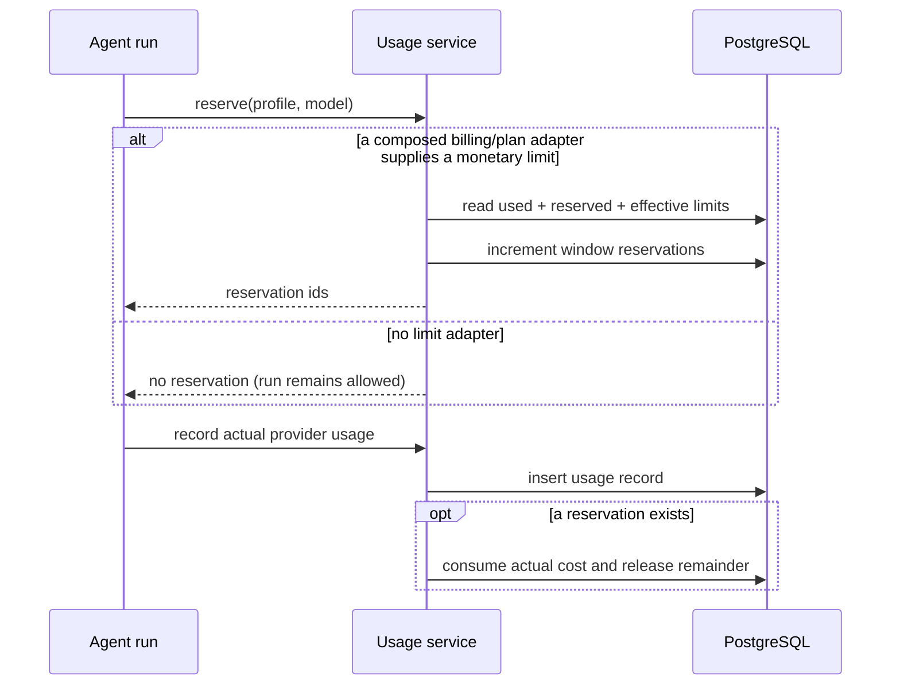

# Usage module

## Purpose

`app/modules/usage` meters model work, calculates system-provider cost,
optionally reserves budget before a run, records final usage, exposes
organization/user reports, and provides an extension port for billing/plan
limits.

## Runtime contributions

| Contribution | Behavior |
| --- | --- |
| API router | Organization summaries/events/stats/limits and current-user usage |
| Domain events | Usage-recorded and limit-denied events are collected with the UoW |

## Main data model

| Table | Meaning |
| --- | --- |
| `usage_records` | Immutable run/profile/model/token/unit/cost/status attribution |
| `usage_limit_counters` | Per organization/user time-window reserved amount used to constrain concurrency |

System-scoped runtimes use registered per-model pricing when available. An
unknown model is still metered, but its record has `cost_usd = null` and
`metadata.pricing_missing = true`; missing pricing never blocks the run.
User-owned provider profiles are recorded but do not count as Lemma system
cost.

## API groups

All routes are under `/usage/organizations/{organization_id}`: aggregate
summary, paginated events, time-bucketed/grouped stats, effective limits, and
the current user's view. Access is organization-membership/role scoped.

## Reservation and recording flow

## How a cost is resolved

Three layers, most specific first, in `services/cost_resolver.py`:

1. **A registered rate** (`UsageService.register_model_pricing`) — what a
   deployment configured, and always what wins.
2. **`genai-prices`** — the public dataset behind pydantic-ai's own usage
   extraction. It identifies a provider from the runtime profile's base URL, so a
   profile someone added with their own key reports a real cost with no
   per-model configuration, and it carries what a flat rate card cannot: separate
   cache-write rates and tiered pricing above a context threshold.
3. **Nothing** — the cost is recorded as *unknown*, never as zero.

Each record carries `cost_source` (`REGISTERED` / `ESTIMATED` / `UNKNOWN`) so a
best-effort figure is never mistaken for a configured one. Cost is resolved for
every profile scope; keeping a customer's own spend out of their Lemma allowance
is the job of the limit queries, which filter on `profile_scope == 'SYSTEM'`.

`input_tokens` is the inclusive parent count. `cached_input_tokens` and
`cache_write_tokens` are subsets of it, and the remainder is what bills at the
full rate.

## What is metered, and what is not

Every model call made on the deployment's credentials is metered, including the
ones that happen outside a run of the user's own: history compaction (via
`services/metered_model.py`, which wraps the summarizer's model) and the vision
delegate that reads images for a text-only model.

Deliberately **not** metered today: speech (Deepgram `listen`/`say` and voice
transcription at ingress) and web search (Brave). Both run on platform API keys
and are treated as included. The `units` / `unit_usd` / `UsageKind` machinery
exists for them when that stops being true.

`UsageLimitPort` lets another composed module supply plan-specific values. The
OSS/local default is unlimited so an unregistered custom model cannot prevent
an agent run. OSS does not define environment-backed plans or a fail-closed
pricing policy; deployments that need monetary admission install a
`UsageLimitPort` and register the prices they want reflected in usage records.
Direct model-call token/request guardrails are independent of monetary
admission.

## Tests and operations

Tests cover optional pricing, unlimited defaults, injected reservations,
atomic counter concurrency, queries, and API authorization.
