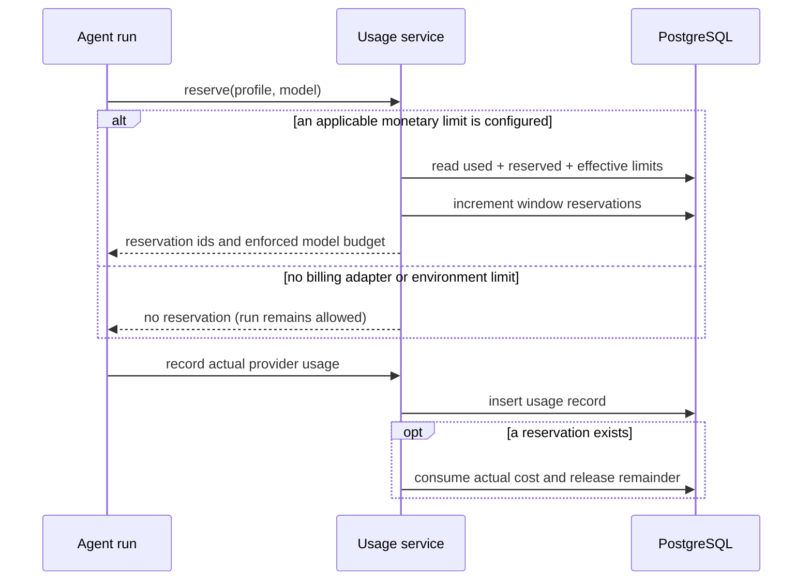

# Usage module

## Purpose

`app/modules/usage` meters model work, calculates system-provider cost,
optionally reserves budget before a run, records final usage, exposes
organization/user reports, and provides an extension port for billing/plan
limits.

## Runtime contributions

| Contribution | Behavior |
| --- | --- |
| API router | Organization summaries/events/stats/limits and current-user usage |
| Domain events | Usage-recorded and limit-denied events are collected with the UoW |

## Main data model

| Table | Meaning |
| --- | --- |
| `usage_records` | Immutable run/profile/model/token/unit/cost/status attribution |
| `usage_limit_counters` | Per organization/user time-window reserved amount used to constrain concurrency |

System-scoped runtimes use registered per-model pricing. An intentionally
conservative fallback estimates unknown models for reporting, without blocking
an otherwise-unlimited local/OSS run. User-owned provider profiles are recorded
but do not count as Lemma system cost.

## API groups

All routes are under `/usage/organizations/{organization_id}`: aggregate
summary, paginated events, time-bucketed/grouped stats, effective limits, and
the current user's view. Access is organization-membership/role scoped.

## Reservation and recording flow

`UsageLimitPort` lets another composed module supply plan-specific values. The
OSS/local default is unlimited so an unregistered custom model cannot prevent
an agent run. Deployments can opt into built-in limits with
`USAGE_DEFAULT_ORG_MONTHLY_COST_LIMIT_USD`,
`USAGE_DEFAULT_USER_WEEKLY_COST_LIMIT_USD`, and
`USAGE_DEFAULT_USER_MONTHLY_COST_LIMIT_USD`, or install a `UsageLimitPort`.
Once any applicable limit is configured, pricing and maximum-budget metadata
are mandatory and admission fails closed if either is missing.

## Tests and operations

Tests cover pricing, unlimited defaults, opt-in reservations, fallback pricing,
hard limits, queries, concurrency, and API authorization. Issue evidence is in
[issues.md](issues.md).
