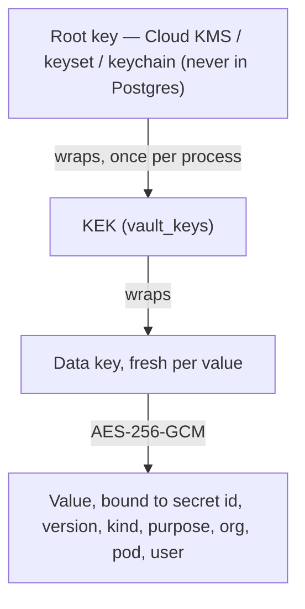

# Vault module

## Purpose

`app/modules/vault` is where the platform stores secrets: a row that uses one
holds only a `*_secret_id`, and reads and writes it through
`app.modules.vault.contracts` -- the only part other modules import.

## Data model

| Table | Holds |
| --- | --- |
| `vault_keys` | Key-encryption keys (KEKs), each wrapped by the root key, with purpose `encrypt` (wraps data keys) or `sign` (roots token signing when the root key is remote) and state `active`, `decrypt_only` or `retired`. At most one active key per purpose. |
| `vault_secrets` | One row per secret: owner scope (`organization_id`, `pod_id`, `user_id`), `purpose`, `kind` (text or JSON), the data key wrapped by a KEK, the AES-256-GCM ciphertext, `version`, non-secret `metadata`, `expires_at`, and a refresh lease (`lease_holder`, `lease_until`). The current version only: a new value replaces the old in place under a new data key. |
| `vault_secret_events` | The audit trail: created, replaced, revealed (when a person or workload asked), deleted (including by an owner row going away), rewrapped and imported, with actor and request id. |

No table stores its secrets here yet. The connector, agent and surface tables
still encrypt their own columns; moving them in is the next change.

## How a secret is protected

- **Binding.** The associated data is the scope the *caller* expects, taken
  from the owner row, plus the purpose (the owning column). A row pointed at
  another tenant's secret, or a ciphertext copied onto another row, fails to
  decrypt. A mismatch is a not-found to callers and is logged.
- **Cost.** A read is one primary-key lookup and two local AES-GCM operations.
  KEKs are unwrapped when a process starts and kept in memory; the root key is
  never on the read path. Plaintext is never cached, in process or in Redis.
- **Lifecycle.** `vault_owned(table, *columns)` installs a trigger on the owner:
  deleting the owner row (by any path, including a cascade from an organization)
  or repointing its column deletes the secret in the same transaction.
- **Refresh.** `try_lease` / `replace(expected_version=…, lease=…)` give OAuth
  refresh a single flight: one caller refreshes, others wait for the version to
  move, and a stale writer gets a conflict instead of overwriting a newer token.
- **Short-lived values.** The sealer (`seal_value` / `open_json`) applies the
  same protection to values held outside the table — the sandbox environment
  cached in Redis, a GitHub installation token, a queued agent-host MCP frame —
  bound to the cache key or run they belong to.

## Runtime contributions

The module is registered first. Its API and worker lifespans validate the root
configuration and load the keyring before anything else starts (a hosted
process with an unusable root refuses to start), then refresh it every
`VAULT_KEK_REFRESH_SECONDS` so a KEK rotated elsewhere is picked up. It has no
routes, events or tasks.

## Tests and operations

`tests/unit` covers binding, the sealer, signing keys and the migration's
legacy decoders; `tests/e2e` covers the store, the owner trigger, leases,
audit and rewrap.
Operators use `scripts/vault_admin.py` (status, probe, rotate-kek, rewrap,
retire-kek, rotate-sign-key); see `docs/operators/secrets-vault.md`.
