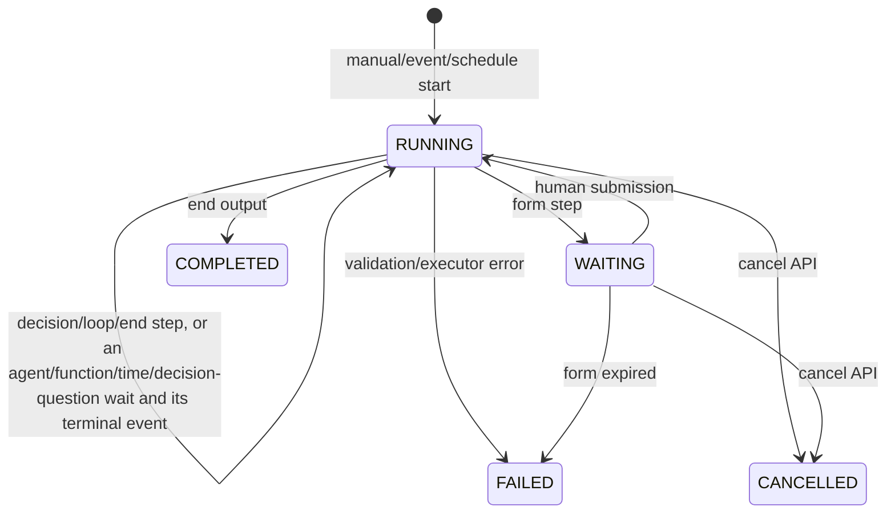

# Workflow module

## Purpose

`app/modules/workflow` defines and executes directed workflow graphs. A graph
can combine functions, agents, decisions, loops, waits, human forms, and end
nodes. The module persists run context and step history, pauses on external
work, and resumes from function, agent, schedule, or user-form events.

## Runtime contributions

| Contribution | Behavior |
| --- | --- |
| API routers | Workflow CRUD/graph/visualization, run create/list/detail/cancel/form/visualization |
| Redis consumers | Function completion, agent completion, and schedule-fired events |
| streaq tasks | Resume function/agent waits, ask a decision node's question (`decide_workflow_step`), and start scheduled workflows |
| cron | Reconcile stale waits every five minutes, re-queueing a lost decision |

## Main data model

| Table | Meaning |
| --- | --- |
| `workflow_flows` | Named pod graph, typed start configuration, visibility |
| `workflow_flow_runs` | Status, trigger/run context, step records, output/error |
| `workflow_run_waits` | Active/completed external or human wait assignment and payload |

## Graph vocabulary

| Node | Behavior |
| --- | --- |
| Function | Starts a function run and waits for its terminal event |
| Agent | Starts/continues an agent conversation and waits for completion |
| Decision | Evaluates ordered rule expressions and chooses a branch, or asks one closed question about some evidence and routes on the answer (see below) |
| Loop | Iterates items while maintaining a scoped loop frame |
| Form | Persists a human wait with schema/assignment and resumes on submission |
| Wait until | Pauses until a time/schedule signal |
| End | Resolves output bindings and completes the run |

## Waits

A step that cannot finish inside the run's transaction writes one ACTIVE row in
`workflow_run_waits` and suspends. Only a form wait moves the run to WAITING;
the others keep it RUNNING while the row says what it is on.

| Wait type | Written by | Resumed by |
| --- | --- | --- |
| `HUMAN` | Form node | The assignee submitting the form |
| `AGENT` | Agent node | The agent run's completion event |
| `FUNCTION` | Function node | The function run's completion event |
| `TIME` | Wait-until node | The scheduler's wake |
| `DECISION` | Decision node with a `question` | The `decide_workflow_step` job, with the answer's route |

## Decision questions

A decision node has `rules` or a `question`, never both. A question asks one
closed question through `decisions.contracts.decide`: `instruction` (trusted),
`evidence` (an input binding resolved against the run context), `answer` (one
property of the decisions schema subset: a choice, yes or no, or a scale; a
multi-choice cannot be routed), and optional `examples`. It routes on the
answer:

| Answer | Next node |
| --- | --- |
| A value with a route (`routes` keys are the value as a string: `true`, `3`, `billing`) | That route |
| No value, or a confidence below `min_confidence` (ignored when the provider reports none) | `unsure_next_node_id` |
| Anything else | The default edge, the node's first outgoing edge |

Saving checks the question against the decisions contract, that every route key
is an answer and every target exists, and that every answer and unsure has
somewhere to go -- a route or the default edge.

The executor resolves the evidence, writes the whole request onto a `DECISION`
wait and suspends; after the commit, `AfterCommitDecisionQueue` enqueues
`decide_workflow_step` (job id `workflow-decision:{external_ref}`). The job
reads the wait in one short transaction, asks with no session open, and in a
second transaction picks the route from the flow as it is then and resumes the
run there. The node's output is `{answer, confidence, provider, model, route}`.

No failure takes a branch. A provider that did not answer, or a rate limit, is
retried with backoff (at least the limit's `retry_after_seconds`) up to six
attempts, then the run fails naming the cause. An invalid question, a spent
usage limit, too much evidence for one decision (`token_limit`) or no configured
provider (`not_configured`) fail the run at once, as does an answer with no
route and no default edge. A cancelled run's job finds no active wait and does
nothing. A `DECISION` wait older than the reconciliation grace period has a job
that is lost or held up, and the sweep asks the queue which. A job still
queued, waiting out a retry or running is left to answer. One that never
reached the queue -- its enqueue lost after the commit -- is queued again and
not counted. One that ran and ended without answering is queued again under a
job id of its own, up to three times (counted in the wait's `requeues`), and
the run then fails saying the job was lost. A queue that cannot be reached is
asked again by the next sweep.

## API groups

`/pods/{pod_id}/workflows` provides CRUD, graph replacement, manual run
creation, run history, and definition visualization. `/pods/{pod_id}/workflow-runs`
provides assigned waits, form submission, cancellation, detail, and run
visualization.

## Execution flow

`WorkflowEngine` loads a run and graph; `WorkflowStepper` selects the current
node and delegates to a typed executor. Input/output bindings use literals or
expressions over the run context. External executors create durable waits before
returning. Event consumers enqueue idempotently named resume jobs, and the cron
reconciles completion events that were missed.

## Authorization and dependencies

Workflow definition/run operations use pod permissions and resource grants.
Human form assignment resolves pod members. Adapter ports invoke agent,
function, and schedule modules. Scheduled start configuration imports schedule
value types directly, while schedule also calls workflow services. That cycle is
in the architecture baseline and cannot grow; see `make architecture`.

## Tests and operations

Tests cover graph validation, expressions, every node executor, waits/forms,
resumption, cancellation, authorization, visualization, schedules, and e2e
function/agent execution. Current unit coverage is 67.6% (1,618 of 2,393
statements). Event-ack reliability remains a review finding.
